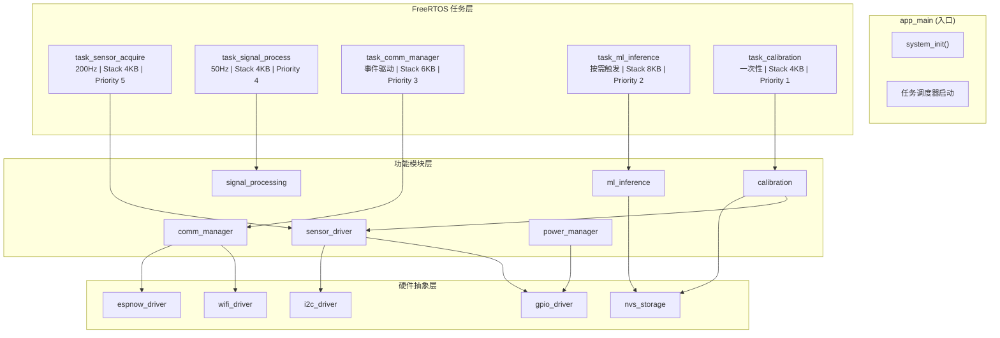
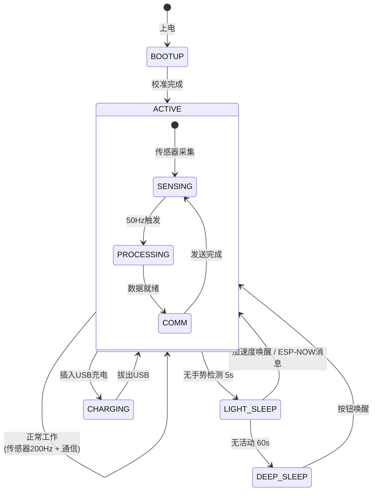
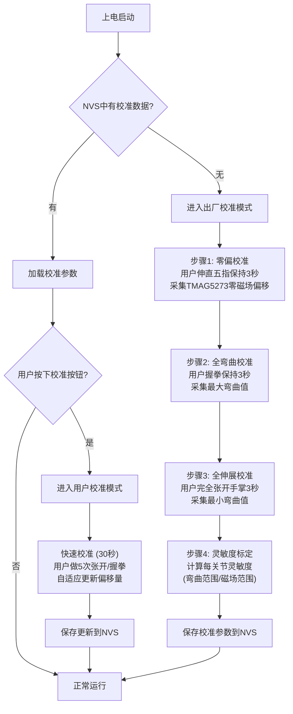

# SPEC-02: 固件架构与通信协议规范

> 版本: v1.0 | 日期: 2025-04-10 | 模块: 固件 (ESP32-S3)
> 依赖: SPEC-01 硬件设计规范

---

## Part A: 固件架构规范

### A1. 固件模块架构



#### 模块职责清单

| 模块 | 文件 | 职责 | 对外接口 | 依赖 |
|------|------|------|---------|------|
| `sensor_driver` | `sensor_driver.h/.c` | TMAG5273/BNO085/TCA9548A 底层驱动 | `sensor_init()`, `sensor_read_all()`, `sensor_get_joint_data()` | i2c_driver |
| `signal_processing` | `signal_proc.h/.c` | Kalman滤波、特征提取、归一化 | `sig_init()`, `sig_filter()`, `sig_extract_features()` | sensor_driver |
| `comm_manager` | `comm_mgr.h/.c` | ESP-NOW发送/接收, WiFi SSE推送 | `comm_init()`, `comm_send_data()`, `comm_register_callback()` | espnow_driver, wifi_driver |
| `ml_inference` | `ml_infer.h/.c` | TFLite Micro模型加载、推理、后处理 | `ml_init()`, `ml_run_inference()`, `ml_get_result()` | nvs_storage |
| `power_manager` | `power_mgr.h/.c` | 睡眠模式管理、电池监测、唤醒控制 | `pwr_init()`, `pwr_enter_light_sleep()`, `pwr_get_battery_level()` | gpio_driver, adc |
| `calibration` | `calibration.h/.c` | 传感器零偏/灵敏度校准、NVS存储 | `cal_start()`, `cal_save()`, `cal_load()` | sensor_driver, nvs_storage |

---

### A2. FreeRTOS 任务调度设计

#### 任务配置表

| 任务名称 | 优先级 | 栈大小 | 周期 | 触发方式 | CPU核心 | 说明 |
|---------|--------|--------|------|---------|---------|------|
| `task_sensor_acquire` | 5 (最高) | 4096B | 5ms (200Hz) | 定时器 | Core 0 | 传感器数据采集，硬实时 |
| `task_signal_process` | 4 | 4096B | 20ms (50Hz) | 定时器 | Core 0 | 滤波+特征提取 |
| `task_comm_manager` | 3 | 6144B | 事件驱动 | 信号量 | Core 1 | ESP-NOW发送+WiFi |
| `task_ml_inference` | 2 | 8192B | 按需(完成滑动窗口后) | 通知 | Core 1 | TFLite推理 |
| `task_calibration` | 1 (最低) | 4096B | 一次性 | 命令触发 | Core 0 | 上电校准流程 |

#### 任务间通信机制

```
                    ┌─────────────────────┐
                    │  sensor_data_queue   │  (xQueue, depth=10, item=sensor_frame_t)
                    │  200Hz → 50Hz 降采样  │
                    └──────────┬──────────┘
                               │
    task_sensor_acquire ──────→│──────→ task_signal_process
                               │
                    ┌──────────┴──────────┐
                    │  processed_data_queue │  (xQueue, depth=5, item=proc_frame_t)
                    └──────────┬──────────┘
                               │
    task_signal_process ──────→│──────→ task_ml_inference
                               │         task_comm_manager
                               │
                    ┌──────────┴──────────┐
                    │  inference_sem       │  (xSemaphore, 二值信号量)
                    │  通知推理任务:窗口就绪 │
                    └─────────────────────┘

    task_ml_inference ──── 推理完成 ───→ task_comm_manager (via callback)
```

#### 数据结构定义

```c
// 传感器原始数据帧 (200Hz)
typedef struct {
    uint32_t timestamp_ms;           // 系统时间戳
    // BNO085 四元数 (手腕姿态)
    float quat_w, quat_x, quat_y, quat_z;
    // TMAG5273 关节磁场数据 (15关节 x 3轴)
    int16_t joints[15][3];           // 单位: 0.1μT, 16-bit量化
    // BNO085 线加速度+角速度 (可选)
    float lin_acc[3];                // m/s^2
    float ang_vel[3];                // rad/s
} sensor_raw_frame_t;

// 信号处理后数据帧 (50Hz)
typedef struct {
    uint32_t timestamp_ms;
    // 滤波后的关节角度 (15关节, 单位: 0.1度)
    float joint_angles[15];          // 由TMAG5273磁场→角度映射得到
    // 手腕欧拉角 (度)
    float wrist_roll, wrist_pitch, wrist_yaw;
    // 7个统计特征 x 每通道 (mean, std, min, max, rms, skew, kurt)
    float features[15 * 7];          // 105维特征向量
    // 关节角速度 (用于动态手势检测)
    float joint_velocities[15];
} processed_frame_t;

// 滑动窗口缓冲区
#define WINDOW_SIZE 30               // 30帧 x 50Hz = 600ms窗口
typedef struct {
    processed_frame_t buffer[WINDOW_SIZE];
    uint8_t write_idx;
    bool is_full;
} sliding_window_t;
```

---

### A3. 传感器驱动规范

#### A3.1 TMAG5273 驱动

TMAG5273 是 TI 的 3D 线性数字霍尔传感器，通过 I2C 接口通信。每颗器件支持 4 个可编程 I2C 地址 (0x22, 0x23, 0x24, 0x25)，通过 DEVICE_CONFIG 寄存器配置。本项目通过 TCA9548A I2C 多路复用器管理 15 颗 TMAG5273，实现同一 I2C 总线上的 15 路独立通信。

```c
// ===== tmag5273.h =====
#ifndef TMAG5273_H
#define TMAG5273_H

#include <stdint.h>
#include <stdbool.h>

#define TMAG5273_I2C_ADDR_BASE  0x22
#define TMAG5273_I2C_ADDR_MAX   0x25
#define TMAG5273_CONV_RESULT     0x10  // 转换结果寄存器 (X: 0x10-11, Y: 0x12-13, Z: 0x14-15)
#define TMAG5273_DEVICE_CONFIG   0x20
#define TMAG5273_SENSOR_CONFIG   0x21
#define TMAG5273_MAG_CONFIG      0x22
#define TMAG5273_THRESHOLD_SET   0x24
#define TMAG5273_MAX_VAL         32767

// 灵敏度模式 (range)
typedef enum {
    TMAG_RANGE_LOW     = 0x00,   // ±250 mT (默认)
    TMAG_RANGE_MEDIUM  = 0x01,   // ±125 mT
    TMAG_RANGE_HIGH    = 0x02,   // ±62.5 mT
} tmag_range_t;

// 工作模式
typedef enum {
    TMAG_MODE_STANDBY  = 0x00,
    TMAG_MODE_CONTINUOUS = 0x01, // 连续转换
    TMAG_MODE_TRIGGER  = 0x10,   // 单次触发
} tmag_mode_t;

// 转换速率
typedef enum {
    TMAG_RATE_20HZ   = 0x00,
    TMAG_RATE_50HZ   = 0x01,
    TMAG_RATE_100HZ  = 0x02,
    TMAG_RATE_200HZ  = 0x03,
} tmag_rate_t;

typedef struct {
    int16_t x, y, z;             // 三轴磁场数据 (单位: 0.1μT)
    int16_t temp;                 // 芯片温度 (可选)
} tmag_data_t;

// 每个关节的传感器实例
typedef struct {
    uint8_t tca_channel;          // TCA9548A 通道号 (0-7)
    uint8_t i2c_addr;             // TMAG5273 I2C 地址
    tmag_range_t range;
    tmag_data_t offset;           // 零偏校准值
    tmag_data_t last_data;        // 最近一次读取的数据
    bool initialized;
} tmag_joint_t;

/**
 * @brief 初始化单颗 TMAG5273
 * @param joint 关节传感器实例指针
 * @param tca_ch TCA9548A 通道号
 * @param addr I2C 地址 (0x22-0x25)
 * @param range 磁场范围
 * @return true 成功, false 失败
 */
bool tmag5273_init(tmag_joint_t *joint, uint8_t tca_ch, uint8_t addr, tmag_range_t range);

/**
 * @brief 读取单颗 TMAG5273 的三轴磁场数据
 * @param joint 关节传感器实例指针
 * @param data 输出数据指针
 * @return true 成功, false 失败
 */
bool tmag5273_read(tmag_joint_t *joint, tmag_data_t *data);

/**
 * @brief 读取全部 15 颗传感器数据
 * @param joints 关节数组 (15个)
 * @param output 输出数组 [15][3]
 * @return 成功读取的数量
 */
int tmag5273_read_all(tmag_joint_t *joints, int16_t output[15][3]);

#endif
```

```c
// ===== tmag5273.c (核心实现) =====
#include "tmag5273.h"
#include "tca9548a.h"
#include "i2c_driver.h"
#include <math.h>

bool tmag5273_init(tmag_joint_t *joint, uint8_t tca_ch, uint8_t addr, tmag_range_t range) {
    joint->tca_channel = tca_ch;
    joint->i2c_addr = addr;
    joint->range = range;
    joint->initialized = false;

    // 1. 切换 TCA9548A 通道
    if (!tca9548a_select_channel(tca_ch)) {
        ESP_LOGE("TMAG", "Failed to select TCA channel %d", tca_ch);
        return false;
    }

    // 2. 软复位 (写入 0x22 的 bit7 = 1)
    uint8_t reset_cmd = 0x80;
    if (!i2c_write_byte(addr, TMAG5273_DEVICE_CONFIG, reset_cmd)) {
        return false;
    }
    vTaskDelay(pdMS_TO_TICKS(5));

    // 3. 配置传感器模式: 连续转换
    uint8_t config = (uint8_t)TMAG_MODE_CONTINUOUS | (0x02 << 2);  // 20Hz avg, 低噪声
    if (!i2c_write_byte(addr, TMAG5273_DEVICE_CONFIG, config)) {
        return false;
    }

    // 4. 设置灵敏度范围
    if (!i2c_write_byte(addr, TMAG5273_MAG_CONFIG, (uint8_t)range)) {
        return false;
    }

    // 5. 设置转换速率 200Hz
    if (!i2c_write_byte(addr, TMAG5273_SENSOR_CONFIG, (uint8_t)TMAG_RATE_200HZ)) {
        return false;
    }

    // 6. 读取零偏校准值 (从 NVS 加载, 见 calibration 模块)
    cal_load_tmag_offset(tca_ch, &joint->offset);

    joint->initialized = true;
    ESP_LOGI("TMAG", "Joint ch%d addr=0x%02X range=%d initialized", tca_ch, addr, range);
    return true;
}

bool tmag5273_read(tmag_joint_t *joint, tmag_data_t *data) {
    if (!joint->initialized) return false;

    // 切换 TCA 通道
    if (!tca9548a_select_channel(joint->tca_channel)) return false;

    // 读取 6 字节 (X[15:8], X[7:0], Y[15:8], Y[7:0], Z[15:8], Z[7:0])
    uint8_t buf[6];
    if (!i2c_read_bytes(joint->i2c_addr, TMAG5273_CONV_RESULT, buf, 6)) return false;

    data->x = (int16_t)((buf[0] << 8) | buf[1]);
    data->y = (int16_t)((buf[2] << 8) | buf[3]);
    data->z = (int16_t)((buf[4] << 8) | buf[5]);

    // 应用零偏校准
    data->x -= joint->offset.x;
    data->y -= joint->offset.y;
    data->z -= joint->offset.z;

    joint->last_data = *data;
    return true;
}

int tmag5273_read_all(tmag_joint_t *joints, int16_t output[15][3]) {
    int success_count = 0;
    for (int i = 0; i < 15; i++) {
        tmag_data_t data;
        if (tmag5273_read(&joints[i], &data)) {
            output[i][0] = data.x;
            output[i][1] = data.y;
            output[i][2] = data.z;
            success_count++;
        }
    }
    return success_count;
}
```

#### A3.2 BNO085 驱动

BNO085 (CEVA/Hillcrest) 是一颗高度集成的 9 轴智能传感器，内置 Sensor Fusion 处理器，可直接输出四元数、欧拉角、线性加速度等融合数据，无需 MCU 端进行额外的姿态解算。本项目将 BNO085 放置在 ESP32-S3 的独立 I2C1 总线上 (GPIO 18/19)，避免与 TCA9548A+TMAG5273 的 I2C0 总线冲突。

```c
// ===== bno085.h =====
#ifndef BNO085_H
#define BNO085_H

#include <stdint.h>
#include <stdbool.h>

#define BNO085_I2C_ADDR          0x4A
#define BNO085_I2C_ADDR_ALT      0x4B
#define BNO085_SHAKE_WAKEUP      0x01

typedef struct {
    // 四元数 (手腕姿态, NED坐标系)
    float quat_w, quat_x, quat_y, quat_z;
    // 欧拉角 (度)
    float roll, pitch, yaw;
    // 线性加速度 (m/s^2, 去重力)
    float lin_acc[3];
    // 角速度 (rad/s)
    float gyro[3];
    // 传感器温度
    float temperature;
    // 校准状态 (0-3, 3=完全校准)
    uint8_t calib_sys, calib_gyro, calib_accel, calib_mag;
} bno085_data_t;

/**
 * @brief 初始化 BNO085, 配置 Sensor Fusion 输出
 * @return true 成功, false 失败
 */
bool bno085_init(void);

/**
 * @brief 读取融合数据 (四元数+欧拉角+加速度)
 * @param data 输出数据指针
 * @return true 成功, false 失败
 */
bool bno085_read(bno085_data_t *data);

/**
 * @brief 触发软复位
 */
void bno085_reset(void);

/**
 * @brief 检查校准状态
 * @return true 已校准, false 未校准
 */
bool bno085_is_calibrated(void);

#endif
```

```c
// ===== bno085.c (核心实现片段) =====
#include "bno085.h"
#include "i2c_driver.h"
#include "esp_log.h"

static const char *TAG = "BNO085";

// BNO085 采用 Hillcrest 的 SH-2 协议
// 报头: SHTP 报告格式
typedef struct {
    uint8_t report_id;
    // SH-2 报告数据...
} shtp_report_t;

bool bno085_init(void) {
    // 1. I2C 总线探测
    uint8_t reg_val;
    if (!i2c_read_byte(BNO085_I2C_ADDR, 0x00, &reg_val)) {
        ESP_LOGE(TAG, "BNO085 not found at 0x%02X", BNO085_I2C_ADDR);
        return false;
    }

    // 2. 软复位
    bno085_reset();
    vTaskDelay(pdMS_TO_TICKS(100));

    // 3. 配置 Sensor Fusion 报告
    // 启用 Rotation Vector (四元数) 报告, 50Hz
    // 启用 Linear Acceleration 报告, 50Hz
    // 启用 Gyroscope 报告, 50Hz
    uint8_t sensor_config[] = {
        0x05, 0x00, 0x02, 0x00, 0x00, 0x00,   // Enable Rotation Vector
        0x05, 0x00, 0x04, 0x00, 0x00, 0x00,   // Enable Linear Acceleration
        0x05, 0x00, 0x08, 0x00, 0x00, 0x00,   // Enable Gyroscope
    };
    // 通过 SH-2 协议发送配置...

    ESP_LOGI(TAG, "BNO085 initialized on I2C1, Sensor Fusion enabled");
    return true;
}

bool bno085_read(bno085_data_t *data) {
    // 读取 SH-2 报告, 解析四元数/加速度/角速度
    // Hillcrest SH-2 协议实现较复杂, 建议参考 SparkFun BNO085 Arduino 库
    // 核心步骤:
    // 1. 检查可读字节数 (I2C 寄存器 0x36/0x37)
    // 2. 读取 SHTP 报头 (4字节)
    // 3. 根据报告ID解析数据载荷
    // 4. Rotation Vector → quat_w/x/y/z + accuracy
    // 5. Linear Acceleration → lin_acc[3]
    // 6. Gyroscope Calibrated → gyro[3]
    // 此处省略完整 SH-2 协议实现...

    // 四元数归一化
    float norm = sqrtf(data->quat_w * data->quat_w +
                       data->quat_x * data->quat_x +
                       data->quat_y * data->quat_y +
                       data->quat_z * data->quat_z);
    if (norm > 0.001f) {
        data->quat_w /= norm;
        data->quat_x /= norm;
        data->quat_y /= norm;
        data->quat_z /= norm;
    }

    // 四元数 → 欧拉角 (ZYX顺序, NED坐标系)
    float sinr_cosp = 2.0f * (data->quat_w * data->quat_x + data->quat_y * data->quat_z);
    float cosr_cosp = 1.0f - 2.0f * (data->quat_x * data->quat_x + data->quat_y * data->quat_y);
    data->roll  = atan2f(sinr_cosp, cosr_cosp) * 180.0f / M_PI;

    float sinp = 2.0f * (data->quat_w * data->quat_y - data->quat_z * data->quat_x);
    data->pitch = (fabsf(sinp) >= 1.0f) ?
                  copysignf(90.0f, sinp) : asinf(sinp) * 180.0f / M_PI;

    float siny_cosp = 2.0f * (data->quat_w * data->quat_z + data->quat_x * data->quat_y);
    float cosy_cosp = 1.0f - 2.0f * (data->quat_y * data->quat_y + data->quat_z * data->quat_z);
    data->yaw   = atan2f(siny_cosp, cosy_cosp) * 180.0f / M_PI;

    return true;
}
```

#### A3.3 TCA9548A 驱动

TCA9548A 是 TI 的 8 通道 I2C 多路复用器，用于解决 TMAG5273 I2C 地址冲突问题。每颗 TMAG5273 支持 4 个地址 (0x22-0x25)，本项目每根手指分配 3 个关节传感器，使用 3 个地址，因此每指占 1 个 TCA 通道。5 根手指占用 5 个通道，剩余 3 通道预留给扩展。

```c
// ===== tca9548a.h =====
#ifndef TCA9548A_H
#define TCA9548A_H

#include <stdint.h>
#include <stdbool.h>

#define TCA9548A_I2C_ADDR    0x70
#define TCA9548A_NUM_CH      8

// 手指→通道映射
#define TCA_CH_THUMB         0   // 拇指 DIP/IP/MCP
#define TCA_CH_INDEX         1   // 食指 DIP/PIP/MCP
#define TCA_CH_MIDDLE        2   // 中指 DIP/PIP/MCP
#define TCA_CH_RING          3   // 无名指 DIP/PIP/MCP
#define TCA_CH_PINKY         4   // 小指 DIP/PIP/MCP
// CH5-7 预留扩展

/**
 * @brief 初始化 TCA9548A, 禁用所有通道
 * @return true 成功
 */
bool tca9548a_init(void);

/**
 * @brief 选择单个 I2C 通道 (自动禁用其他通道)
 * @param channel 通道号 (0-7)
 * @return true 成功
 */
bool tca9548a_select_channel(uint8_t channel);

/**
 * @brief 扫描所选通道上的所有 I2C 设备
 * @param channel 通道号
 * @param found_addrs 输出找到的地址数组
 * @param max_addr 数组最大容量
 * @return 找到的设备数量
 */
int tca9548a_scan_channel(uint8_t channel, uint8_t *found_addrs, int max_addr);

#endif
```

```c
// ===== tca9548a.c =====
#include "tca9548a.h"
#include "i2c_driver.h"
#include "esp_log.h"

static const char *TAG = "TCA9548A";

bool tca9548a_init(void) {
    // 禁用所有通道
    return i2c_write_byte(TCA9548A_I2C_ADDR, 0x00, 0x00);
}

bool tca9548a_select_channel(uint8_t channel) {
    if (channel >= TCA9548A_NUM_CH) return false;
    // 写入通道掩码: 仅使能指定通道
    uint8_t mask = (1 << channel);
    return i2c_write_byte(TCA9548A_I2C_ADDR, 0x00, mask);
}

int tca9548a_scan_channel(uint8_t channel, uint8_t *found_addrs, int max_addr) {
    if (!tca9548a_select_channel(channel)) return 0;

    int count = 0;
    for (uint8_t addr = 0x08; addr <= 0x77; addr++) {
        if (i2c_probe(addr)) {
            if (count < max_addr) {
                found_addrs[count] = addr;
                count++;
            }
            ESP_LOGI(TAG, "  Found device at 0x%02X on channel %d", addr, channel);
        }
    }
    return count;
}
```

---

### A4. 信号处理 Pipeline

#### A4.1 数据采集与降采样

传感器原始采集频率 200Hz，通过 4:1 降采样到 50Hz 送入信号处理任务。降采样使用移动平均滤波器，兼顾抗混叠和低延迟。

```c
// ===== signal_proc.h =====
#define SIGNAL_PROC_RATE_HZ     50
#define SIGNAL_RAW_RATE_HZ      200
#define DOWNSAMPLE_RATIO        (SIGNAL_RAW_RATE_HZ / SIGNAL_PROC_RATE_HZ)
#define KALMAN_PROCESS_NOISE    0.01f    // Q: 过程噪声协方差
#define KALMAN_MEASURE_NOISE    0.1f     // R: 测量噪声协方差
#define FEATURE_WINDOW_SIZE     30       // 30帧 x 50Hz = 600ms

typedef struct {
    float q;        // 过程噪声
    float r;        // 测量噪声
    float x;        // 状态估计
    float p;        // 估计误差协方差
    float k;        // Kalman 增益
} kalman_filter_t;

typedef struct {
    kalman_filter_t kf[15];    // 15 个关节各自的 Kalman 滤波器
    float joint_angles[15];     // 滤波后关节角度 (度)
    float joint_velocities[15]; // 关节角速度 (度/秒)
} signal_processor_t;

void sig_init(signal_processor_t *proc);
void sig_filter(signal_processor_t *proc, const int16_t raw_joints[15][3]);
void sig_extract_features(const signal_processor_t *proc, float features[105]);
```

#### A4.2 Kalman 滤波器实现

每个关节独立运行一个 Kalman 滤波器，对 TMAG5273 的三轴磁场数据转换为角度后进行滤波。Kalman 滤波器选择一维状态模型 (仅角度)，适用于平滑的弯曲/伸展运动。对于快速动态手势 (如挥手)，滤波器的过程噪声 Q 需要适当增大以提高响应速度。

```c
void kalman_init(kalman_filter_t *kf, float q, float r) {
    kf->q = q;
    kf->r = r;
    kf->x = 0.0f;
    kf->p = 1.0f;
    kf->k = 0.0f;
}

float kalman_update(kalman_filter_t *kf, float measurement) {
    // 预测步骤
    kf->p = kf->p + kf->q;

    // 更新步骤
    kf->k = kf->p / (kf->p + kf->r);
    kf->x = kf->x + kf->k * (measurement - kf->x);
    kf->p = (1.0f - kf->k) * kf->p;

    return kf->x;
}

// TMAG5273 磁场 → 关节角度映射
// 原理: 磁铁随手指弯曲, TMAG5273 检测到的磁场方向发生变化
// 角度 = atan2(By, Bz) (在弯曲平面内)
static float mag_to_angle(const int16_t mag[3], const tmag_data_t *offset) {
    float bx = (float)(mag[0] - offset->x);
    float by = (float)(mag[1] - offset->y);
    float bz = (float)(mag[2] - offset->z);
    return atan2f(by, bz) * 180.0f / M_PI;  // 度
}
```

#### A4.3 特征提取

参考 ReikiC 仓库的 Edge Impulse 特征工程方案，提取 7 个统计特征。每个关节 7 个特征，15 个关节共 105 维特征向量。这些特征将作为 1D-CNN 的输入 (L1 边缘模型) 或 Attention-BiLSTM 的输入 (L2 上位机模型)。

| 特征 | 计算公式 | 物理意义 |
|------|---------|---------|
| Mean | μ = (1/N)Σxᵢ | 窗口内平均弯曲角度 |
| StdDev | σ = √[(1/N)Σ(xᵢ-μ)²] | 弯曲角度波动程度 |
| Min | min(xᵢ) | 最大伸展角度 |
| Max | max(xᵢ) | 最大弯曲角度 |
| RMS | √[(1/N)Σxᵢ²] | 有效弯曲幅度 |
| Skewness | (1/N)Σ[(xᵢ-μ)/σ]³ | 分布偏斜度 (快弯曲vs慢弯曲) |
| Kurtosis | (1/N)Σ[(xᵢ-μ)/σ]⁴ | 分布尖锐度 (急停vs渐停) |

```c
void sig_extract_features(const sliding_window_t *window, float features[105]) {
    for (int j = 0; j < 15; j++) {
        float buf[FEATURE_WINDOW_SIZE];
        for (int i = 0; i < FEATURE_WINDOW_SIZE; i++) {
            buf[i] = window->buffer[i].joint_angles[j];
        }

        // Mean
        float sum = 0;
        for (int i = 0; i < FEATURE_WINDOW_SIZE; i++) sum += buf[i];
        float mean = sum / FEATURE_WINDOW_SIZE;

        // StdDev
        float var = 0;
        for (int i = 0; i < FEATURE_WINDOW_SIZE; i++) {
            float d = buf[i] - mean;
            var += d * d;
        }
        float stddev = sqrtf(var / FEATURE_WINDOW_SIZE);

        // Min, Max
        float min_val = buf[0], max_val = buf[0];
        for (int i = 1; i < FEATURE_WINDOW_SIZE; i++) {
            if (buf[i] < min_val) min_val = buf[i];
            if (buf[i] > max_val) max_val = buf[i];
        }

        // RMS
        float rms_sum = 0;
        for (int i = 0; i < FEATURE_WINDOW_SIZE; i++) rms_sum += buf[i] * buf[i];
        float rms = sqrtf(rms_sum / FEATURE_WINDOW_SIZE);

        // Skewness & Kurtosis
        float skew = 0, kurt = 0;
        if (stddev > 0.001f) {
            for (int i = 0; i < FEATURE_WINDOW_SIZE; i++) {
                float z = (buf[i] - mean) / stddev;
                skew += z * z * z;
                kurt += z * z * z * z;
            }
            skew /= FEATURE_WINDOW_SIZE;
            kurt = kurt / FEATURE_WINDOW_SIZE - 3.0f;  // 超额峰度
        }

        int idx = j * 7;
        features[idx + 0] = mean;
        features[idx + 1] = stddev;
        features[idx + 2] = min_val;
        features[idx + 3] = max_val;
        features[idx + 4] = rms;
        features[idx + 5] = skew;
        features[idx + 6] = kurt;
    }
}
```

---

### A5. TFLite Micro 集成规范

#### 架构概述

TFLite Micro 在 ESP32-S3 上运行 INT8 量化的 1D-CNN 模型，用于简单静态手语 (10-20 词) 的实时分类。模型输入为 105 维特征向量 (15 关节 × 7 统计特征)，输出为手势类别概率分布。ESP32-S3 的 128-bit SIMD 向量指令可加速 INT8 矩阵运算。

```
特征提取 (105维) → 归一化 → INT8量化 → TFLite Micro推理 → Softmax → Top-K → 置信度≥80% → 手势结果
```

```c
// ===== ml_infer.h =====
#include "tensorflow/lite/micro/all_ops_resolver.h"
#include "tensorflow/lite/micro/micro_interpreter.h"
#include "tensorflow/lite/schema/schema_generated.h"

#define ML_INPUT_DIM      105     // 15关节 × 7特征
#define ML_OUTPUT_CLASSES 20      // 手势类别数 (可扩展)
#define ML_CONFIDENCE_THR 0.80f   // 置信度阈值
#define ML_MAX_RESULTS    3       // Top-K 结果数

typedef struct {
    const tflite::Model *model;
    tflite::MicroInterpreter *interpreter;
    TfLiteTensor *input_tensor;
    TfLiteTensor *output_tensor;
    bool is_loaded;
    // 统计
    int32_t last_inference_time_ms;
    float last_confidence;
    uint8_t last_gesture_id;
} ml_engine_t;

typedef struct {
    uint8_t gesture_id;
    float confidence;
    const char *gesture_name;
} ml_result_t;

bool ml_init(ml_engine_t *engine);
bool ml_run_inference(ml_engine_t *engine, const float features[105], ml_result_t results[ML_MAX_RESULTS]);
int ml_get_result_count(ml_engine_t *engine);
const char* ml_get_gesture_name(uint8_t gesture_id);
```

#### 推理流程

```c
bool ml_run_inference(ml_engine_t *engine, const float features[105], ml_result_t results[ML_MAX_RESULTS]) {
    if (!engine->is_loaded || !engine->interpreter) return false;

    int64_t start = esp_timer_get_time();

    // 1. 归一化输入到 [0, 1]
    float norm_features[ML_INPUT_DIM];
    for (int i = 0; i < ML_INPUT_DIM; i++) {
        norm_features[i] = (features[i] + 90.0f) / 180.0f;  // 角度范围 [-90, 90] → [0, 1]
    }

    // 2. 填充输入张量 (INT8 量化)
    float input_scale = engine->input_tensor->params.scale;
    int input_zero_point = engine->input_tensor->params.zero_point;
    int8_t *input_data = engine->input_tensor->data.int8;
    for (int i = 0; i < ML_INPUT_DIM; i++) {
        input_data[i] = (int8_t)(norm_features[i] / input_scale + input_zero_point);
    }

    // 3. 执行推理
    TfLiteStatus status = engine->interpreter->Invoke();
    if (status != kTfLiteOk) {
        ESP_LOGE("ML", "Inference failed: %d", status);
        return false;
    }

    // 4. 后处理: Softmax + Top-K
    int8_t *output_data = engine->output_tensor->data.int8;
    float out_scale = engine->output_tensor->params.scale;
    float out_zp = engine->output_tensor->params.zero_point;

    // Dequantize + Softmax
    float probs[ML_OUTPUT_CLASSES];
    float max_val = -FLT_MAX;
    for (int i = 0; i < ML_OUTPUT_CLASSES; i++) {
        probs[i] = (output_data[i] - out_zp) * out_scale;
        if (probs[i] > max_val) max_val = probs[i];
    }
    float sum_exp = 0;
    for (int i = 0; i < ML_OUTPUT_CLASSES; i++) {
        probs[i] = expf(probs[i] - max_val);
        sum_exp += probs[i];
    }

    // Top-K 选择
    for (int k = 0; k < ML_MAX_RESULTS; k++) {
        int best_idx = -1;
        float best_prob = -1;
        for (int i = 0; i < ML_OUTPUT_CLASSES; i++) {
            bool used = false;
            for (int j = 0; j < k; j++) {
                if (results[j].gesture_id == (uint8_t)i) { used = true; break; }
            }
            if (!used && probs[i] > best_prob) {
                best_prob = probs[i];
                best_idx = i;
            }
        }
        results[k].gesture_id = best_idx;
        results[k].confidence = best_prob / sum_exp;
        results[k].gesture_name = ml_get_gesture_name(best_idx);
    }

    // 更新统计
    engine->last_inference_time_ms = (esp_timer_get_time() - start) / 1000;
    engine->last_confidence = results[0].confidence;
    engine->last_gesture_id = results[0].gesture_id;

    return results[0].confidence >= ML_CONFIDENCE_THR;
}
```

#### 内存占用估算

| 组件 | 大小 | 说明 |
|------|------|------|
| 1D-CNN INT8 模型 | ~30-50 KB | 3层Conv1D + 2层Dense, INT8量化 |
| TFLite Micro 运行时 | ~15 KB | 核心解释器 |
| Arena 内存 | ~20 KB | 张量分配区 |
| 输入缓冲 | ~1 KB | 105 × 1 × 4 bytes |
| 输出缓冲 | ~0.5 KB | 20 × 1 bytes |
| **总计** | **~70-90 KB** | PSRAM 内分配, 不占用 SRAM |

#### 推理延迟目标

| 指标 | 目标值 | ESP32-S3 实测 (预估) |
|------|--------|---------------------|
| 模型加载 | <500ms | ~200ms (PSRAM) |
| 单次推理 | <100ms | ~30-50ms (SIMD加速) |
| 特征提取 | <50ms | ~10-20ms |
| **端到端 (特征→结果)** | **<150ms** | **~50-80ms** ✅ |

---

### A6. 电源管理规范

#### 工作模式切换



#### 功耗模式参数

| 模式 | 触发条件 | 唤醒源 | 传感器状态 | WiFi/ESP-NOW | 预估电流 |
|------|---------|--------|-----------|-------------|---------|
| **Active** | 校准完成 | - | 200Hz采集 | ESP-NOW发送 | ~80-100mA |
| **Light Sleep** | 无手势5s | BNO085加速度阈值 | 停止 | ESP-NOW保持接收 | ~5-8mA |
| **Deep Sleep** | 无活动60s | GPIO按钮 | 关闭 | 关闭 | ~0.5-1mA |
| **Charging** | USB插入 | 拔出USB | 关闭 | 关闭 | 充电器供电 |

```c
// ===== power_mgr.h =====
typedef enum {
    PWR_MODE_ACTIVE,
    PWR_MODE_LIGHT_SLEEP,
    PWR_MODE_DEEP_SLEEP,
    PWR_MODE_CHARGING
} pwr_mode_t;

void pwr_init(void);
void pwr_set_mode(pwr_mode_t mode);
pwr_mode_t pwr_get_mode(void);
uint8_t pwr_get_battery_percent(void);  // 通过 ADC 读取电池电压
bool pwr_is_charging(void);
```

---

### A7. 校准系统规范

#### 校准流程



#### NVS 存储结构

```c
// 校准数据 NVS 键值对
#define NVS_NAMESPACE       "glove_cal"
#define NVS_KEY_CAL_VERSION "cal_ver"          // 校准数据版本号
#define NVS_KEY_JOINT_OFF   "j_off_%d"         // 关节零偏 [0-14], 每值 6 bytes (xyz)
#define NVS_KEY_JOINT_RANGE "j_rng_%d"         // 关节灵敏度范围 [0-14], 每值 2 bytes (min_angle, max_angle)
#define NVS_KEY_BNO_CAL     "bno_cal"          // BNO085 校准数据, 22 bytes
#define NVS_KEY_USER_ID     "user_id"          // 用户标识
#define NVS_KEY_CAL_COUNT   "cal_count"        // 校准次数
```

---

## Part B: 通信协议规范

### B1. ESP-NOW 数据帧格式

```c
// ===== protocol.h =====
#ifndef PROTOCOL_H
#define PROTOCOL_H

#include <stdint.h>

// 协议版本
#define PROTOCOL_VERSION    0x01

// 帧类型
#define FRAME_TYPE_SENSOR   0x01   // 传感器数据帧
#define FRAME_TYPE_CMD      0x02   // 命令帧
#define FRAME_TYPE_ACK      0x03   // 应答帧
#define FRAME_TYPE_CAL      0x04   // 校准数据帧
#define FRAME_TYPE_HEARTBEAT 0x05  // 心跳帧

// 设备ID
#define DEVICE_LEFT_HAND    0x00
#define DEVICE_RIGHT_HAND   0x01

// ===== 核心数据帧 (<= 250 bytes) =====
// 总计: 1+1+1+1+4+16+60+4+4+8+1 = 101 bytes (留 149 bytes 扩展空间)
typedef struct __attribute__((packed)) {
    // --- 帧头 (4 bytes) ---
    uint8_t  header;           // 0xAA 帧头标识
    uint8_t  version;          // 协议版本 (0x01)
    uint8_t  frame_type;       // 帧类型
    uint8_t  device_id;        // 设备ID (0=左手, 1=右手)

    // --- 时间戳 (4 bytes) ---
    uint32_t timestamp_ms;     // 毫秒级时间戳

    // --- BNO085 姿态数据 (16 bytes) ---
    int16_t quat_w;            // 四元数 (Q15.16定点, /32768→[-1,1])
    int16_t quat_x;
    int16_t quat_y;
    int16_t quat_z;

    // --- TMAG5273 关节数据 (60 bytes = 15关节 × 4bytes/关节) ---
    // 每关节存 1 个主轴角度 (int16, 0.1度分辨率, ±3276.7°)
    int16_t joint_angles[15];  // 角度序列:
                               // [0] 拇指DIP, [1] 拇指IP, [2] 拇指MCP,
                               // [3] 食指DIP, [4] 食指PIP, [5] 食指MCP,
                               // [6] 中指DIP, [7] 中指PIP, [8] 中指MCP,
                               // [9] 无名DIP, [10] 无名PIP, [11] 无名MCP,
                               // [12] 小指DIP, [13] 小指PIP, [14] 小指MCP

    // --- 边缘推理结果 (4 bytes, 可选) ---
    uint8_t  gesture_id;       // 手语ID (0=无识别, 1-255=手势)
    uint8_t  confidence;       // 置信度 (0-100%)
    uint16_t reserved1;        // 预留

    // --- 统计信息 (4 bytes) ---
    int16_t  battery_mv;       // 电池电压 (mV)
    int16_t  rssi;             // 信号强度 (dBm)

    // --- 扩展区 (8 bytes) ---
    uint32_t seq_num;          // 帧序号 (递增, 用于检测丢包)
    uint32_t reserved2;        // 预留

    // --- 校验 (1 byte) ---
    uint8_t  checksum;         // CRC-8 校验 (从header到reserved2)

} sensor_data_frame_t;

// 静态断言: 确保帧大小不超过 250 bytes
_Static_assert(sizeof(sensor_data_frame_t) <= 250, "Frame too large for ESP-NOW!");

// ===== 命令帧 (小载荷) =====
typedef struct __attribute__((packed)) {
    uint8_t  header;           // 0xAA
    uint8_t  version;          // 0x01
    uint8_t  frame_type;       // FRAME_TYPE_CMD
    uint8_t  cmd_code;         // 命令码
    uint8_t  payload[8];       // 命令参数
    uint8_t  checksum;         // CRC-8
} cmd_frame_t;

// 命令码定义
#define CMD_START_CALIBRATION   0x01
#define CMD_RESET               0x02
#define CMD_SET_MODE            0x03
#define CMD_REQUEST_STATUS      0x04
#define CMD_OTA_UPDATE          0x05

#endif
```

#### CRC-8 校验实现

```c
// CRC-8/MAXIM (多项式: x^8 + x^5 + x^4 + 1, 初始值: 0x00)
uint8_t crc8_maxim(const uint8_t *data, size_t len) {
    uint8_t crc = 0x00;
    for (size_t i = 0; i < len; i++) {
        crc ^= data[i];
        for (int j = 0; j < 8; j++) {
            if (crc & 0x80) {
                crc = (crc << 1) ^ 0x31;   // 多项式
            } else {
                crc <<= 1;
            }
        }
    }
    return crc;
}
```

#### ESP-NOW 发送配置

```c
// ===== comm_mgr.c (ESP-NOW 初始化) =====
#include "comm_mgr.h"
#include "protocol.h"
#include "esp_now.h"
#include "esp_wifi.h"
#include "esp_log.h"

static const char *TAG = "COMM";
static uint8_t peer_mac[6] = {0xFF, 0xFF, 0xFF, 0xFF, 0xFF, 0xFF};  // 广播
static uint32_t frame_seq = 0;

// 发送回调
static void espnow_send_cb(const uint8_t *mac_addr, esp_now_send_status_t status) {
    if (status != ESP_NOW_SEND_SUCCESS) {
        ESP_LOGW(TAG, "Send to %02X:%02X:%02X:%02X:%02X:%02X failed",
                 mac_addr[0], mac_addr[1], mac_addr[2], mac_addr[3], mac_addr[4], mac_addr[5]);
        // 触发重传 (最多3次)
    }
}

bool comm_init(void) {
    // 1. 初始化 WiFi (必须先初始化WiFi才能用ESP-NOW)
    ESP_ERROR_CHECK(esp_netif_init());
    ESP_ERROR_CHECK(esp_event_loop_create_default());
    wifi_init_config_t cfg = WIFI_INIT_CONFIG_DEFAULT();
    ESP_ERROR_CHECK(esp_wifi_init(&cfg));
    ESP_ERROR_CHECK(esp_wifi_set_mode(WIFI_MODE_STA));
    ESP_ERROR_CHECK(esp_wifi_start());

    // 2. 初始化 ESP-NOW
    ESP_ERROR_CHECK(esp_now_init());
    ESP_ERROR_CHECK(esp_now_register_send_cb(espnow_send_cb));

    // 3. 添加接收端为 peer
    esp_now_peer_info_t peer_info;
    memset(&peer_info, 0, sizeof(peer_info));
    memcpy(peer_info.peer_addr, peer_mac, 6);
    peer_info.channel = 0;          // 自动选择信道
    peer_info.encrypt = false;      // 明文 (生产环境建议开启加密)
    peer_info.ifidx = ESP_IF_WIFI_STA;
    ESP_ERROR_CHECK(esp_now_add_peer(&peer_info));

    // 4. 配置 ESP-NOW 参数
    ESP_ERROR_CHECK(esp_now_set_pmk((const uint8_t *)"glove_pmk_2025"));  // 加密主密钥

    ESP_LOGI(TAG, "ESP-NOW initialized, peer added");
    return true;
}

// 发送传感器数据帧
bool comm_send_sensor_data(const sensor_raw_frame_t *raw,
                           const processed_frame_t *processed,
                           const ml_result_t *ml_result) {
    sensor_data_frame_t frame;
    memset(&frame, 0, sizeof(frame));

    // 填充帧头
    frame.header = 0xAA;
    frame.version = PROTOCOL_VERSION;
    frame.frame_type = FRAME_TYPE_SENSOR;
    frame.device_id = DEVICE_LEFT_HAND;  // 或从配置读取
    frame.timestamp_ms = raw->timestamp_ms;
    frame.seq_num = ++frame_seq;

    // BNO085 四元数 → Q15.16 定点
    frame.quat_w = (int16_t)(raw->quat_w * 32767.0f);
    frame.quat_x = (int16_t)(raw->quat_x * 32767.0f);
    frame.quat_y = (int16_t)(raw->quat_y * 32767.0f);
    frame.quat_z = (int16_t)(raw->quat_z * 32767.0f);

    // 关节角度 (0.1度分辨率)
    for (int i = 0; i < 15; i++) {
        frame.joint_angles[i] = (int16_t)(processed->joint_angles[i] * 10.0f);
    }

    // 边缘推理结果
    if (ml_result) {
        frame.gesture_id = ml_result->gesture_id;
        frame.confidence = (uint8_t)(ml_result->confidence * 100.0f);
    }

    // 电池电压
    frame.battery_mv = pwr_get_battery_mv();
    frame.rssi = 0;  // ESP-NOW不直接提供RSSI, 可在接收端获取

    // 计算校验和
    frame.checksum = crc8_maxim((const uint8_t *)&frame,
                                 sizeof(frame) - sizeof(uint8_t));

    // 发送
    esp_err_t err = esp_now_send(peer_mac, (const uint8_t *)&frame, sizeof(frame));
    if (err != ESP_OK) {
        ESP_LOGE(TAG, "esp_now_send failed: %s", esp_err_to_name(err));
        return false;
    }

    return true;
}
```

---

### B2. 接收端协议

#### 多手套同步策略

```
左手套 (device_id=0)     右手套 (device_id=1)
    |                         |
    |  frame seq=100 ts=5000  |  frame seq=200 ts=5002
    v                         v
  ┌─────────────────────────────────┐
  │         接收端同步器              │
  │                                 │
  │  RingBuffer_L: [...frame...]    │
  │  RingBuffer_R: [...frame...]    │
  │                                 │
  │  同步算法:                       │
  │  1. 对齐时间戳 (容差 ±20ms)     │
  │  2. 丢弃无配对的帧              │
  │  3. 输出合并帧 → AI推理         │
  └─────────────────────────────────┘
```

```python
# 接收端同步器 (Python)
class MultiGloveSynchronizer:
    def __init__(self, sync_tolerance_ms=20):
        self.buffers = {}       # device_id -> deque
        self.tolerance = sync_tolerance_ms

    def add_frame(self, frame: sensor_data_frame_t):
        did = frame.device_id
        if did not in self.buffers:
            self.buffers[did] = deque(maxlen=100)
        self.buffers[did].append(frame)

    def get_synced_frames(self) -> dict:
        """尝试找到时间戳最接近的一组帧"""
        if len(self.buffers) < 2:
            return None  # 等待所有手套

        # 以第一个手套的时间戳为基准
        ref_did = min(self.buffers.keys())
        if not self.buffers[ref_did]:
            return None
        ref_ts = self.buffers[ref_did][0].timestamp_ms

        result = {}
        for did, buf in self.buffers.items():
            if not buf:
                return None
            # 找到时间戳最接近的帧
            best = None
            for f in buf:
                if abs(f.timestamp_ms - ref_ts) <= self.tolerance:
                    best = f
                    break
            if best is None:
                return None  # 无法对齐
            result[did] = best

        # 移除已消费的帧
        for did in result:
            self.buffers[did].popleft()

        return result
```

---

### B3. WiFi SSE 推送协议

接收端 (ESP32-S3 网关或 PC) 通过 WiFi HTTP Server 提供 SSE (Server-Sent Events) 接口，将传感器数据和识别结果实时推送到浏览器端 Three.js 渲染器。

#### HTTP API 端点

| 端点 | 方法 | 描述 |
|------|------|------|
| `/api/sse/sensor` | GET (SSE) | 实时传感器数据流 |
| `/api/sse/gesture` | GET (SSE) | 实时手势识别结果流 |
| `/api/v1/status` | GET | 系统状态 (连接设备、电池、延迟) |
| `/api/v1/calibrate` | POST | 触发校准流程 |
| `/api/v1/settings` | GET/PUT | 系统设置 (灵敏度、阈值) |

#### SSE 事件格式

```
event: sensor
data: {"device":0,"ts":5000,"quat":[-0.5,0.5,0.5,0.5],"joints":[45,30,15,60,55,20,50,50,20,45,45,18,35,40,15],"gesture_id":0,"confidence":0,"battery":3850}

event: gesture
data: {"device":0,"gesture_id":5,"gesture_name":"hello","confidence":95,"timestamp":5000}

event: heartbeat
data: {"uptime":3600,"fps":50,"connected_devices":2}
```

#### 浏览器端 JavaScript 接收

```javascript
// 浏览器端 SSE 连接
class GloveSSEClient {
    constructor(url = '/api/sse/sensor') {
        this.url = url;
        this.eventSource = null;
        this.onSensor = null;   // callback(data)
        this.onGesture = null;  // callback(data)
    }

    connect() {
        this.eventSource = new EventSource(this.url);

        this.eventSource.addEventListener('sensor', (e) => {
            const data = JSON.parse(e.data);
            if (this.onSensor) this.onSensor(data);
        });

        this.eventSource.addEventListener('gesture', (e) => {
            const data = JSON.parse(e.data);
            if (this.onGesture) this.onGesture(data);
        });

        this.eventSource.onerror = () => {
            console.warn('SSE disconnected, reconnecting in 3s...');
            setTimeout(() => this.connect(), 3000);
        };
    }

    disconnect() {
        if (this.eventSource) this.eventSource.close();
    }
}

// 使用示例
const client = new GloveSSEClient();
client.onSensor = (data) => {
    // 更新 Three.js 手部骨骼
    updateHandBones(data.joints, data.quat);
};
client.onGesture = (data) => {
    // 显示识别结果 + TTS
    showGestureResult(data.gesture_name, data.confidence);
    speakGesture(data.gesture_name);
};
client.connect();
```

---

### B4. 通信可靠性设计

#### 可靠性机制总结

| 机制 | 实现 | 说明 |
|------|------|------|
| **CRC-8 校验** | 每帧尾部 1 byte | 检测传输错误, 丢弃损坏帧 |
| **帧序号** | `seq_num` 递增 | 检测丢包和乱序 |
| **重传** | 发送失败后最多 3 次 | ESP-NOW send_cb 触发 |
| **心跳包** | 每 1 秒发送 | 检测链路存活 |
| **断连重连** | 3 次心跳超时 → 重连 | ESP-NOW 重新注册 peer |
| **时间戳对齐** | 接收端基于 ts 同步 | 多手套帧对齐 |

#### 错误处理策略

```c
// 接收端帧验证
bool validate_frame(const sensor_data_frame_t *frame) {
    // 1. 帧头检查
    if (frame->header != 0xAA) return false;

    // 2. 版本检查
    if (frame->version != PROTOCOL_VERSION) return false;

    // 3. CRC-8 校验
    uint8_t calc_crc = crc8_maxim((const uint8_t *)frame,
                                   sizeof(sensor_data_frame_t) - 1);
    if (calc_crc != frame->checksum) {
        ESP_LOGW(TAG, "CRC mismatch: calc=0x%02X got=0x%02X", calc_crc, frame->checksum);
        return false;
    }

    // 4. 帧序号检查 (检测乱序/丢包)
    static uint32_t last_seq = 0;
    if (frame->seq_num > 0) {  // 跳过第一个帧
        uint32_t expected = last_seq + 1;
        if (frame->seq_num < expected) {
            ESP_LOGD(TAG, "Duplicate/late frame: got=%lu expected=%lu",
                     frame->seq_num, expected);
        } else if (frame->seq_num > expected) {
            ESP_LOGW(TAG, "Packet loss: %lu frames missing",
                     frame->seq_num - expected);
        }
    }
    last_seq = frame->seq_num;

    return true;
}
```

---

## 附录: PlatformIO 项目结构

```
data_glove/
├── platformio.ini
├── src/
│   ├── main.cpp                  # 入口 + 任务创建
│   ├── modules/
│   │   ├── sensor_driver/
│   │   │   ├── sensor_driver.h
│   │   │   ├── tmag5273.h / .c
│   │   │   ├── bno085.h / .c
│   │   │   └── tca9548a.h / .c
│   │   ├── signal_processing/
│   │   │   ├── signal_proc.h / .c
│   │   │   └── kalman.h / .c
│   │   ├── comm_manager/
│   │   │   ├── comm_mgr.h / .c
│   │   │   ├── espnow_driver.h / .c
│   │   │   ├── protocol.h
│   │   │   └── wifi_sse_server.h / .c
│   │   ├── ml_inference/
│   │   │   ├── ml_infer.h / .c
│   │   │   └── models/
│   │   │       └── gesture_cnn_v1.tflite
│   │   ├── power_manager/
│   │   │   └── power_mgr.h / .c
│   │   └── calibration/
│   │       └── calibration.h / .c
│   ├── tasks/
│   │   ├── task_sensor.c
│   │   ├── task_processing.c
│   │   ├── task_comm.c
│   │   ├── task_inference.c
│   │   └── task_calibration.c
│   └── hal/
│       ├── i2c_driver.h / .c
│       └── nvs_storage.h / .c
├── lib/
│   └── tflite-micro/            # TFLite Micro 库
├── test/
│   ├── test_tmag5273.cpp
│   ├── test_signal_proc.cpp
│   ├── test_protocol.cpp
│   └── test_ml_infer.cpp
├── models/                       # AI 模型文件
│   ├── gesture_cnn_v1.tflite
│   └── gesture_cnn_v1_quant.tflite
└── config/
    ├── glove_config.h            # 全局配置 (引脚、参数、阈值)
    └── calibration_data.h        # 出厂默认校准值
```

---

*本文档版本 v1.0, 后续将随硬件原型迭代更新。*
