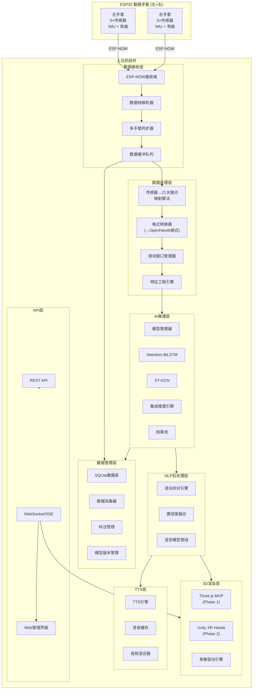

# SPEC-03: 上位机软件架构规范

> **版本**: v1.0.0
> **日期**: 2025-07-11
> **状态**: Draft
> **负责人**: AI系统架构师
> **关联文档**: SPEC-01(系统总览)、SPEC-02(硬件规范)、SPEC-04(AI流水线)、SPEC-05(3D渲染)

---

## 目录

1. [上位机系统总体架构](#1-上位机系统总体架构)
2. [数据接收模块](#2-数据接收模块)
3. [数据处理模块](#3-数据处理模块)
4. [AI推理模块](#4-ai推理模块)
5. [NLP后处理模块](#5-nlp后处理模块)
6. [TTS模块](#6-tts模块)
7. [数据管理模块](#7-数据管理模块)
8. [REST API设计](#8-rest-api设计)
9. [部署与运维](#9-部署与运维)

---

## 1. 上位机系统总体架构

### 1.1 架构概述

上位机软件是整个手语翻译系统的核心枢纽，承担着数据接收、预处理、AI推理、3D可视化和语音合成等关键职责。系统采用分层解耦的微内核架构，各模块通过定义清晰的接口进行通信，支持独立开发、测试和部署。整体设计遵循高内聚低耦合原则，每个模块可以独立替换和升级，例如AI推理模块可以从Attention-BiLSTM无缝切换到ST-GCN或其他模型，3D渲染模块可以从Three.js平滑过渡到Unity XR Hands。

系统运行环境支持Windows 10/11、Ubuntu 20.04+和macOS 12+，推荐使用Python 3.10+作为主运行时环境。上位机同时提供本地桌面应用模式（基于Electron或PyQt6）和远程Web服务模式（基于FastAPI），以满足不同使用场景的需求。在桌面模式下，所有模块运行在同一进程中以获得最低延迟；在Web服务模式下，数据处理和推理通过REST API暴露，3D渲染通过WebSocket推送数据到浏览器前端。

### 1.2 系统架构图



### 1.3 模块职责总表

| 模块 | 职责 | 输入 | 输出 | 技术栈 |
|------|------|------|------|--------|
| 数据接收层 | 接收ESP-NOW数据帧、解析协议、多手套同步 | ESP-NOW射频信号 | 结构化传感器数据 | Python + esptool/pyserial |
| 数据处理层 | 原始数据→关键点映射、格式转换、滑动窗口 | 传感器原始数据 | 标准化Pose序列 | NumPy, SciPy |
| AI推理层 | 手势识别模型推理、模型管理 | Pose特征序列 | 手势类别+置信度 | PyTorch, OpenHands |
| NLP后处理层 | 语法校对、置信度融合、上下文消歧 | 手势识别结果 | 自然语言文本 | 规则引擎/小LM |
| 3D渲染层 | 手部3D可视化、骨骼动画驱动 | 21关键点 + 手势结果 | 渲染画面 | Three.js / Unity |
| TTS层 | 文本→语音合成、语音缓存管理 | 文本字符串 | PCM音频流 | piper-tts / Azure |
| 数据管理层 | 数据采集、标注、模型版本管理 | 采集数据+标注 | 训练数据集 | SQLite, Alembic |
| API层 | 对外接口、实时推送 | HTTP请求 | JSON/WebSocket | FastAPI |

### 1.4 模块间通信机制

模块间通信采用发布-订阅（Pub/Sub）模式与直接函数调用相结合的混合架构。对于高频数据流（传感器数据→渲染），采用零拷贝的共享内存队列以降低延迟；对于低频控制流（模型加载、配置变更），采用事件总线（EventBus）模式异步通知。所有模块间传递的数据结构使用Python dataclass或Pydantic BaseModel定义，确保类型安全和序列化一致性。

核心数据管道采用生产者-消费者模式：数据接收模块作为生产者将解析后的数据帧推入RingBuffer，数据处理模块从Buffer消费数据进行预处理，AI推理模块消费处理后的特征数据进行推理。每个消费者可以设置独立的消费速率，避免下游处理能力不足导致上游阻塞。整个数据管道的设计端到端延迟目标是小于50ms（从传感器采集到推理结果输出）。

---

## 2. 数据接收模块

### 2.1 ESP-NOW接收端程序

ESP-NOW接收端程序是上位机与手套硬件之间的通信桥梁。由于ESP-NOW协议工作在2.4GHz频段的MAC层，上位机本身无法直接接收ESP-NOW信号，因此需要一个ESP32设备作为接收网关，将ESP-NOW数据包转发给上位机。该网关设备通过USB串口（UART）与上位机连接，采用自定义的二进制协议进行数据传输。网关固件基于ESP-IDF 4.4+开发，支持同时接收最多6个手套设备的数据。

网关固件的接收逻辑采用中断驱动+DMA方式，确保不丢失数据包。每个手套设备发送的数据帧包含：设备MAC地址（6字节）、时间戳（4字节）、帧序号（2字节）、传感器数据（10个弯曲值 × 2字节 + IMU六轴数据 × 12字节），总计约50字节。网关收到数据后立即通过UART转发给上位机，同时在内部维护一个环形缓冲区用于数据重传。上位机端的接收程序使用Python的`pyserial`库，以115200波特率打开串口，采用独立线程持续读取数据并解析。

```python
# espnow_receiver.py — ESP-NOW网关数据接收端
import serial
import struct
import threading
import time
from dataclasses import dataclass
from typing import Optional
from collections import deque
import logging

logger = logging.getLogger(__name__)

# 数据帧格式定义 (小端序)
# [Header(2B)] [MAC(6B)] [Timestamp(4B)] [SeqNum(2B)] [FlexData(20B)] [IMUData(24B)] [CRC16(2B)]
FRAME_HEADER = 0xAA55
FRAME_SIZE = 60  # 完整帧字节数

@dataclass
class SensorFrame:
    """单只手套的传感器数据帧"""
    mac_address: bytes          # 6字节设备MAC
    timestamp: float            # 接收时间戳 (秒)
    seq_num: int                # 帧序号
    flex_values: list[float]    # 10个弯曲传感器值 (0~4095 ADC)
    accel: tuple[float,float,float]   # 三轴加速度 (m/s²)
    gyro: tuple[float,float,float]    # 三轴角速度 (rad/s)
    quat: tuple[float,float,float,float]  # 四元数 (w,x,y,z)
    is_left: bool               # 是否左手
    rssi: int                   # 信号强度

@dataclass
class SyncFrame:
    """左右手同步帧"""
    left_hand: Optional[SensorFrame]
    right_hand: Optional[SensorFrame]
    sync_timestamp: float
    is_complete: bool  # 左右手数据是否齐全

class ESPNOWReceiver:
    """ESP-NOW数据接收器 (通过串口网关)"""

    def __init__(self, port: str = "/dev/ttyUSB0", baudrate: int = 115200):
        self.serial = serial.Serial(port, baudrate, timeout=0.01)
        self._running = False
        self._recv_thread: Optional[threading.Thread] = None
        self._frame_buffer = bytearray()
        self._left_buffer = deque(maxlen=100)
        self._right_buffer = deque(maxlen=100)
        self._device_registry: dict[bytes, bool] = {}  # MAC -> is_left
        self._sync_callback = None
        self._raw_callback = None
        self._stats = {"rx_frames": 0, "crc_errors": 0, "lost_frames": 0}

    def register_device(self, mac: bytes, is_left: bool):
        """注册手套设备MAC地址和左右手标识"""
        self._device_registry[mac] = is_left
        logger.info(f"注册设备: {mac.hex()} -> {'左手' if is_left else '右手'}")

    def on_sync_frame(self, callback):
        """注册同步帧回调"""
        self._sync_callback = callback

    def _parse_frame(self, data: bytes) -> Optional[SensorFrame]:
        """解析单帧数据"""
        if len(data) != FRAME_SIZE:
            return None
        header = struct.unpack_from('<H', data, 0)[0]
        if header != FRAME_HEADER:
            return None
        # CRC校验
        crc_calc = self._crc16(data[:-2])
        crc_recv = struct.unpack_from('<H', data, -2)[0]
        if crc_calc != crc_recv:
            self._stats["crc_errors"] += 1
            return None

        mac = data[2:8]
        timestamp = struct.unpack_from('<I', data, 8)[0] / 1000.0
        seq_num = struct.unpack_from('<H', data, 12)[0]
        # 弯曲传感器: 10个uint16
        flex = list(struct.unpack_from('<10H', data, 14))
        # IMU: 6个float32 (accel_x,y,z, gyro_x,y,z)
        imu = struct.unpack_from('<6f', data, 34)
        # 四元数: 4个float32
        quat = struct.unpack_from('<4f', data, 58)

        is_left = self._device_registry.get(mac, True)
        flex_norm = [v / 4095.0 for v in flex]  # 归一化到0~1

        return SensorFrame(
            mac_address=mac,
            timestamp=timestamp,
            seq_num=seq_num,
            flex_values=flex_norm,
            accel=imu[:3],
            gyro=imu[3:6],
            quat=quat,
            is_left=is_left,
            rssi=0  # RSSI在网关侧获取
        )

    @staticmethod
    def _crc16(data: bytes) -> int:
        """CRC16-CCITT校验"""
        crc = 0xFFFF
        for byte in data:
            crc ^= byte << 8
            for _ in range(8):
                if crc & 0x8000:
                    crc = (crc << 1) ^ 0x1021
                else:
                    crc <<= 1
                crc &= 0xFFFF
        return crc

    def _recv_loop(self):
        """数据接收主循环"""
        while self._running:
            try:
                raw = self.serial.read(self.serial.in_waiting or 1)
                if not raw:
                    continue
                self._frame_buffer.extend(raw)
                while len(self._frame_buffer) >= FRAME_SIZE:
                    frame_data = bytes(self._frame_buffer[:FRAME_SIZE])
                    self._frame_buffer = self._frame_buffer[FRAME_SIZE:]
                    frame = self._parse_frame(frame_data)
                    if frame:
                        self._stats["rx_frames"] += 1
                        self._dispatch_frame(frame)
            except Exception as e:
                logger.error(f"接收异常: {e}")

    def _dispatch_frame(self, frame: SensorFrame):
        """分发数据帧到对应缓冲区"""
        if frame.is_left:
            self._left_buffer.append(frame)
        else:
            self._right_buffer.append(frame)
        # 尝试同步
        self._try_sync()

    def _try_sync(self):
        """尝试同步左右手数据 (基于时间戳对齐)"""
        if not self._left_buffer or not self._right_buffer:
            return
        sync_window = 0.02  # 20ms同步窗口
        left = self._left_buffer[0]
        right = self._right_buffer[0]
        if abs(left.timestamp - right.timestamp) < sync_window:
            self._left_buffer.popleft()
            self._right_buffer.popleft()
            sync = SyncFrame(
                left_hand=left,
                right_hand=right,
                sync_timestamp=(left.timestamp + right.timestamp) / 2,
                is_complete=True
            )
            if self._sync_callback:
                self._sync_callback(sync)

    def start(self):
        """启动接收器"""
        self._running = True
        self._recv_thread = threading.Thread(target=self._recv_loop, daemon=True)
        self._recv_thread.start()
        logger.info("ESP-NOW接收器已启动")

    def stop(self):
        """停止接收器"""
        self._running = False
        if self._recv_thread:
            self._recv_thread.join(timeout=2)
        self.serial.close()
        logger.info(f"ESP-NOW接收器已停止. 统计: {self._stats}")
```

### 2.2 数据帧解析器

数据帧解析器负责将原始字节流转换为结构化的传感器数据对象。解析过程遵循严格的状态机模型，包含帧头检测、长度校验、CRC验证和数据解包四个阶段。状态机的设计确保即使在数据流中存在噪声或残缺帧的情况下，也能快速恢复同步状态。解析器维护一个滑动窗口用于帧头搜索，当检测到帧头标志（0xAA55）后，开始按协议定义逐字段解析。

解析器支持多种传感器数据格式的自动识别。不同版本的手套固件可能使用不同的数据编码方式（例如弯曲传感器可能使用12位ADC或16位ADC），解析器通过版本字段自动选择正确的解码策略。此外，解析器还内置了基本的异常值检测，当传感器读数超出物理合理范围时（例如弯曲角度超过180度或IMU加速度超过16g），会标记该帧为可疑数据，但不丢弃，而是附带警告标志传递给下游模块，由下游模块决定是否使用。

### 2.3 多手套同步器

多手套同步器解决的核心问题是确保左右手数据在时间维度上的精确对齐。在实际场景中，左右手套通过独立的ESP-NOW通道发送数据，由于无线通信的异步特性和网关轮询顺序的差异，两只手套的数据到达上位机的时间可能有几毫秒到几十毫秒的偏差。同步器采用基于时间戳的最近邻匹配算法，在可配置的时间窗口内寻找最佳的左右手帧配对。

同步策略支持三种模式：严格同步模式（要求左右手帧时间差小于5ms，否则丢弃较旧帧）、宽松同步模式（允许20ms内的时间差，取最近的帧配对）、单手模式（仅使用一只手套的数据，适用于单手手语识别）。默认使用宽松同步模式，该模式在数据完整性和延迟之间取得了良好的平衡。同步器还会持续监控同步质量，当丢帧率超过阈值时自动发出警告，并记录同步统计信息用于后续分析。

```python
# multi_glove_sync.py — 多手套同步器
from dataclasses import dataclass
from typing import Optional, Callable
from collections import deque
import time

@dataclass
class SyncConfig:
    """同步器配置"""
    sync_window_ms: float = 20.0    # 同步时间窗口 (毫秒)
    max_buffer_size: int = 50       # 单手缓冲区最大帧数
    stale_frame_age_ms: float = 100.0  # 过期帧最大存活时间
    mode: str = "loose"  # strict | loose | single

class MultiGloveSynchronizer:
    """多手套数据同步器"""

    def __init__(self, config: SyncConfig = None):
        self.config = config or SyncConfig()
        self._left_buffer = deque(maxlen=self.config.max_buffer_size)
        self._right_buffer = deque(maxlen=self.config.max_buffer_size)
        self._last_seq = {"left": -1, "right": -1}
        self._stats = {
            "sync_success": 0,
            "sync_miss_left": 0,
            "sync_miss_right": 0,
            "stale_dropped": 0,
            "avg_time_diff_ms": 0.0
        }

    def push_frame(self, frame):
        """推送传感器帧到缓冲区"""
        now = time.time() * 1000
        age = now - frame.timestamp * 1000
        if age > self.config.stale_frame_age_ms:
            self._stats["stale_dropped"] += 1
            return

        if frame.is_left:
            self._check_seq(frame.seq_num, "left")
            self._left_buffer.append(frame)
        else:
            self._check_seq(frame.seq_num, "right")
            self._right_buffer.append(frame)

        self._try_sync()

    def _check_seq(self, seq_num: int, hand: str):
        """检查帧序号连续性"""
        expected = self._last_seq[hand] + 1
        if seq_num > expected + 1:
            lost = seq_num - expected - 1
            logger.warning(f"{hand}手丢帧: 预期{expected}, 收到{seq_num}, 丢失{lost}帧")

    def _try_sync(self):
        """尝试同步左右手帧"""
        if not self._left_buffer or not self._right_buffer:
            return
        if self.config.mode == "single":
            # 单手模式: 直接输出先到的帧
            return

        left = self._left_buffer[0]
        right = self._right_buffer[0]
        time_diff = abs(left.timestamp - right.timestamp) * 1000

        if time_diff <= self.config.sync_window_ms:
            # 同步成功: 时间差在窗口内
            self._left_buffer.popleft()
            self._right_buffer.popleft()
            self._stats["sync_success"] += 1
            # 更新平均时间差 (EMA)
            alpha = 0.1
            self._stats["avg_time_diff_ms"] = (
                alpha * time_diff +
                (1 - alpha) * self._stats["avg_time_diff_ms"]
            )
            return SyncFrame(
                left_hand=left,
                right_hand=right,
                sync_timestamp=(left.timestamp + right.timestamp) / 2,
                is_complete=True
            )
        elif self.config.mode == "strict":
            # 严格模式: 丢弃较旧的帧
            if left.timestamp < right.timestamp:
                self._left_buffer.popleft()
                self._stats["sync_miss_right"] += 1
            else:
                self._right_buffer.popleft()
                self._stats["sync_miss_left"] += 1
        # loose模式下继续等待

    def get_stats(self) -> dict:
        """获取同步统计"""
        return dict(self._stats)
```

### 2.4 数据缓冲和队列管理

数据缓冲系统采用多级缓冲架构，以满足不同模块对数据吞吐量和延迟的不同需求。第一级是高速环形缓冲区（RingBuffer），位于数据接收层内部，用于吸收ESP-NOW数据到达时间的不均匀性（抖动），缓冲区大小默认为256帧（约2.5秒@100Hz），采用无锁设计以支持多生产者单消费者场景。第二级是滑动窗口缓冲区，位于数据处理层内部，用于维护固定长度的历史数据窗口（例如2秒的时序数据），供AI推理模块进行时序建模使用。

队列管理器实现了背压（backpressure）机制，当下游消费者处理速度跟不上上游生产速度时，会根据配置策略选择：丢弃最新帧（保持数据新鲜度）、丢弃最旧帧（保持数据完整性）或阻塞生产者（强制同步）。默认策略为丢弃最旧帧，以优先保证实时性。队列管理器还提供流量监控接口，实时报告各队列的长度、入队/出队速率和溢出次数，这些指标通过Prometheus格式暴露，可用于系统监控和告警。

```python
# data_buffer.py — 数据缓冲和队列管理
import threading
import time
from collections import deque
from enum import Enum
from typing import TypeVar, Generic, Optional, Callable

T = TypeVar('T')

class OverflowPolicy(Enum):
    DROP_OLDEST = "drop_oldest"     # 丢弃最旧帧 (默认)
    DROP_NEWEST = "drop_newest"     # 丢弃最新帧
    BLOCK = "block"                 # 阻塞等待

class RingBuffer(Generic[T]):
    """线程安全的环形缓冲区"""

    def __init__(self, capacity: int, overflow_policy: OverflowPolicy = OverflowPolicy.DROP_OLDEST):
        self._buffer: deque[T] = deque(maxlen=capacity)
        self._lock = threading.Lock()
        self._not_empty = threading.Condition(self._lock)
        self._overflow_policy = overflow_policy
        self._overflow_count = 0
        self._total_pushed = 0
        self._total_popped = 0

    def push(self, item: T, timeout: float = 0):
        """推入数据项"""
        with self._lock:
            if len(self._buffer) >= self._buffer.maxlen:
                self._overflow_count += 1
                if self._overflow_policy == OverflowPolicy.DROP_NEWEST:
                    return False
                elif self._overflow_policy == OverflowPolicy.BLOCK and timeout > 0:
                    start = time.time()
                    while len(self._buffer) >= self._buffer.maxlen:
                        elapsed = time.time() - start
                        if elapsed >= timeout:
                            return False
                        self._lock.wait(timeout - elapsed)

            self._buffer.append(item)
            self._total_pushed += 1
            self._not_empty.notify()
            return True

    def pop(self, timeout: float = 1.0) -> Optional[T]:
        """弹出数据项"""
        with self._not_empty:
            deadline = time.time() + timeout
            while not self._buffer:
                remaining = deadline - time.time()
                if remaining <= 0:
                    return None
                self._not_empty.wait(remaining)
            item = self._buffer.popleft()
            self._total_popped += 1
            return item

    def peek(self, count: int = 1) -> list[T]:
        """查看最近N项 (不移除)"""
        with self._lock:
            return list(self._buffer)[-count:]

    @property
    def size(self) -> int:
        with self._lock:
            return len(self._buffer)

    @property
    def stats(self) -> dict:
        with self._lock:
            return {
                "size": len(self._buffer),
                "capacity": self._buffer.maxlen,
                "overflow_count": self._overflow_count,
                "total_pushed": self._total_pushed,
                "total_popped": self._total_popped,
                "utilization": len(self._buffer) / self._buffer.maxlen
            }

class SlidingWindowBuffer:
    """滑动窗口缓冲区 — 维护固定时长的时序数据"""

    def __init__(self, window_duration_sec: float, sample_rate_hz: float):
        self._window_size = int(window_duration_sec * sample_rate_hz)
        self._buffer = deque(maxlen=self._window_size * 2)  # 双倍缓冲
        self._window_duration = window_duration_sec
        self._sample_rate = sample_rate_hz

    def add_frame(self, frame):
        """添加新帧"""
        self._buffer.append(frame)

    def get_window(self, duration: float = None) -> list:
        """获取指定时长的窗口数据"""
        duration = duration or self._window_duration
        count = int(duration * self._sample_rate)
        frames = list(self._buffer)
        return frames[-count:] if len(frames) >= count else frames

    def get_features(self) -> list:
        """获取窗口内所有帧的特征数据 (用于推理)"""
        frames = self.get_window()
        return [self._extract_features(f) for f in frames]
```

---

## 3. 数据处理模块

### 3.1 传感器原始数据→21关节Pose关键点映射算法

传感器数据到21关键点Pose的映射是整个数据处理管线的核心算法。每只手套配备10个弯曲传感器（5个手指各2个：PIP和DIP关节）和1个IMU（位于手背），需要推算出InterHand2.6M标准的21个三维关键点坐标。映射算法基于手部运动学模型（Kinematic Chain），采用正向运动学（Forward Kinematics, FK）方法，从已知的手腕位置出发，逐级计算各关节的旋转角度和空间位置。

手部骨骼层次结构如下：WRIST（手腕，根节点）→ THUMB_CMC → THUMB_MCP → THUMB_IP → THUMB_TIP（拇指4关节）；INDEX_MCP → INDEX_PIP → INDEX_DIP → INDEX_TIP（食指4关节）；MIDDLE_MCP → MIDDLE_PIP → MIDDLE_DIP → MIDDLE_TIP（中指4关节）；RING_MCP → RING_PIP → RING_DIP → RING_TIP（无名指4关节）；PINKY_MCP → PINKY_PIP → PINKY_DIP → PINKY_TIP（小指4关节）。总计21个关键点。

对于每个手指，弯曲传感器直接测量PIP和DIP关节的弯曲角度。MCP关节的弯曲角度通过PIP弯曲角度的线性回归估算（系数根据手部解剖学统计数据设定）。手指的横向展开（abduction）角度通过相邻手指的弯曲差值间接估算。IMU提供手腕的三维方向（四元数），用于将所有关节角度从传感器坐标系转换到世界坐标系。最终的21个关键点坐标通过正向运动学链式计算得到。

```python
# pose_mapper.py — 传感器数据→21关键点映射
import numpy as np
from scipy.spatial.transform import Rotation
from dataclasses import dataclass
from typing import Optional

# InterHand2.6M 标准的21个关键点名称
JOINT_NAMES = [
    "WRIST",
    "THUMB_CMC", "THUMB_MCP", "THUMB_IP", "THUMB_TIP",
    "INDEX_MCP", "INDEX_PIP", "INDEX_DIP", "INDEX_TIP",
    "MIDDLE_MCP", "MIDDLE_PIP", "MIDDLE_DIP", "MIDDLE_TIP",
    "RING_MCP", "RING_PIP", "RING_DIP", "RING_TIP",
    "PINKY_MCP", "PINKY_PIP", "PINKY_DIP", "PINKY_TIP"
]

# 各手指骨骼长度 (mm) — 标准成人手部比例
BONE_LENGTHS = {
    "thumb": [35.0, 25.0, 18.0, 15.0],    # CMC, MCP, IP, TIP
    "index": [45.0, 25.0, 16.0, 12.0],    # MCP, PIP, DIP, TIP
    "middle": [48.0, 27.0, 17.0, 13.0],
    "ring": [43.0, 25.0, 16.0, 12.0],
    "pinky": [32.0, 18.0, 13.0, 10.0],
    "palm": [70.0, 65.0, 60.0, 55.0],     # 手掌宽度参考
}

# 手指基础方向 (相对于手腕, 弧度)
FINGER_BASE_ANGLES = {
    "thumb": np.array([0.3, -0.5, 0.8]),    # 拇指特殊角度
    "index": np.array([0.1, 0.0, 0.0]),
    "middle": np.array([0.0, 0.0, 0.0]),
    "ring": np.array([-0.1, 0.0, 0.0]),
    "pinky": np.array([-0.2, 0.0, 0.0]),
}

@dataclass
class Pose21:
    """21关键点Pose数据"""
    joints: np.ndarray          # (21, 3) xyz坐标 (mm)
    joints_confidence: np.ndarray  # (21,) 各关节置信度
    wrist_quat: np.ndarray      # (4,) 手腕四元数 (w,x,y,z)
    timestamp: float
    hand_type: str              # "left" or "right"

class SensorToPoseMapper:
    """传感器数据→21关键点Pose映射器"""

    def __init__(self, is_left: bool = True):
        self.is_left = is_left
        self._bone_lengths = BONE_LENGTHS
        self._base_angles = FINGER_BASE_ANGLES
        # MCP弯曲角度估算系数 (基于PIP弯曲的线性回归)
        self._mcp_coefficients = {
            "thumb": 0.6, "index": 0.5, "middle": 0.45,
            "ring": 0.5, "pinky": 0.55
        }

    def map(self, flex_values: list, quat: tuple,
            accel: tuple = None) -> Pose21:
        """
        将传感器数据映射为21关键点Pose

        Args:
            flex_values: 10个弯曲传感器归一化值 (0~1)
                [拇指PIP, 拇指DIP, 食指PIP, 食指DIP, ..., 小指PIP, 小指DIP]
            quat: 手腕四元数 (w, x, y, z)
            accel: 三轴加速度 (可选, 用于改善手腕位置估算)

        Returns:
            Pose21: 21关键点Pose
        """
        # 1. 解析弯曲角度 (归一化值→角度)
        finger_names = ["thumb", "index", "middle", "ring", "pinky"]
        flex_angles = {}  # {finger: {pip: angle, dip: angle, mcp: angle}}
        for i, finger in enumerate(finger_names):
            pip_val = flex_values[i * 2]
            dip_val = flex_values[i * 2 + 1]
            pip_angle = pip_val * np.pi  # 0~180度
            dip_angle = dip_val * np.pi * 0.8  # DIP活动范围略小
            mcp_angle = pip_angle * self._mcp_coefficients[finger]
            flex_angles[finger] = {
                "mcp": mcp_angle, "pip": pip_angle, "dip": dip_angle
            }

        # 2. 获取手腕方向
        wrist_rot = Rotation.from_quat([quat[1], quat[2], quat[3], quat[0]])

        # 3. 正向运动学计算21个关节位置
        joints = np.zeros((21, 3), dtype=np.float32)
        confidence = np.ones(21, dtype=np.float32)

        # 手腕位于原点
        joints[0] = [0.0, 0.0, 0.0]  # WRIST

        # 逐手指计算
        for finger_idx, finger_name in enumerate(finger_names):
            base_idx = 1 + finger_idx * 4
            angles = flex_angles[finger_name]
            base_dir = self._base_angles[finger_name]

            # 将基础方向转换到世界坐标
            base_dir_world = wrist_rot.apply(base_dir)

            # MCP关节
            current_pos = joints[0].copy()
            mcp_bend = np.array([0, 0, -angles["mcp"]])
            current_rot = Rotation.from_rotvec(mcp_bend) * wrist_rot
            mcp_offset = current_rot.apply(np.array([0, 0, 1])) * \
                         self._bone_lengths[finger_name][0]
            joints[base_idx] = current_pos + mcp_offset

            # PIP关节
            pip_bend = np.array([0, 0, -angles["pip"]])
            pip_rot = Rotation.from_rotvec(pip_bend) * current_rot
            pip_offset = pip_rot.apply(np.array([0, 0, 1])) * \
                         self._bone_lengths[finger_name][1]
            joints[base_idx + 1] = joints[base_idx] + pip_offset

            # DIP关节
            dip_bend = np.array([0, 0, -angles["dip"]])
            dip_rot = Rotation.from_rotvec(dip_bend) * pip_rot
            dip_offset = dip_rot.apply(np.array([0, 0, 1])) * \
                         self._bone_lengths[finger_name][2]
            joints[base_idx + 2] = joints[base_idx + 1] + dip_offset

            # TIP关节
            tip_offset = dip_rot.apply(np.array([0, 0, 1])) * \
                         self._bone_lengths[finger_name][3]
            joints[base_idx + 3] = joints[base_idx + 2] + tip_offset

        return Pose21(
            joints=joints,
            joints_confidence=confidence,
            wrist_quat=np.array(quat, dtype=np.float32),
            timestamp=time.time(),
            hand_type="left" if self.is_left else "right"
        )
```

### 3.2 数据格式转换

数据格式转换模块负责将内部Pose数据转换为OpenHands框架要求的标准输入格式。OpenHands框架期望的输入格式为NumPy数组，维度为`[batch_size, num_frames, num_joints, joint_dim]`，其中`num_joints=21`，`joint_dim=3`（xyz坐标）。转换器还支持输出为归一化坐标（相对于手腕的偏移量）或绝对坐标，以及可选的速度特征（关节位移的一阶导数）和加速度特征（二阶导数）。

此外，转换器支持将数据导出为多种标准格式，用于离线训练和模型评估：CSV格式（兼容WLASL、CSL等公开数据集）、NPZ格式（NumPy压缩格式，适合大规模数据）、JSON格式（人类可读，适合数据检查和调试）。所有格式均包含完整的元数据：采集时间、设备ID、采集环境参数、标注信息等。格式转换器还实现了数据增强功能，包括随机旋转、缩放、高斯噪声注入和时间轴微调，这些增强功能在训练数据准备阶段使用。

### 3.3 滑动窗口管理

滑动窗口管理器是连接数据处理模块和AI推理模块的关键组件。手语识别本质上是一个时序分类任务，模型需要观察一段连续时间内的手部运动才能做出准确判断。滑动窗口管理器维护一个固定长度的环形缓冲区，持续接收新的Pose帧，并在每次更新后输出一个完整的窗口数据供推理模块使用。

窗口参数可配置：默认窗口大小为30帧（约0.5秒@60Hz采集率），步长为1帧（即每接收一帧新数据就输出一次推理结果），窗口之间有29帧的重叠。这种高重叠率的滑动窗口设计可以实现接近实时的推理响应，同时保证模型有足够的时序上下文。窗口管理器还支持动态窗口大小调整：当检测到"手势开始"信号时，自动增大窗口以捕获更长的时序特征；当识别到"手势结束"时，缩小窗口以提高响应速度。

```python
# sliding_window.py — 滑动窗口管理器
import numpy as np
from collections import deque
from typing import Optional, Callable
from dataclasses import dataclass

@dataclass
class WindowConfig:
    """滑动窗口配置"""
    window_size: int = 30        # 窗口帧数
    step_size: int = 1           # 步长帧数
    sample_rate: float = 60.0    # 采样率 (Hz)
    min_window_size: int = 10    # 最小有效窗口
    max_window_size: int = 60    # 最大窗口 (动态调整上限)
    padding_mode: str = "zero"   # zero | edge | reflect

class SlidingWindowManager:
    """滑动窗口管理器"""

    def __init__(self, config: WindowConfig = None):
        self.config = config or WindowConfig()
        self._buffer = deque(maxlen=self.config.max_window_size)
        self._frame_count = 0
        self._step_counter = 0
        self._on_window_ready: Optional[Callable] = None

    def set_callback(self, callback: Callable):
        """设置窗口就绪回调"""
        self._on_window_ready = callback

    def push_frame(self, pose_data: np.ndarray):
        """
        推入新帧, 当累积足够帧数后触发窗口输出

        Args:
            pose_data: 单帧Pose数据, shape (21, 3) 或 (21, 4) 含置信度
        """
        self._buffer.append(pose_data)
        self._frame_count += 1
        self._step_counter += 1

        # 检查是否到达步长
        if self._step_counter >= self.config.step_size:
            self._step_counter = 0
            window = self._get_current_window()
            if window is not None and self._on_window_ready:
                self._on_window_ready(window)

    def _get_current_window(self) -> Optional[np.ndarray]:
        """获取当前窗口数据"""
        frames = list(self._buffer)
        if len(frames) < self.config.min_window_size:
            return None

        # 填充到窗口大小
        window_data = np.stack(frames, axis=0)  # (N, 21, 3)
        if window_data.shape[0] < self.config.window_size:
            pad_size = self.config.window_size - window_data.shape[0]
            if self.config.padding_mode == "zero":
                padding = np.zeros((pad_size, *window_data.shape[1:]))
            elif self.config.padding_mode == "edge":
                padding = np.repeat(window_data[:1], pad_size, axis=0)
            elif self.config.padding_mode == "reflect":
                padding = np.flip(window_data[:pad_size], axis=0)
            else:
                padding = np.zeros((pad_size, *window_data.shape[1:]))
            window_data = np.concatenate([padding, window_data], axis=0)

        return window_data  # (window_size, 21, 3)

    def get_window_duration(self) -> float:
        """获取当前窗口时长 (秒)"""
        return self.config.window_size / self.config.sample_rate

    def reset(self):
        """重置窗口"""
        self._buffer.clear()
        self._frame_count = 0
        self._step_counter = 0
```

---

## 4. AI推理模块

### 4.1 OpenHands框架集成方案

OpenHands框架是一个专注于手语识别的开源深度学习框架，支持多种网络架构（BiLSTM、Transformer、ST-GCN、SL-GCN）和多个数据集（包括中国手语CSL数据集）。集成方案采用"框架内嵌+适配器"模式：OpenHands作为核心推理引擎嵌入上位机软件，通过适配器层屏蔽框架内部细节，对外暴露统一的推理接口。

集成步骤分为三个阶段：第一阶段是环境搭建和依赖安装，OpenHands基于PyTorch构建，需要安装PyTorch 2.0+和框架所需的CUDA支持（如果有GPU）；第二阶段是数据适配，将本项目的21关键点Pose数据转换为OpenHands期望的数据格式（SkelData格式），编写自定义数据集加载器；第三阶段是模型集成，加载预训练模型或微调后的模型，封装推理API。

OpenHands框架的核心优势在于其模块化设计，可以方便地替换不同的backbone网络。在本项目中，Phase1使用Attention-BiLSTM作为主模型（论文12证明其在CSL数据集上达到98.85%准确率），Phase2可以评估ST-GCN在空间-时间建模上的优势，选择更优模型。框架还提供了完善的训练、验证和评估工具链，可以直接复用于自定义数据集的训练。

### 4.2 Attention-BiLSTM模型配置

Attention-BiLSTM是本项目的主力手语识别模型，结合了双向长短期记忆网络（BiLSTM）对时序数据的强大建模能力和注意力机制（Attention）对关键帧的自动聚焦能力。模型配置如下：

- **输入维度**: 每帧21个关节 × 3维坐标 = 63维特征向量
- **BiLSTM层数**: 2层，隐藏维度256，双向拼接后输出512维
- **注意力机制**: 多头自注意力（Multi-Head Self-Attention），8个注意力头，维度64
- **分类器**: 全连接层 + Softmax，输出维度=手势类别数（CSL数据集500类）
- **Dropout率**: 0.3（训练时），0.0（推理时）
- **激活函数**: GELU
- **序列长度**: 可变长度，最大60帧（1秒@60Hz）

模型推理配置参数需要根据部署环境调整。在GPU环境（NVIDIA RTX 3060及以上）下，batch_size可设为32，使用FP16半精度推理；在CPU环境下，batch_size设为8，使用INT8量化模型以加速推理。推理延迟目标：单次推理<20ms（GPU）或<100ms（CPU）。

```python
# model_config.py — Attention-BiLSTM 模型配置
from dataclasses import dataclass, field
from typing import Optional
import torch

@dataclass
class AttentionBiLSTMConfig:
    """Attention-BiLSTM 模型配置"""

    # 输入配置
    num_joints: int = 21               # 关节数量
    joint_dim: int = 3                 # 每关节维度 (xyz)
    input_dim: int = 63                # = num_joints * joint_dim
    include_velocity: bool = True      # 是否包含速度特征
    max_seq_len: int = 60              # 最大序列长度

    # BiLSTM配置
    lstm_hidden_dim: int = 256         # LSTM隐藏维度
    lstm_num_layers: int = 2           # LSTM层数
    lstm_dropout: float = 0.3          # LSTM层间Dropout
    bidirectional: bool = True         # 双向LSTM

    # Attention配置
    attention_heads: int = 8           # 多头注意力头数
    attention_dim: int = 64            # 每头维度
    attention_dropout: float = 0.1

    # 分类器配置
    num_classes: int = 500             # CSL数据集500类
    classifier_dropout: float = 0.3

    # 训练配置
    learning_rate: float = 1e-3
    weight_decay: float = 1e-4
    scheduler: str = "cosine"          # cosine | step | plateau
    warmup_epochs: int = 5
    max_epochs: int = 100

    # 推理配置
    inference_mode: str = "streaming"  # streaming | batch
    confidence_threshold: float = 0.6  # 置信度阈值
    smoothing_window: int = 5          # 结果平滑窗口

    # 量化配置
    quantize: bool = False             # 是否使用量化模型
    quant_dtype: str = "int8"          # int8 | fp16

    # 模型路径
    model_path: Optional[str] = None
    device: str = "auto"               # auto | cuda | cpu

    def get_device(self) -> torch.device:
        if self.device == "auto":
            return torch.device("cuda" if torch.cuda.is_available() else "cpu")
        return torch.device(self.device)

    @property
    def effective_input_dim(self) -> int:
        """实际输入维度 (含速度特征)"""
        dim = self.input_dim
        if self.include_velocity:
            dim *= 2  # 位置 + 速度
        return dim

# 预定义配置
CSL_CONFIG = AttentionBiLSTMConfig(
    num_classes=500,
    model_path="models/attention_bilstm_csl_v1.pth",
    confidence_threshold=0.65,
)

CUSTOM_CONFIG = AttentionBiLSTMConfig(
    num_classes=100,   # 自定义数据集类别数
    model_path="models/attention_bilstm_custom_v1.pth",
    confidence_threshold=0.7,
    max_epochs=50,
)
```

### 4.3 推理API封装

推理API封装为上层应用提供简洁、统一的模型推理接口，屏蔽底层框架细节。API设计遵循以下原则：同步/异步双模式支持（短时间序列使用同步推理，长时间序列使用异步推理）、自动批处理（将连续的多个推理请求合并为一个batch以提高GPU利用率）、结果缓存和去重（避免对相似帧重复推理）、优雅降级（当GPU不可用时自动切换到CPU推理）。

```python
# inference_engine.py — AI推理引擎
import torch
import torch.nn as nn
import numpy as np
import asyncio
import logging
from typing import Optional, List, Dict, Any
from dataclasses import dataclass
from collections import deque
import time

logger = logging.getLogger(__name__)

@dataclass
class InferenceResult:
    """推理结果"""
    gesture_id: int               # 手势ID
    gesture_name: str             # 手势名称 (中文)
    confidence: float             # 置信度 (0~1)
    all_probabilities: np.ndarray # 所有类别的概率分布
    latency_ms: float             # 推理延迟 (毫秒)
    timestamp: float              # 推理时间戳

@dataclass
class SmoothingResult:
    """平滑后的最终识别结果"""
    gesture_id: int
    gesture_name: str
    confidence: float
    is_stable: bool               # 是否稳定 (连续N帧一致)
    stable_count: int             # 稳定帧数
    timestamp: float

class InferenceEngine:
    """AI推理引擎 — 统一推理API"""

    def __init__(self, config, model: nn.Module, label_map: Dict[int, str]):
        self.config = config
        self.model = model
        self.label_map = label_map
        self.device = config.get_device()
        self.model.to(self.device)
        self.model.eval()

        # 结果平滑器
        self._result_buffer = deque(maxlen=config.smoothing_window)
        self._last_stable_result: Optional[SmoothingResult] = None

        # 性能统计
        self._stats = {
            "total_inferences": 0,
            "avg_latency_ms": 0.0,
            "max_latency_ms": 0.0,
            "gpu_memory_used_mb": 0.0,
        }

        logger.info(f"推理引擎初始化完成: device={self.device}, "
                     f"classes={config.num_classes}")

    @torch.no_grad()
    def infer(self, pose_sequence: np.ndarray) -> InferenceResult:
        """
        执行单次推理

        Args:
            pose_sequence: Pose序列, shape (seq_len, 21, 3) 或 (seq_len, 63)

        Returns:
            InferenceResult: 推理结果
        """
        start_time = time.perf_counter()

        # 数据预处理
        if pose_sequence.ndim == 3:
            # (seq_len, 21, 3) → (1, seq_len, 63)
            x = pose_sequence.reshape(pose_sequence.shape[0], -1)
            x = np.expand_dims(x, axis=0)
        else:
            x = np.expand_dims(pose_sequence, axis=0)

        # 归一化
        x = self._normalize(x)

        # 添加速度特征
        if self.config.include_velocity:
            x = self._add_velocity(x)

        # 转换为Tensor
        tensor = torch.from_numpy(x).float().to(self.device)

        # 推理
        if self.config.quantize:
            tensor = self._quantize_input(tensor)
            logits = self._quantized_forward(tensor)
        else:
            logits = self.model(tensor)

        # 后处理
        probabilities = torch.softmax(logits, dim=-1).cpu().numpy()[0]
        gesture_id = int(np.argmax(probabilities))
        confidence = float(probabilities[gesture_id])

        latency = (time.perf_counter() - start_time) * 1000
        self._update_stats(latency)

        result = InferenceResult(
            gesture_id=gesture_id,
            gesture_name=self.label_map.get(gesture_id, f"unknown_{gesture_id}"),
            confidence=confidence,
            all_probabilities=probabilities,
            latency_ms=latency,
            timestamp=time.time()
        )

        return result

    def infer_with_smoothing(self, pose_sequence: np.ndarray) -> SmoothingResult:
        """推理 + 结果平滑"""
        result = self.infer(pose_sequence)
        self._result_buffer.append(result)

        # 多数投票平滑
        if len(self._result_buffer) >= 3:
            gesture_counts = {}
            conf_sums = {}
            for r in self._result_buffer:
                gid = r.gesture_id
                gesture_counts[gid] = gesture_counts.get(gid, 0) + 1
                conf_sums[gid] = conf_sums.get(gid, 0) + r.confidence

            best_gid = max(gesture_counts, key=gesture_counts.get)
            stable_count = gesture_counts[best_gid]
            avg_conf = conf_sums[best_gid] / stable_count

            is_stable = (stable_count >= self.config.smoothing_window - 1 and
                        avg_conf >= self.config.confidence_threshold)

            if is_stable:
                self._last_stable_result = SmoothingResult(
                    gesture_id=best_gid,
                    gesture_name=self.label_map.get(best_gid, f"unknown_{best_gid}"),
                    confidence=avg_conf,
                    is_stable=True,
                    stable_count=stable_count,
                    timestamp=time.time()
                )
                return self._last_stable_result

        # 返回上次稳定结果或当前结果
        if self._last_stable_result:
            return self._last_stable_result
        return SmoothingResult(
            gesture_id=result.gesture_id,
            gesture_name=result.gesture_name,
            confidence=result.confidence,
            is_stable=False,
            stable_count=1,
            timestamp=time.time()
        )

    def _normalize(self, x: np.ndarray) -> np.ndarray:
        """数据归一化"""
        # 相对手腕位置归一化
        if x.shape[-1] >= 63:
            wrist = x[:, :, :3]  # (batch, seq, 3)
            x = x - np.concatenate([wrist] * (x.shape[-1] // 3), axis=-1)
        return x

    def _add_velocity(self, x: np.ndarray) -> np.ndarray:
        """添加速度特征 (一阶差分)"""
        velocity = np.zeros_like(x)
        velocity[:, 1:, :] = x[:, 1:, :] - x[:, :-1, :]
        velocity[:, 0, :] = 0  # 第一帧速度为零
        return np.concatenate([x, velocity], axis=-1)

    def _update_stats(self, latency_ms: float):
        """更新性能统计"""
        self._stats["total_inferences"] += 1
        alpha = 0.05
        self._stats["avg_latency_ms"] = (
            alpha * latency_ms +
            (1 - alpha) * self._stats["avg_latency_ms"]
        )
        self._stats["max_latency_ms"] = max(
            self._stats["max_latency_ms"], latency_ms
        )
        if torch.cuda.is_available():
            self._stats["gpu_memory_used_mb"] = (
                torch.cuda.memory_allocated() / 1024 / 1024
            )

    def get_stats(self) -> dict:
        return dict(self._stats)
```

### 4.4 批处理 vs 流式推理

推理模式分为批处理（Batch Inference）和流式推理（Streaming Inference）两种。批处理模式适用于离线分析和大规模数据集评估，将多个样本组成一个batch一次性送入模型推理，充分利用GPU并行计算能力，吞吐量高但延迟大（需要等待整个batch准备完毕）。流式推理模式适用于实时交互场景，每收到一个滑动窗口就立即进行推理，延迟低但GPU利用率可能不足。

在本项目中，实时交互场景使用流式推理模式，滑动窗口步长为1帧（每帧触发一次推理），推理结果通过回调函数立即返回。为了兼顾吞吐量，推理引擎内部实现了一个微型批处理优化：当推理请求到达速率超过处理速率时，自动将最近N个请求合并为一个batch处理，然后分别返回各自的结果。这种动态批处理策略在保持低延迟的同时提高了GPU利用率。

### 4.5 模型热更新机制

模型热更新允许在不停止系统运行的情况下替换AI模型，这对于持续改进模型质量和部署新版本至关重要。热更新机制采用"双缓冲区"设计：维护两个模型实例（当前模型A和待切换模型B），更新流程为：1）加载新模型到实例B；2）在新模型B上运行验证集进行冒烟测试；3）验证通过后，原子切换指针使B成为当前模型；4）释放旧模型A的内存。

更新触发方式支持三种：手动触发（通过REST API调用）、定时检查（定期从模型服务器检查新版本）、自动OTA（当训练流水线完成新模型训练后自动推送）。模型版本管理遵循语义化版本规范（SemVer），每次更新记录版本号、训练数据集版本、评估指标和更新说明。如果新模型验证失败，系统自动回滚到上一个稳定版本，确保服务不中断。

```python
# model_manager.py — 模型管理器 (热更新)
import torch
import threading
import logging
import hashlib
import json
import os
from pathlib import Path
from typing import Optional, Dict
from dataclasses import dataclass, field
from datetime import datetime

logger = logging.getLogger(__name__)

@dataclass
class ModelVersion:
    """模型版本信息"""
    version: str                   # 语义化版本号 (e.g. "1.2.3")
    model_path: str                # 模型文件路径
    config_path: str               # 配置文件路径
    accuracy: float                # 验证集准确率
    f1_score: float                # F1分数
    latency_ms: float              # 平均推理延迟
    created_at: str                # 创建时间
    checksum: str                  # 文件校验和
    is_active: bool = False        # 是否为当前活跃模型
    metadata: Dict = field(default_factory=dict)

class ModelManager:
    """模型管理器 — 支持热更新和版本管理"""

    def __init__(self, model_dir: str = "models"):
        self.model_dir = Path(model_dir)
        self.model_dir.mkdir(parents=True, exist_ok=True)
        self._current_model: Optional[torch.nn.Module] = None
        self._pending_model: Optional[torch.nn.Module] = None
        self._current_version: Optional[ModelVersion] = None
        self._lock = threading.RLock()
        self._version_history: list[ModelVersion] = []

    def load_model(self, version: ModelVersion) -> bool:
        """加载模型"""
        try:
            model = torch.jit.load(version.model_path) if version.model_path.endswith('.pt') \
                    else torch.load(version.model_path)
            model.eval()
            with self._lock:
                self._current_model = model
                # 标记旧版本为非活跃
                for v in self._version_history:
                    v.is_active = False
                version.is_active = True
                self._current_version = version
            logger.info(f"模型加载成功: {version.version}")
            return True
        except Exception as e:
            logger.error(f"模型加载失败: {e}")
            return False

    def hot_update(self, model_path: str, config_path: str = None,
                   validation_fn = None) -> bool:
        """
        热更新模型

        Args:
            model_path: 新模型文件路径
            config_path: 配置文件路径
            validation_fn: 验证函数 (model) -> bool

        Returns:
            bool: 是否更新成功
        """
        try:
            # 加载新模型到待切换缓冲区
            new_model = torch.load(model_path)
            new_model.eval()

            # 运行验证
            if validation_fn:
                if not validation_fn(new_model):
                    logger.warning("新模型验证失败, 取消更新")
                    return False

            # 创建版本信息
            checksum = self._compute_checksum(model_path)
            version = ModelVersion(
                version=self._generate_version(),
                model_path=model_path,
                config_path=config_path or "",
                accuracy=0.0,  # 由验证函数填写
                f1_score=0.0,
                latency_ms=0.0,
                created_at=datetime.now().isoformat(),
                checksum=checksum,
            )

            # 原子切换
            with self._lock:
                self._pending_model = new_model
                self._current_model = self._pending_model
                self._pending_model = None
                for v in self._version_history:
                    v.is_active = False
                version.is_active = True
                self._current_version = version
                self._version_history.append(version)

            logger.info(f"模型热更新成功: {version.version}")
            return True

        except Exception as e:
            logger.error(f"模型热更新失败: {e}")
            return False

    def get_current_model(self) -> Optional[torch.nn.Module]:
        """获取当前活跃模型"""
        with self._lock:
            return self._current_model

    def get_current_version(self) -> Optional[ModelVersion]:
        """获取当前版本信息"""
        with self._lock:
            return self._current_version

    def rollback(self, target_version: str = None) -> bool:
        """回滚到指定版本"""
        if target_version:
            version = next((v for v in self._version_history
                          if v.version == target_version), None)
        else:
            # 回滚到上一个版本
            active_idx = next((i for i, v in enumerate(self._version_history)
                              if v.is_active), -1)
            if active_idx > 0:
                version = self._version_history[active_idx - 1]
            else:
                logger.warning("没有可回滚的版本")
                return False

        if version:
            return self.load_model(version)
        return False

    @staticmethod
    def _compute_checksum(file_path: str) -> str:
        """计算文件MD5校验和"""
        md5 = hashlib.md5()
        with open(file_path, 'rb') as f:
            for chunk in iter(lambda: f.read(8192), b''):
                md5.update(chunk)
        return md5.hexdigest()

    def _generate_version(self) -> str:
        """生成下一个版本号"""
        if not self._version_history:
            return "1.0.0"
        last = self._version_history[-1]
        parts = last.version.split('.')
        parts[-1] = str(int(parts[-1]) + 1)
        return '.'.join(parts)
```

---

## 5. NLP后处理模块

### 5.1 手语→文本语法校对

手语和自然语言（书面汉语）之间存在显著的语法差异。中国手语（CSL）的语法结构更接近SOV（主语-宾语-动词）语序，而书面汉语采用SVO（主语-动词-宾语）语序。此外，手语表达通常省略虚词（如"的"、"了"、"吗"等），且缺乏时态和语态的显式标记。NLP后处理模块的核心任务是将手势识别输出的"手语词序列"转换为符合书面汉语语法的自然语言句子。

语法校对引擎采用规则系统与轻量级语言模型相结合的混合策略。规则系统负责处理高频的手语-汉语语法转换模式，例如语序调整（SOV→SVO）、虚词插入（在手语名词前插入"的"）、时态补充（根据上下文添加"了"、"过"等时态标记）。轻量级语言模型（基于DistilBERT-Chinese或类似的小型预训练模型）负责处理规则无法覆盖的复杂场景，例如上下文指代消解和语义歧义消歧。

```python
# nlp_postprocessor.py — NLP后处理模块
from typing import List, Optional
from dataclasses import dataclass
import re

@dataclass
class GestureToken:
    """手势识别输出的单个token"""
    gesture_id: int
    gesture_name: str    # 手语词汇 (如 "我", "爱", "中国")
    confidence: float
    timestamp: float

@dataclass
class ProcessedSentence:
    """处理后的句子"""
    original: str            # 原始手语序列
    corrected: str           # 语法校正后的文本
    confidence: float        # 综合置信度
    grammar_rules_applied: List[str]  # 应用的语法规则

class SignLanguagePostProcessor:
    """手语→文本 后处理器"""

    # 手语常用语法转换规则 (SOV → SVO)
    GRAMMAR_RULES = {
        "sov_to_svo": {
            "description": "SOV语序转SVO",
            "patterns": [
                # (主语, 宾语, 动词) → (主语, 动词, 宾语)
                (r"(.+?)(我|你|他|她)(.+?)(吃|喝|看|读|写|爱|喜欢)(.+?)",
                 r"\1\2\4\3\5"),
            ]
        },
        "particle_insertion": {
            "description": "虚词插入",
            "rules": {
                "的": ["形容词", "名词"] + ["名词"],  # 形容词+名词 → 形容词+的+名词
                "了": ["动词"] + ["完成"],  # 动词+完成标志 → 动词+了
                "吗": ["疑问句末尾"],
            }
        },
        "reduplication": {
            "description": "动词重叠 (表示短暂动作)",
            "patterns": [
                (r"看(?!过|了)", "看一看"),
                (r"想(?!法|到)", "想一想"),
            ]
        },
        "classifier_handling": {
            "description": "量词处理",
            "rules": {
                "人": "个", "书": "本", "车": "辆",
                "花": "朵", "鸟": "只", "水": "杯"
            }
        }
    }

    def __init__(self, use_neural_lm: bool = False):
        self.use_neural_lm = use_neural_lm
        self._lm_model = None
        if use_neural_lm:
            self._load_neural_lm()

    def process(self, gesture_tokens: List[GestureToken]) -> ProcessedSentence:
        """
        处理手势token序列, 输出自然语言句子

        Args:
            gesture_tokens: 手势识别输出的token序列

        Returns:
            ProcessedSentence: 处理后的句子
        """
        # 1. 组合原始序列
        original = " ".join(t.gesture_name for t in gesture_tokens)
        rules_applied = []

        # 2. 置信度过滤 (低置信度token标记为未知)
        filtered_tokens = [t for t in gesture_tokens
                          if t.confidence >= 0.3]
        text = "".join(t.gesture_name for t in filtered_tokens)

        # 3. 规则-based语法校正
        text = self._apply_grammar_rules(text, rules_applied)

        # 4. 神经LM优化 (可选)
        if self.use_neural_lm and self._lm_model:
            text = self._neural_lm_correct(text)

        # 5. 计算综合置信度
        avg_conf = sum(t.confidence for t in gesture_tokens) / \
                   max(len(gesture_tokens), 1)

        return ProcessedSentence(
            original=original,
            corrected=text,
            confidence=avg_conf,
            grammar_rules_applied=rules_applied
        )

    def _apply_grammar_rules(self, text: str,
                              rules_applied: list) -> str:
        """应用语法校正规则"""
        # SOV → SVO 转换
        for pattern, replacement in self.GRAMMAR_RULES["sov_to_svo"]["patterns"]:
            new_text = re.sub(pattern, replacement, text)
            if new_text != text:
                rules_applied.append("SOV→SVO语序调整")
                text = new_text

        # 虚词插入
        text = self._insert_particles(text, rules_applied)

        # 量词处理
        text = self._handle_classifiers(text, rules_applied)

        return text

    def _insert_particles(self, text: str, rules_applied: list) -> str:
        """插入虚词"""
        # 简单的虚词插入逻辑
        # 在句末添加合适的语气助词
        if text and text[-1] not in "的了吗呢啊呀吧哦":
            # 检查是否为疑问句 (通过上下文判断)
            text = text + "。"  # 默认添加句号
            rules_applied.append("句末标点添加")

        return text

    def _handle_classifiers(self, text: str, rules_applied: list) -> str:
        """处理量词"""
        for noun, classifier in self.GRAMMAR_RULES["classifier_handling"]["rules"].items():
            # 数字+名词 → 数字+量词+名词
            pattern = rf"(\d+){noun}"
            replacement = rf"\1{classifier}{noun}"
            new_text = re.sub(pattern, replacement, text)
            if new_text != text:
                rules_applied.append(f"量词插入: {classifier}")
                text = new_text

        return text

    def _load_neural_lm(self):
        """加载神经语言模型 (可选)"""
        try:
            from transformers import AutoModelForMaskedLM, AutoTokenizer
            model_name = "distilbert-base-chinese"
            self._lm_tokenizer = AutoTokenizer.from_pretrained(model_name)
            self._lm_model = AutoModelForMaskedLM.from_pretrained(model_name)
            logger.info("神经语言模型加载成功")
        except ImportError:
            logger.warning("transformers未安装, 使用纯规则模式")
            self.use_neural_lm = False
```

### 5.2 语言模型选择

语言模型的选择需要在质量、速度和资源消耗之间取得平衡。三种可选方案如下：

**方案一：纯规则系统**。基于手语语法研究论文编写的手语→汉语转换规则集，覆盖常见的语法模式。优点：推理速度极快（<1ms），无额外资源消耗，行为确定性。缺点：覆盖面有限，难以处理复杂语义和上下文依赖。

**方案二：轻量级神经LM**。使用DistilBERT-Chinese或类似的小型预训练模型（约66M参数），通过少量手语-汉语平行语料微调。优点：能处理规则无法覆盖的情况，语义理解更好。缺点：需要GPU推理，增加约50ms延迟，模型体积约250MB。

**方案三：生成式LLM**。使用小型生成式语言模型（如Qwen-1.5-1.8B-Chat），通过prompt engineering实现手语→汉语翻译。优点：翻译质量最高，能处理复杂的语义转换。缺点：资源消耗大，推理延迟高（>500ms），需要至少4GB VRAM。

**推荐方案**：Phase1使用方案一（纯规则系统），Phase2根据实际需求评估是否升级到方案二。对于大部分常见手语表达，规则系统已经足够。如果用户的表达涉及复杂的语义推理或文学性内容，再引入神经LM。

### 5.3 置信度融合

置信度融合机制将AI推理模块输出的原始概率分布与上下文信息结合，产生更可靠的最终识别结果。融合策略包括：

- **时序平滑**：使用指数移动平均（EMA）对连续帧的置信度进行平滑，减少单帧噪声的影响。
- **上下文约束**：利用已识别的上下文（前几个手势）对当前候选手势进行约束，例如在"你好"之后出现"吗"的概率应该远高于出现"飞机"的概率。
- **阈值自适应**：根据环境噪声水平自动调整置信度阈值，在安静环境下使用较高的阈值以减少误识别，在噪声环境下适当降低阈值以提高召回率。
- **多模型集成**：当同时运行多个模型（如BiLSTM和ST-GCN）时，通过加权平均或投票机制融合多个模型的输出。

---

## 6. TTS模块

### 6.1 TTS引擎选择

TTS（Text-to-Speech）模块将NLP后处理输出的文本转换为自然流畅的语音。引擎选择需要考虑语音质量、延迟、离线支持和中文支持等因素。

| 引擎 | 类型 | 延迟 | 语音质量 | 离线 | 中文 | 模型大小 |
|------|------|------|---------|------|------|---------|
| **piper-tts** | 离线/Neural | <200ms | 良好 | ✓ | ✓ | 15~60MB |
| **espeak-ng** | 离线/规则 | <50ms | 一般 | ✓ | ✓ | 2MB |
| **Azure TTS** | 在线/Neural | 300~800ms | 优秀 | ✗ | ✓ | N/A |
| **Google TTS** | 在线/Neural | 200~500ms | 良好 | ✗ | ✓ | N/A |
| **Edge-TTS** | 在线/Neural | 200~600ms | 良好 | ✗ | ✓ | N/A |
| **VITS** | 离线/Neural | <300ms | 优秀 | ✓ | ✓(需微调) | 100~300MB |

**推荐方案**：默认使用piper-tts作为主力引擎（完全离线，延迟可控，中文语音质量良好），同时提供Edge-TTS作为在线备选（当网络可用时自动切换以获得更好的语音质量）。piper-tts基于VITS架构，模型体积小巧（中文模型约40MB），首次合成延迟约200ms，后续合成通过缓存优化可降低到100ms以内。

```python
# tts_engine.py — TTS引擎封装
import io
import hashlib
import logging
from pathlib import Path
from typing import Optional, List
from dataclasses import dataclass
from enum import Enum
import numpy as np

logger = logging.getLogger(__name__)

class TTSEngineType(Enum):
    PIPER = "piper"
    ESPEAK = "espeak"
    EDGE = "edge"
    AZURE = "azure"

@dataclass
class TTSConfig:
    """TTS配置"""
    engine: TTSEngineType = TTSEngineType.PIPER
    voice_id: str = "zh_CN-huayan-medium"  # piper中文语音
    rate: float = 1.0           # 语速 (0.5~2.0)
    pitch: float = 1.0          # 音调 (0.5~2.0)
    volume: float = 1.0         # 音量 (0.0~1.0)
    cache_enabled: bool = True  # 启用缓存
    cache_dir: str = "cache/tts"
    max_cache_size_mb: int = 500  # 最大缓存大小

class TTSEngine:
    """TTS引擎统一接口"""

    def __init__(self, config: TTSConfig = None):
        self.config = config or TTSConfig()
        self._backend = None
        self._cache = {}
        self._cache_dir = Path(self.config.cache_dir)
        self._cache_dir.mkdir(parents=True, exist_ok=True)

        self._init_backend()

    def _init_backend(self):
        """初始化TTS后端"""
        if self.config.engine == TTSEngineType.PIPER:
            self._init_piper()
        elif self.config.engine == TTSEngineType.ESPEAK:
            self._init_espeak()
        elif self.config.engine == TTSEngineType.EDGE:
            self._init_edge()

    def _init_piper(self):
        """初始化piper-tts"""
        try:
            import piper
            self._backend = piper.Piper(
                model_path=f"tts_models/{self.config.voice_id}.onnx",
                config_path=f"tts_models/{self.config.voice_id}.onnx.json",
            )
            logger.info("piper-tts初始化成功")
        except ImportError:
            logger.warning("piper-tts未安装, 尝试使用espeak-ng")
            self.config.engine = TTSEngineType.ESPEAK
            self._init_espeak()

    def _init_espeak(self):
        """初始化espeak-ng"""
        try:
            import subprocess
            result = subprocess.run(["espeak-ng", "--version"],
                                    capture_output=True, text=True)
            if result.returncode == 0:
                self._backend = "espeak"
                logger.info("espeak-ng初始化成功")
            else:
                logger.error("espeak-ng不可用")
        except FileNotFoundError:
            logger.error("espeak-ng未安装")

    def _init_edge(self):
        """初始化Edge-TTS (在线)"""
        try:
            import edge_tts
            self._backend = edge_tts
            logger.info("Edge-TTS初始化成功")
        except ImportError:
            logger.warning("edge-tts未安装")

    def synthesize(self, text: str) -> Optional[np.ndarray]:
        """
        文本转语音

        Args:
            text: 要合成的文本

        Returns:
            PCM音频数据 (16kHz, 16-bit, mono) 或 None
        """
        # 检查缓存
        if self.config.cache_enabled:
            cached = self._get_from_cache(text)
            if cached is not None:
                logger.debug(f"TTS缓存命中: {text[:20]}...")
                return cached

        # 合成语音
        if self.config.engine == TTSEngineType.PIPER:
            audio = self._synthesize_piper(text)
        elif self.config.engine == TTSEngineType.ESPEAK:
            audio = self._synthesize_espeak(text)
        elif self.config.engine == TTSEngineType.EDGE:
            audio = self._synthesize_edge(text)
        else:
            audio = None

        # 写入缓存
        if audio is not None and self.config.cache_enabled:
            self._save_to_cache(text, audio)

        return audio

    def _synthesize_piper(self, text: str) -> Optional[np.ndarray]:
        """使用piper-tts合成"""
        try:
            import piper
            wav_buffer = io.BytesIO()
            self._backend.synthesize(text, wav_buffer)
            wav_buffer.seek(0)
            # 读取WAV数据, 跳过头部
            audio_data = np.frombuffer(wav_buffer.read()[44:], dtype=np.int16)
            return audio_data.astype(np.float32) / 32768.0
        except Exception as e:
            logger.error(f"piper合成失败: {e}")
            return None

    def _synthesize_espeak(self, text: str) -> Optional[np.ndarray]:
        """使用espeak-ng合成"""
        try:
            import subprocess
            result = subprocess.run(
                ["espeak-ng", "-v", "cmn", "-s",
                 str(int(175 * self.config.rate)),
                 "-p", str(int(50 * self.config.pitch)),
                 "--stdout", text],
                capture_output=True
            )
            # 解析WAV输出
            audio_data = np.frombuffer(
                result.stdout[44:], dtype=np.int16
            )
            return audio_data.astype(np.float32) / 32768.0
        except Exception as e:
            logger.error(f"espeak合成失败: {e}")
            return None

    async def _synthesize_edge(self, text: str) -> Optional[np.ndarray]:
        """使用Edge-TTS合成 (异步)"""
        try:
            import edge_tts
            communicate = edge_tts.Communicate(
                text, "zh-CN-XiaoxiaoNeural"
            )
            audio_bytes = b""
            async for chunk in communicate.stream():
                if chunk["type"] == "audio":
                    audio_bytes += chunk["data"]
            audio_data = np.frombuffer(audio_bytes, dtype=np.int16)
            return audio_data.astype(np.float32) / 32768.0
        except Exception as e:
            logger.error(f"Edge-TTS合成失败: {e}")
            return None

    def _get_cache_key(self, text: str) -> str:
        """生成缓存键"""
        key = f"{self.config.engine.value}_{self.config.voice_id}_{text}"
        return hashlib.md5(key.encode()).hexdigest()

    def _get_from_cache(self, text: str) -> Optional[np.ndarray]:
        """从缓存获取"""
        key = self._get_cache_key(text)
        cache_file = self._cache_dir / f"{key}.npy"
        if cache_file.exists():
            return np.load(cache_file)
        return None

    def _save_to_cache(self, text: str, audio: np.ndarray):
        """保存到缓存"""
        key = self._get_cache_key(text)
        cache_file = self._cache_dir / f"{key}.npy"
        np.save(cache_file, audio)
```

### 6.2 API封装

TTS模块对外提供简洁的同步和异步API接口。同步接口`synthesize(text) -> audio_data`直接返回PCM音频数据，适用于简单的播放场景。异步接口`async synthesize_async(text) -> audio_stream`返回音频流迭代器，适用于长文本的流式播放。额外提供`preload(text)`方法用于预加载即将播放的文本，将合成提前到NLP后处理阶段，减少用户感知延迟。

### 6.3 语音缓存策略

语音缓存采用LRU（Least Recently Used）淘汰策略，缓存键由引擎类型、语音ID和文本内容的哈希值组成。高频短语（如"你好"、"谢谢"等常见手语对应的文本）在系统启动时预加载到缓存中，确保首次响应延迟最低。缓存数据以NumPy格式（.npy）存储在磁盘上，进程重启后仍然有效。缓存空间限制为500MB（约可存储1000条常用短语的语音数据），超出限制时自动淘汰最久未使用的缓存条目。对于参数化语音（不同语速、音调），每个参数组合生成独立的缓存条目。

---

## 7. 数据管理模块

### 7.1 数据库设计

数据管理模块使用SQLite作为持久化存储引擎，SQLite零配置、嵌入式部署的特性非常适合本项目的单机部署需求。数据库包含以下核心表：

```sql
-- 手势字典表
CREATE TABLE gestures (
    id INTEGER PRIMARY KEY AUTOINCREMENT,
    gesture_code VARCHAR(50) UNIQUE NOT NULL,   -- 手势编码 (如 "CSL_001")
    name_zh VARCHAR(100) NOT NULL,              -- 中文名称
    name_en VARCHAR(100),                        -- 英文名称
    category VARCHAR(50),                        -- 分类 (字母/数字/日常/情感)
    description TEXT,                            -- 描述
    video_ref VARCHAR(255),                      -- 参考视频路径
    created_at DATETIME DEFAULT CURRENT_TIMESTAMP
);

-- 数据采集记录表
CREATE TABLE collections (
    id INTEGER PRIMARY KEY AUTOINCREMENT,
    session_id VARCHAR(50) NOT NULL,             -- 采集会话ID
    gesture_id INTEGER REFERENCES gestures(id),
    collector_id INTEGER REFERENCES users(id),
    left_data_path VARCHAR(255),                 -- 左手数据文件路径
    right_data_path VARCHAR(255),                -- 右手数据文件路径
    duration_sec FLOAT,                          -- 采集时长
    frame_count INTEGER,                         -- 帧数
    sample_rate FLOAT,                           -- 采样率
    quality_score FLOAT,                         -- 质量评分 (0~1)
    notes TEXT,                                  -- 备注
    created_at DATETIME DEFAULT CURRENT_TIMESTAMP
);

-- 标注数据表
CREATE TABLE annotations (
    id INTEGER PRIMARY KEY AUTOINCREMENT,
    collection_id INTEGER REFERENCES collections(id),
    annotator_id INTEGER REFERENCES users(id),
    gesture_id INTEGER REFERENCES gestures(id),
    start_frame INTEGER,
    end_frame INTEGER,
    label VARCHAR(100) NOT NULL,                 -- 标注标签
    confidence FLOAT DEFAULT 1.0,                -- 标注置信度
    is_verified BOOLEAN DEFAULT FALSE,           -- 是否经过验证
    created_at DATETIME DEFAULT CURRENT_TIMESTAMP,
    updated_at DATETIME DEFAULT CURRENT_TIMESTAMP
);

-- 模型版本管理表
CREATE TABLE model_versions (
    id INTEGER PRIMARY KEY AUTOINCREMENT,
    version VARCHAR(20) NOT NULL,                -- 语义化版本号
    model_type VARCHAR(50) NOT NULL,             -- 模型类型 (bilstm/stgcn/1dcnn)
    model_path VARCHAR(255) NOT NULL,
    config_json TEXT,                            -- 训练配置JSON
    training_dataset VARCHAR(255),               -- 训练数据集版本
    accuracy FLOAT,                              -- 验证集准确率
    f1_score FLOAT,                              -- F1分数
    latency_ms FLOAT,                            -- 平均推理延迟
    is_active BOOLEAN DEFAULT FALSE,
    is_deployed BOOLEAN DEFAULT FALSE,
    checksum VARCHAR(64),                        -- 文件MD5
    notes TEXT,
    created_at DATETIME DEFAULT CURRENT_TIMESTAMP
);

-- 系统配置表
CREATE TABLE system_config (
    key VARCHAR(100) PRIMARY KEY,
    value TEXT NOT NULL,
    type VARCHAR(20) DEFAULT 'string',           -- string/int/float/bool/json
    description TEXT,
    updated_at DATETIME DEFAULT CURRENT_TIMESTAMP
);

-- 用户表
CREATE TABLE users (
    id INTEGER PRIMARY KEY AUTOINCREMENT,
    username VARCHAR(50) UNIQUE NOT NULL,
    role VARCHAR(20) DEFAULT 'operator',         -- admin/operator/annotator
    created_at DATETIME DEFAULT CURRENT_TIMESTAMP
);
```

### 7.2 数据采集记录

数据采集记录功能跟踪每次数据采集的完整生命周期。采集会话（Session）是采集记录的基本单位，每次会话对应一次连续的采集操作，包含一个或多个手势的采集数据。采集记录包含元数据（采集时间、采集者、设备信息、环境参数）和原始数据文件路径（CSV或NPZ格式）。每个采集记录还附带自动计算的质量评分，基于数据完整性（是否有丢帧）、信号质量（传感器信噪比）和运动幅度（是否包含有效运动）等指标。

采集流程自动化程度分为三个级别：L1手动采集（操作者手动控制开始/停止，适用于初始数据收集）、L2半自动采集（系统提供采集引导界面，提示操作者执行指定手势并自动分段）、L3全自动采集（系统自动播放手势示例视频，操作者跟随演示，系统自动检测手势开始/结束并记录数据）。Phase1实现L1和L2级别，Phase2增加L3全自动采集支持。

### 7.3 标注数据管理

标注数据管理支持数据标注的完整工作流：任务创建→标注执行→质量审核→数据导出。标注任务可以分配给多个标注者，支持交叉标注以评估标注者一致性（Inter-Annotator Agreement, IAA）。标注工具提供时间轴可视化界面，标注者可以在传感器数据的时间序列上精确标记手势的起止时间点和对应的标签。

标注质量控制采用多级审核机制：首先自动检测标注异常（如时间区间重叠、标签不存在于字典中），然后由资深标注者或管理员进行人工审核。IAA使用Cohen's Kappa系数评估，要求≥0.8才能通过质量审核。标注数据的最终版本导出为训练数据集，格式兼容OpenHands框架的输入要求。

### 7.4 模型版本管理

模型版本管理遵循Git-like的版本控制理念，每个模型训练完成后自动创建版本记录，包含版本号、训练配置、评估指标、训练数据集版本和模型文件路径。版本号遵循语义化版本规范（MAJOR.MINOR.PATCH）：MAJOR版本表示架构变更（如从BiLSTM切换到ST-GCN），MINOR版本表示数据集更新或超参数调整，PATCH版本表示bug修复或小优化。

模型仓库支持分支管理：main分支存放已部署的稳定模型，dev分支存放开发中的实验模型，experiment分支存放各种消融实验模型。每个分支维护独立的模型评估排行榜，方便对比不同版本的性能差异。通过REST API可以查询所有模型版本、下载指定版本、触发模型切换和回滚操作。

---

## 8. REST API设计

### 8.1 端点列表

上位机软件通过FastAPI提供RESTful API接口，支持手势识别控制、数据采集管理、模型管理和系统配置等功能。所有API遵循统一的响应格式和错误处理规范。

```python
# api_router.py — REST API 路由定义
from fastapi import FastAPI, HTTPException, WebSocket, UploadFile
from pydantic import BaseModel
from typing import Optional, List
from enum import Enum

app = FastAPI(title="手语翻译系统API", version="1.0.0")

# ==================== 请求/响应模型 ====================

class GestureRecognitionRequest(BaseModel):
    """手势识别请求"""
    pose_data: List[List[List[float]]]  # [frames, joints, xyz]
    hand_type: str = "both"  # left/right/both
    include_confidence: bool = True

class GestureRecognitionResponse(BaseModel):
    """手势识别响应"""
    gesture_id: int
    gesture_name: str
    confidence: float
    all_probabilities: Optional[List[float]] = None
    latency_ms: float
    processed_text: Optional[str] = None

class CollectionStartRequest(BaseModel):
    """开始采集请求"""
    gesture_id: int
    duration_sec: float = 3.0
    sample_rate: float = 60.0
    hand_type: str = "both"
    notes: Optional[str] = None

class ModelInfo(BaseModel):
    """模型信息"""
    version: str
    model_type: str
    accuracy: float
    f1_score: float
    latency_ms: float
    is_active: bool
    created_at: str

class SystemStatus(BaseModel):
    """系统状态"""
    status: str  # running/stopped/error
    fps: float
    latency_ms: float
    gpu_usage: Optional[float]
    memory_usage_mb: float
    active_model: Optional[ModelInfo]
    connected_devices: int

# ==================== 手势识别 API ====================

@app.post("/api/v1/recognize", response_model=GestureRecognitionResponse)
async def recognize_gesture(request: GestureRecognitionRequest):
    """
    手势识别 (同步)

    接收Pose序列数据, 返回识别结果。
    支持单帧和时序识别。
    """
    pass

@app.get("/api/v1/recognize/stream")
async def recognize_stream():
    """手势识别 (SSE流式推送)"""
    pass

# ==================== 数据采集 API ====================

@app.post("/api/v1/collection/start")
async def start_collection(request: CollectionStartRequest):
    """开始数据采集"""
    pass

@app.post("/api/v1/collection/stop")
async def stop_collection(session_id: str):
    """停止数据采集"""
    pass

@app.get("/api/v1/collection/list")
async def list_collections(
    gesture_id: Optional[int] = None,
    limit: int = 50,
    offset: int = 0
):
    """获取采集记录列表"""
    pass

@app.get("/api/v1/collection/{collection_id}")
async def get_collection(collection_id: int):
    """获取采集记录详情 (含数据下载)"""
    pass

@app.delete("/api/v1/collection/{collection_id}")
async def delete_collection(collection_id: int):
    """删除采集记录"""
    pass

# ==================== 标注管理 API ====================

@app.get("/api/v1/annotation/tasks")
async def list_annotation_tasks(status: Optional[str] = None):
    """获取标注任务列表"""
    pass

@app.post("/api/v1/annotation/submit")
async def submit_annotation(
    collection_id: int,
    gesture_id: int,
    start_frame: int,
    end_frame: int,
    label: str
):
    """提交标注结果"""
    pass

@app.get("/api/v1/annotation/export")
async def export_annotations(
    format: str = "openhands",
    gesture_ids: Optional[List[int]] = None
):
    """导出标注数据为训练数据集"""
    pass

# ==================== 模型管理 API ====================

@app.get("/api/v1/models", response_model=List[ModelInfo])
async def list_models():
    """获取所有模型版本"""
    pass

@app.get("/api/v1/models/active", response_model=ModelInfo)
async def get_active_model():
    """获取当前活跃模型"""
    pass

@app.post("/api/v1/models/switch")
async def switch_model(version: str):
    """切换活跃模型 (热更新)"""
    pass

@app.post("/api/v1/models/upload")
async def upload_model(
    file: UploadFile,
    version: str,
    model_type: str
):
    """上传新模型"""
    pass

@app.post("/api/v1/models/rollback")
async def rollback_model(target_version: Optional[str] = None):
    """回滚模型版本"""
    pass

# ==================== 系统配置 API ====================

@app.get("/api/v1/system/status", response_model=SystemStatus)
async def get_system_status():
    """获取系统运行状态"""
    pass

@app.get("/api/v1/system/config")
async def get_system_config():
    """获取系统配置"""
    pass

@app.put("/api/v1/system/config")
async def update_system_config(key: str, value: str):
    """更新系统配置"""
    pass

@app.post("/api/v1/system/restart")
async def restart_system():
    """重启系统服务"""
    pass

# ==================== TTS API ====================

@app.post("/api/v1/tts/synthesize")
async def synthesize_speech(text: str, voice_id: Optional[str] = None):
    """文本转语音"""
    pass

@app.get("/api/v1/tts/voices")
async def list_voices():
    """获取可用语音列表"""
    pass
```

### 8.2 WebSocket/SSE实时推送

对于需要实时推送数据的场景（如实时识别结果、3D渲染数据、系统状态更新），系统提供WebSocket和SSE（Server-Sent Events）两种实时通信机制。

**WebSocket通道**用于双向实时通信，主要承载3D渲染数据的推送。浏览器前端通过WebSocket连接上位机服务，接收21关键点Pose数据和识别结果，驱动Three.js渲染。WebSocket消息格式为JSON，包含类型字段（pose/recognition/control）和对应的负载数据。支持心跳保活机制，当连接断开时自动重连。

```python
# websocket_manager.py — WebSocket 管理器
from fastapi import WebSocket, WebSocketDisconnect
from typing import List, Dict, Set
import json
import asyncio
import logging

logger = logging.getLogger(__name__)

class ConnectionManager:
    """WebSocket 连接管理器"""

    def __init__(self):
        self._active_connections: List[WebSocket] = []
        self._subscriptions: Dict[str, Set[WebSocket]] = {
            "pose": set(),
            "recognition": set(),
            "system": set(),
        }

    async def connect(self, websocket: WebSocket):
        """接受新连接"""
        await websocket.accept()
        self._active_connections.append(websocket)
        logger.info(f"WebSocket连接建立. 当前连接数: {len(self._active_connections)}")

    def disconnect(self, websocket: WebSocket):
        """断开连接"""
        if websocket in self._active_connections:
            self._active_connections.remove(websocket)
        for channel in self._subscriptions:
            self._subscriptions[channel].discard(websocket)
        logger.info(f"WebSocket连接断开. 当前连接数: {len(self._active_connections)}")

    async def subscribe(self, websocket: WebSocket, channel: str):
        """订阅频道"""
        if channel in self._subscriptions:
            self._subscriptions[channel].add(websocket)

    async def broadcast(self, channel: str, data: dict):
        """向频道所有订阅者广播消息"""
        message = json.dumps({
            "channel": channel,
            "timestamp": __import__('time').time(),
            "data": data
        })
        dead_connections = []
        for ws in self._subscriptions.get(channel, set()):
            try:
                await ws.send_text(message)
            except Exception:
                dead_connections.append(ws)

        for ws in dead_connections:
            self.disconnect(ws)

    async def send_pose_data(self, pose_data: dict):
        """推送Pose数据到3D渲染前端"""
        await self.broadcast("pose", {
            "left_hand": pose_data.get("left_hand"),
            "right_hand": pose_data.get("right_hand"),
            "gesture_result": pose_data.get("gesture_result"),
        })

    async def send_recognition_result(self, result: dict):
        """推送识别结果"""
        await self.broadcast("recognition", {
            "gesture_id": result["gesture_id"],
            "gesture_name": result["gesture_name"],
            "confidence": result["confidence"],
            "processed_text": result.get("processed_text"),
        })

ws_manager = ConnectionManager()

@app.websocket("/ws")
async def websocket_endpoint(websocket: WebSocket):
    """WebSocket 主端点"""
    await ws_manager.connect(websocket)
    try:
        while True:
            data = await websocket.receive_text()
            msg = json.loads(data)
            if msg.get("type") == "subscribe":
                await ws_manager.subscribe(websocket, msg["channel"])
            elif msg.get("type") == "config":
                # 处理前端配置请求
                pass
    except WebSocketDisconnect:
        ws_manager.disconnect(websocket)
```

**SSE通道**用于单向服务器推送，主要承载系统状态更新和识别结果流。SSE基于HTTP协议，无需额外的连接管理，兼容性更好，但不支持双向通信。SSE端点`/api/v1/recognize/stream`持续输出识别结果的JSON流，每行一个JSON对象，格式为`data: {"gesture_name": "你好", "confidence": 0.95}\n\n`。

---

## 9. 部署与运维

### 9.1 部署架构

系统支持三种部署模式：

1. **单机桌面模式**：所有组件运行在同一台PC上，通过PyQt6或Electron提供桌面GUI，适合个人使用和开发调试。安装简单，双击启动，无需额外配置。

2. **本地服务模式**：上位机软件作为后台服务运行（systemd或Windows Service），通过Web界面和REST API访问，适合实验室环境和多人协作场景。

3. **分布式部署模式**（可选）：AI推理和3D渲染分离部署在不同机器上，通过gRPC通信，适合需要大量推理计算的生产环境。

### 9.2 性能监控

系统内置性能监控模块，实时采集和展示以下指标：

- **数据接收**: 帧率、丢帧率、信噪比
- **数据处理**: 处理延迟、队列积压
- **AI推理**: 推理延迟、GPU利用率、GPU显存占用、吞吐量
- **TTS**: 合成延迟、缓存命中率
- **系统**: CPU利用率、内存使用量、磁盘IO

监控数据通过Prometheus格式暴露（`/metrics`端点），支持集成到Grafana等监控平台进行可视化展示和告警。

### 9.3 日志和错误处理

日志系统基于Python标准logging库，支持分级日志输出（DEBUG/INFO/WARNING/ERROR/CRITICAL），日志同时输出到控制台和文件。文件日志按天滚动，保留最近30天的日志。关键错误（如模型加载失败、设备通信中断）触发自动告警（桌面通知+日志记录），并在Web管理界面显示。所有模块实现统一的异常处理链，确保单个模块的异常不会导致整个系统崩溃。

---

## 附录A: 技术栈汇总

| 组件 | 技术选择 | 版本 |
|------|---------|------|
| 主运行时 | Python | 3.10+ |
| Web框架 | FastAPI | 0.100+ |
| 深度学习 | PyTorch | 2.0+ |
| 手语框架 | OpenHands | latest |
| 数据库 | SQLite | 3.35+ |
| ORM | SQLAlchemy | 2.0+ |
| 异步 | asyncio | stdlib |
| 串口通信 | pyserial | 3.5+ |
| 数值计算 | NumPy | 1.24+ |
| TTS | piper-tts | latest |
| WebSocket | FastAPI WebSocket | stdlib |
| 3D渲染(Phase1) | Three.js | r160+ |
| 3D渲染(Phase2) | Unity | 2022.3+ |

## 附录B: 目录结构

```
upper_host/
├── main.py                     # 主入口
├── config/
│   ├── default.yaml            # 默认配置
│   └── models.yaml             # 模型配置
├── core/
│   ├── receiver/               # 数据接收模块
│   │   ├── espnow_receiver.py
│   │   ├── frame_parser.py
│   │   ├── multi_sync.py
│   │   └── data_buffer.py
│   ├── processor/              # 数据处理模块
│   │   ├── pose_mapper.py
│   │   ├── format_converter.py
│   │   └── sliding_window.py
│   ├── inference/              # AI推理模块
│   │   ├── model_config.py
│   │   ├── inference_engine.py
│   │   ├── model_manager.py
│   │   └── openhands_adapter.py
│   ├── nlp/                    # NLP后处理模块
│   │   ├── postprocessor.py
│   │   └── grammar_rules.json
│   ├── tts/                    # TTS模块
│   │   ├── engine.py
│   │   └── cache.py
│   └── storage/                # 数据管理模块
│       ├── database.py
│       ├── models.py
│       └── migrations/
├── api/                        # API层
│   ├── router.py
│   ├── websocket.py
│   └── sse.py
├── web/                        # 前端 (Three.js)
│   ├── index.html
│   ├── js/
│   │   ├── scene.js
│   │   ├── hand_model.js
│   │   └── websocket_client.js
│   └── assets/
│       └── models/
├── models/                     # 模型文件
├── data/                       # 数据目录
│   ├── collections/
│   ├── annotations/
│   └── datasets/
├── tests/                      # 测试
└── docs/                       # 文档
```

---

> **文档结束** | 下一步: 编写SPEC-04(AI训练流水线规范)和SPEC-05(3D渲染规范)
