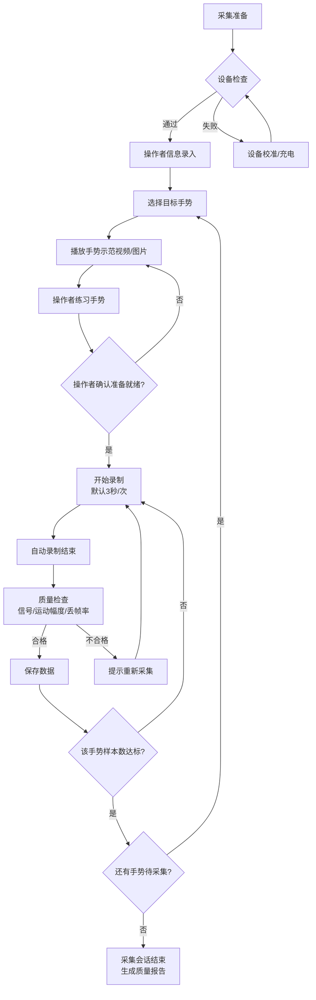
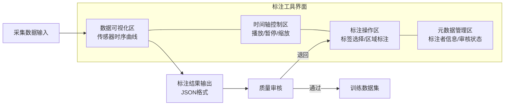
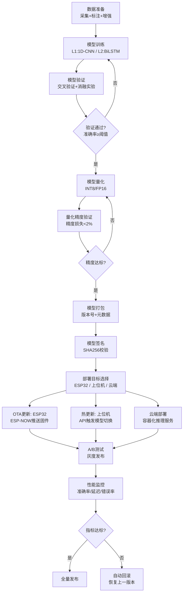

# SPEC-04: AI训练流水线规范

> **版本**: v1.0.0
> **日期**: 2025-07-11
> **状态**: Draft
> **负责人**: AI系统架构师
> **关联文档**: SPEC-01(系统总览)、SPEC-03(软件架构)、SPEC-05(3D渲染)

---

## 目录

1. [数据采集规范](#1-数据采集规范)
2. [数据标注工具设计](#2-数据标注工具设计)
3. [特征工程规范](#3-特征工程规范)
4. [模型训练规范](#4-模型训练规范)
5. [模型评估规范](#5-模型评估规范)
6. [模型部署流水线](#6-模型部署流水线)

---

## 1. 数据采集规范

### 1.1 采集环境要求

数据采集环境的质量直接影响模型训练效果和最终识别精度。为确保数据集的多样性和泛化能力，采集环境需要覆盖多种条件组合。环境参数分为必控参数和记录参数两类：必控参数在采集过程中需要严格控制和标准化，记录参数在每次采集时记录但不强制控制。

**必控参数：**
- **光照条件**：采集需要在至少三种光照环境下进行——室内自然光（500~1000 lux）、室内人工光（300~500 lux）、暗光环境（100~200 lux）。虽然本项目的手套传感器不依赖视觉，但光照条件会影响操作者的手部姿态和运动幅度，间接影响数据分布。
- **背景干扰**：采集区域应保持安静，避免频繁的人员走动和噪音干扰。操作者应面对固定的方向，保持与接收网关的固定距离（1~3米范围内），避免因距离变化导致的ESP-NOW信号质量波动。
- **设备状态**：每次采集前检查手套传感器的校准状态（弯曲传感器归零、IMU校准），确保电池电量充足（>50%），ESP-NOW通信正常（信号强度 > -70dBm）。
- **操作者状态**：操作者应处于舒适自然的坐姿或站姿，手臂放松，手指处于自然弯曲状态作为起始姿态。

**记录参数：**
- 操作者ID、性别、年龄、惯用手
- 手套型号、固件版本、校准日期
- 环境温度、湿度
- 采集时间、采集地点
- 接收网关的RSSI信号强度

### 1.2 采集流程

标准采集流程分为准备、执行和质量检查三个阶段。每个手势需要由多个操作者分别采集，以确保数据的多样性。参考Redgerd项目的14K样本数据集和OpenHands框架CSL数据集的采集标准，本项目设定每个手势至少需要30个有效样本，来自至少5个不同的操作者，每个操作者每个手势采集3~6次。



**采集参数配置：**

| 参数 | 默认值 | 范围 | 说明 |
|------|--------|------|------|
| 单次采集时长 | 3.0秒 | 1.0~10.0秒 | 每个手势样本的录制时长 |
| 采样率 | 60Hz | 30~120Hz | 传感器数据采样频率 |
| 最小运动幅度 | 0.1弧度 | — | 低于此值的数据标记为无效 |
| 最大丢帧率 | 5% | — | 超过此值的样本标记为低质量 |
| 信号质量阈值 | -70dBm | — | RSSI低于此值告警 |
| 每手势目标样本数 | 30 | 20~100 | 所有操作者合计 |
| 最少操作者数 | 5 | 3~20 | 数据多样性要求 |

采集系统自动执行质量检查，包括：信号连续性检查（检测丢帧和突变）、运动幅度检查（确认操作者确实执行了手势）、数据范围检查（传感器读数是否在合理范围内）。不合格的样本会立即提示操作者重新采集，并记录不合格原因用于后续分析。

### 1.3 数据格式标准

采集数据存储为标准化的文件格式，支持CSV（人类可读）和NPZ（高效二进制）两种格式。每个采集样本包含元数据文件（JSON）和数据文件（CSV/NPZ），存放于统一的目录结构中。

**目录结构：**
```
data/
├── collections/
│   ├── 2025-07-11_session_001/
│   │   ├── meta.json              # 会话元数据
│   │   ├── CSL_001_hello_001.csv  # 样本数据
│   │   ├── CSL_001_hello_002.csv
│   │   └── quality_report.json    # 质量报告
│   └── 2025-07-11_session_002/
├── annotations/
│   ├── CSL_001_annotations.json
│   └── review_log.json
└── datasets/
    ├── csl_custom_v1/
    │   ├── train/
    │   ├── val/
    │   ├── test/
    │   └── label_map.json
    └── edge_impulse_export/
```

**CSV格式规范（单样本）：**
```csv
# 元数据头
# gesture: CSL_001_hello
# operator: user_001
# hand: both
# sample_rate: 60.0
# duration: 3.0
# timestamp: 2025-07-11T10:30:00
# columns: frame_id, timestamp, thumb_pip, thumb_dip, index_pip, index_dip, middle_pip, middle_dip, ring_pip, ring_dip, pinky_pip, pinky_dip, accel_x, accel_y, accel_z, gyro_x, gyro_y, gyro_z, quat_w, quat_x, quat_y, quat_z
frame_id,timestamp,thumb_pip,thumb_dip,index_pip,index_dip,middle_pip,middle_dip,ring_pip,ring_dip,pinky_pip,pinky_dip,accel_x,accel_y,accel_z,gyro_x,gyro_y,gyro_z,quat_w,quat_x,quat_y,quat_z
0,0.000,0.102,0.081,0.305,0.152,0.198,0.100,0.256,0.128,0.312,0.156,0.02,-0.05,9.78,0.001,-0.002,0.998,0.002,0.001,0.001
1,0.017,0.105,0.083,0.312,0.155,0.203,0.102,0.261,0.130,0.318,0.159,0.02,-0.04,9.79,0.002,-0.001,0.997,0.002,0.001,0.002
...
```

**NPZ格式规范：**
```python
# NPZ文件包含以下数组:
# - 'flex_left': (T, 10) float32   左手弯曲传感器
# - 'flex_right': (T, 10) float32  右手弯曲传感器
# - 'imu_left': (T, 10) float32    左手IMU (accel+gyro)
# - 'imu_right': (T, 10) float32   右手IMU
# - 'quat_left': (T, 4) float32    左手四元数
# - 'quat_right': (T, 4) float32   右手四元数
# - 'joints_left': (T, 21, 3) float32  左手21关键点
# - 'joints_right': (T, 21, 3) float32 右手21关键点
```

### 1.4 质量控制要求

数据质量控制贯穿采集、标注和训练的全流程。采集阶段的质量控制包括实时监控和事后审核两个环节。实时监控在采集过程中自动执行，对每个样本计算质量评分（0~1），评分维度包括：

- **完整性（权重0.3）**：帧数是否达到目标时长，是否有缺失数据
- **信号质量（权重0.3）**：传感器信号是否平滑，是否有异常跳变，RSSI信号强度
- **运动有效性（权重0.2）**：弯曲传感器的变化幅度是否在合理范围内（既不能太小表示没有执行手势，也不能太大表示可能存在传感器故障）
- **时间一致性（权重0.2）**：左右手数据同步质量，帧间隔稳定性

质量评分低于0.6的样本自动标记为"需要重新采集"。每次采集会话结束后生成质量报告，汇总所有样本的质量指标分布和异常情况，供操作者和管理员审查。数据集发布前需要通过最终质量审核，确保满足以下标准：每个类别至少有20个有效样本，平均质量评分≥0.7，类别间样本数量比例不超过10:1。

---

## 2. 数据标注工具设计

### 2.1 标注界面设计

数据标注工具是连接数据采集和模型训练的关键环节，提供直观、高效的手势数据标注界面。标注工具基于Web技术（HTML5 + JavaScript）构建，以浏览器为载体运行，兼容主流桌面浏览器。标注界面分为四个主要区域：数据可视化区、时间轴控制区、标注操作区和元数据管理区。

数据可视化区展示传感器数据的时间序列曲线图，使用Chart.js或Plotly.js绘制。图表支持缩放和平移，标注者可以精确查看任意时间段的数据细节。不同传感器的数据用不同颜色区分，弯曲传感器数据绘制为折线图，IMU数据绘制为三轴子图，四元数数据绘制为单位球面投影。标注区域用半透明色块覆盖在时间轴上，支持拖拽调整起止时间。



**标注工作流程：**

1. **任务分配**：管理员创建标注任务，指定数据范围和标注指南，分配给标注者
2. **数据加载**：标注者打开标注工具，加载分配的采集数据
3. **数据浏览**：标注者播放数据，观察传感器数据的变化模式，理解手势的运动特征
4. **区域标注**：标注者在时间轴上标记手势的起止区间，选择对应的标签
5. **质量自检**：标注者检查标注结果的合理性，确认无误后提交
6. **交叉审核**：第二个标注者对同一数据进行独立标注
7. **一致性评估**：系统自动计算两位标注者的IAA（Inter-Annotator Agreement）
8. **争议解决**：对于标注不一致的样本，由资深标注者仲裁
9. **数据导出**：审核通过的数据导出为标准训练数据集格式

### 2.2 标注格式规范

标注数据以JSON格式存储，每个标注记录包含完整的位置信息、标签信息和审核状态。标注格式设计遵循以下原则：兼容OpenHands框架的数据格式要求，支持时间轴级别的精细标注（精确到帧级别），支持多标注者和多轮审核的完整工作流。

```json
{
    "annotation_version": "1.0",
    "dataset_name": "csl_custom_v1",
    "annotations": [
        {
            "id": "ann_001",
            "collection_id": "2025-07-11_session_001",
            "sample_file": "CSL_001_hello_001.csv",
            "segments": [
                {
                    "start_frame": 10,
                    "end_frame": 180,
                    "start_time_sec": 0.167,
                    "end_time_sec": 3.0,
                    "gesture_id": 1,
                    "gesture_code": "CSL_001",
                    "gesture_name": "你好",
                    "label": "hello",
                    "confidence": 1.0,
                    "annotator_id": "user_001",
                    "annotated_at": "2025-07-11T14:30:00"
                }
            ],
            "review_status": "approved",
            "reviewer_id": "admin_001",
            "reviewed_at": "2025-07-11T15:00:00",
            "iaa_score": 0.92
        }
    ],
    "label_map": {
        "0": "background",
        "1": "你好",
        "2": "谢谢",
        "3": "再见",
        "4": "对不起",
        "5": "是",
        "6": "不",
        "7": "请",
        "8": "我",
        "9": "你"
    }
}
```

### 2.3 多标注者一致性

多标注者一致性（Inter-Annotator Agreement, IAA）是衡量标注质量的核心指标。本项目要求每个数据样本至少由两名标注者独立标注，IAA评分使用Cohen's Kappa系数计算。Kappa系数的取值范围为-1到1，其中≥0.8表示"几乎完全一致"，≥0.6表示"基本一致"，<0.4表示"一致性较差"。

标注一致性的具体要求：训练集的IAA Kappa系数必须≥0.8才能进入训练流程；对于IAA在0.6~0.8之间的样本，需要增加第三位标注者进行仲裁；对于IAA<0.6的样本，需要重新组织标注讨论会，统一标注标准后重新标注。系统自动生成IAA报告，展示每个手势类别的Kappa系数、标注者间的混淆矩阵和争议样本列表，帮助发现标注指南中的模糊之处并持续优化。

```python
# annotation_quality.py — 标注质量评估
import numpy as np
from typing import List, Dict
from collections import defaultdict

def cohens_kappa(annotations_a: List[int], annotations_b: List[int]) -> float:
    """
    计算Cohen's Kappa系数

    Args:
        annotations_a: 标注者A的标注列表
        annotations_b: 标注者B的标注列表

    Returns:
        float: Kappa系数 (-1~1)
    """
    n = len(annotations_a)
    if n == 0:
        return 0.0

    # 构建混淆矩阵
    labels = sorted(set(annotations_a + annotations_b))
    k = len(labels)
    label_to_idx = {l: i for i, l in enumerate(labels)}

    matrix = np.zeros((k, k), dtype=np.int32)
    for a, b in zip(annotations_a, annotations_b):
        matrix[label_to_idx[a]][label_to_idx[b]] += 1

    # 计算观测一致率 Po
    po = np.trace(matrix) / n

    # 计算期望一致率 Pe
    row_sums = matrix.sum(axis=1)
    col_sums = matrix.sum(axis=0)
    pe = np.sum(row_sums * col_sums) / (n * n)

    # 计算Kappa
    if pe == 1.0:
        return 1.0
    kappa = (po - pe) / (1 - pe)
    return float(kappa)

class AnnotationQualityReport:
    """标注质量报告生成器"""

    def __init__(self):
        self._annotations: Dict[str, List] = defaultdict(list)

    def add_annotation(self, sample_id: str, annotator_id: str, label: int):
        """添加标注记录"""
        self._annotations[sample_id].append({
            "annotator": annotator_id,
            "label": label
        })

    def generate_report(self) -> Dict:
        """生成质量报告"""
        kappa_scores = {}
        per_gesture_kappa = defaultdict(list)
        disagreements = []

        for sample_id, anns in self._annotations.items():
            if len(anns) >= 2:
                labels_a = [a["label"] for a in anns[:1]]
                labels_b = [a["label"] for a in anns[1:2]]
                kappa = cohens_kappa(labels_a, labels_b)
                kappa_scores[sample_id] = kappa

                if kappa < 0.8:
                    disagreements.append({
                        "sample_id": sample_id,
                        "kappa": kappa,
                        "annotations": anns
                    })

        overall_kappa = np.mean(list(kappa_scores.values())) if kappa_scores else 0.0

        return {
            "overall_kappa": overall_kappa,
            "quality_level": self._get_quality_level(overall_kappa),
            "total_samples": len(kappa_scores),
            "disagreement_count": len(disagreements),
            "disagreement_rate": len(disagreements) / max(len(kappa_scores), 1),
            "disagreement_details": disagreements[:20],  # 最多显示20个
            "recommendation": self._get_recommendation(overall_kappa)
        }

    @staticmethod
    def _get_quality_level(kappa: float) -> str:
        if kappa >= 0.8:
            return "excellent"
        elif kappa >= 0.6:
            return "acceptable"
        else:
            return "needs_improvement"

    @staticmethod
    def _get_recommendation(kappa: float) -> str:
        if kappa >= 0.8:
            return "标注质量优秀, 可以进入训练流程"
        elif kappa >= 0.6:
            return "标注质量基本可接受, 建议对争议样本进行仲裁"
        else:
            return "标注质量不足, 需要统一标注标准并重新标注"
```

---

## 3. 特征工程规范

### 3.1 原始传感器特征

原始传感器特征直接来自手套上的物理传感器，包括弯曲角度和IMU惯性数据。每只手套每帧包含以下原始特征：

**弯曲传感器特征（10维）：**
- 5个手指的PIP关节弯曲角度（归一化到0~1，对应0°~180°）
- 5个手指的DIP关节弯曲角度（归一化到0~1，对应0°~144°）
- 原始ADC值范围：0~4095（12位ADC），归一化后映射为角度值

**IMU惯性特征（10维）：**
- 三轴加速度（accel_x, accel_y, accel_z），单位m/s²，量程±16g
- 三轴角速度（gyro_x, gyro_y, gyro_z），单位rad/s，量程±2000°/s
- 四元数（quat_w, quat_x, quat_y, quat_z），表示手腕方向

**单帧总特征维度：20维/手 × 2手 = 40维**

原始特征经过基本预处理后直接用于L1边缘模型（1D-CNN）的输入。预处理步骤包括：去趋势（去除传感器漂移）、低通滤波（4阶Butterworth，截止频率10Hz，去除高频噪声）、归一化（Z-score标准化或Min-Max归一化）。

```python
# sensor_preprocessing.py — 传感器原始数据预处理
import numpy as np
from scipy import signal

class SensorPreprocessor:
    """传感器数据预处理器"""

    def __init__(self, sample_rate: float = 60.0):
        self.sample_rate = sample_rate
        # 设计低通滤波器 (4阶Butterworth, 截止10Hz)
        nyquist = sample_rate / 2
        self.butter_low = signal.butter(
            4, 10.0 / nyquist, btype='low'
        )

    def preprocess(self, raw_data: np.ndarray) -> np.ndarray:
        """
        预处理单帧传感器数据

        Args:
            raw_data: 原始数据 (20,) 或 (batch, 20)

        Returns:
            预处理后的数据, 形状与输入相同
        """
        if raw_data.ndim == 1:
            data = raw_data.copy().reshape(1, -1)
        else:
            data = raw_data.copy()

        # 1. 低通滤波 (仅在时序数据上使用)
        # 单帧数据无需滤波, 此步骤在时序处理时应用

        # 2. 归一化
        data = self._normalize(data)

        return data.squeeze()

    def preprocess_sequence(self, sequence: np.ndarray) -> np.ndarray:
        """
        预处理时序数据

        Args:
            sequence: 时序数据 (T, 20) 或 (batch, T, 20)

        Returns:
            预处理后的时序数据
        """
        # 1. 低通滤波
        if sequence.ndim == 2:
            filtered = np.zeros_like(sequence)
            for ch in range(sequence.shape[1]):
                filtered[:, ch] = signal.filtfilt(
                    self.butter_low[0], self.butter_low[1],
                    sequence[:, ch]
                )
        else:
            filtered = np.zeros_like(sequence)
            for b in range(sequence.shape[0]):
                for ch in range(sequence.shape[2]):
                    filtered[b, :, ch] = signal.filtfilt(
                        self.butter_low[0], self.butter_low[1],
                        sequence[b, :, ch]
                    )

        # 2. 去趋势
        detrended = signal.detrend(filtered, axis=-2)

        # 3. Z-score归一化 (per-channel)
        if detrended.ndim == 2:
            mean = detrended.mean(axis=0, keepdims=True)
            std = detrended.std(axis=0, keepdims=True) + 1e-8
            normalized = (detrended - mean) / std
        else:
            mean = detrended.mean(axis=1, keepdims=True)
            std = detrended.std(axis=1, keepdims=True) + 1e-8
            normalized = (detrended - mean) / std

        return normalized

    def _normalize(self, data: np.ndarray) -> np.ndarray:
        """归一化到[-1, 1]"""
        return (data - 0.5) * 2  # 假设原始数据已归一化到[0,1]
```

### 3.2 统计特征

统计特征是对原始传感器数据在时间窗口内进行统计分析得到的高阶特征，参考ReikiC项目的7统计特征工程方法。这些特征能够捕获手势的全局运动特性，对于区分不同的手语手势非常有效。统计特征在L1边缘模型和L2上位机模型中都可以使用。

| 特征 | 公式 | 维度 | 说明 |
|------|------|------|------|
| 均值 (Mean) | μ = (1/N)Σxᵢ | 20×2 | 窗口内均值, 反映平均弯曲程度 |
| 标准差 (Std) | σ = √[(1/N)Σ(xᵢ-μ)²] | 20×2 | 反映运动幅度和变化性 |
| 最小值 (Min) | min(x) | 20×2 | 反映手指的最大伸展程度 |
| 最大值 (Max) | max(x) | 20×2 | 反映手指的最大弯曲程度 |
| 均方根 (RMS) | RMS = √[(1/N)Σxᵢ²] | 20×2 | 反映信号的能量水平 |
| 偏度 (Skewness) | γ = (1/N)Σ[(xᵢ-μ)/σ]³ | 20×2 | 反映信号分布的不对称性 |
| 峰度 (Kurtosis) | κ = (1/N)Σ[(xᵢ-μ)/σ]⁴ - 3 | 20×2 | 反映信号分布的尖锐程度 |

**每个窗口的统计特征总维度：7 × 20 × 2 = 280维**

```python
# statistical_features.py — 统计特征提取
import numpy as np
from scipy.stats import skew, kurtosis
from typing import Dict

class StatisticalFeatureExtractor:
    """统计特征提取器 (参考ReikiC 7特征工程)"""

    FEATURE_NAMES = [
        "mean", "std", "min", "max", "rms", "skewness", "kurtosis"
    ]

    def __init__(self, window_size: int = 30):
        self.window_size = window_size

    def extract(self, sequence: np.ndarray) -> np.ndarray:
        """
        从时序数据中提取统计特征

        Args:
            sequence: 传感器时序数据 (T, C), T=帧数, C=通道数(20或40)

        Returns:
            统计特征向量 (7 * C,)
        """
        features = []
        for ch in range(sequence.shape[1]):
            ch_data = sequence[:, ch]
            features.extend([
                np.mean(ch_data),                    # 均值
                np.std(ch_data),                     # 标准差
                np.min(ch_data),                     # 最小值
                np.max(ch_data),                     # 最大值
                np.sqrt(np.mean(ch_data ** 2)),      # RMS
                skew(ch_data),                       # 偏度
                kurtosis(ch_data),                   # 峰度 (超额峰度)
            ])
        return np.array(features, dtype=np.float32)

    def extract_with_names(self, sequence: np.ndarray) -> Dict[str, float]:
        """提取统计特征并附带特征名称"""
        features = self.extract(sequence)
        feature_names = []
        ch_names = [
            "thumb_pip", "thumb_dip", "index_pip", "index_dip",
            "middle_pip", "middle_dip", "ring_pip", "ring_dip",
            "pinky_pip", "pinky_dip", "accel_x", "accel_y", "accel_z",
            "gyro_x", "gyro_y", "gyro_z", "quat_w", "quat_x", "quat_y", "quat_z"
        ]
        for ch_name in ch_names:
            for feat_name in self.FEATURE_NAMES:
                feature_names.append(f"{ch_name}_{feat_name}")

        return dict(zip(feature_names, features))
```

### 3.3 频域特征

频域特征通过对传感器数据进行傅里叶变换（FFT）得到，能够捕获手势的频率特性。不同的手语手势具有不同的运动频率模式，例如快速的手指弹动具有较高的频率成分，而缓慢的手臂移动集中在低频段。频域特征的提取参考ASL-DataGlove项目的方法。

| 特征 | 说明 | 维度 |
|------|------|------|
| FFT系数 | 离散傅里叶变换的前N个系数 | 10×20×2 |
| 功率谱密度 (PSD) | 各频率分量的功率 | 10×20×2 |
| 频谱质心 | 频谱能量分布的中心频率 | 20×2 |
| 频谱带宽 | 频谱能量的分布范围 | 20×2 |
| 主频率 | 功率最大的频率分量 | 20×2 |

FFT系数的维度通过保留前N个最有意义的频率分量来控制（N=10），这覆盖了0~20Hz的主要频率范围（高于20Hz的手部运动频率对识别的贡献很小）。功率谱密度（PSD）使用Welch方法计算，提供了更平滑和稳定的频谱估计。频谱质心和频谱带宽是对频谱形状的高级描述，能够区分具有相似频率成分但不同能量分布的手势。

```python
# frequency_features.py — 频域特征提取
import numpy as np
from scipy import signal

class FrequencyFeatureExtractor:
    """频域特征提取器"""

    def __init__(self, sample_rate: float = 60.0, n_fft_coeffs: int = 10):
        self.sample_rate = sample_rate
        self.n_fft_coeffs = n_fft_coeffs
        self.freq_resolution = sample_rate / (2 * self.n_fft_coeffs)

    def extract_fft(self, sequence: np.ndarray) -> np.ndarray:
        """
        提取FFT系数特征

        Args:
            sequence: (T, C) 传感器时序数据

        Returns:
            FFT特征 (n_fft_coeffs * C,)
        """
        T, C = sequence.shape
        features = np.zeros(self.n_fft_coeffs * C, dtype=np.float32)

        for ch in range(C):
            # 去均值
            ch_data = sequence[:, ch] - np.mean(sequence[:, ch])
            # FFT
            fft_result = np.fft.rfft(ch_data)
            # 取前N个系数的幅值
            magnitudes = np.abs(fft_result[:self.n_fft_coeffs])
            features[ch * self.n_fft_coeffs:(ch + 1) * self.n_fft_coeffs] = magnitudes

        # L2归一化
        norm = np.linalg.norm(features) + 1e-8
        return features / norm

    def extract_psd(self, sequence: np.ndarray) -> np.ndarray:
        """提取功率谱密度特征"""
        T, C = sequence.shape
        features = np.zeros(self.n_fft_coeffs * C, dtype=np.float32)

        for ch in range(C):
            freqs, psd = signal.welch(
                sequence[:, ch],
                fs=self.sample_rate,
                nperseg=min(T, 32)
            )
            # 取前N个频率分量的PSD
            psd_truncated = psd[:self.n_fft_coeffs]
            features[ch * self.n_fft_coeffs:(ch + 1) * self.n_fft_coeffs] = psd_truncated

        return features

    def extract_spectral_centroid(self, sequence: np.ndarray) -> np.ndarray:
        """提取频谱质心特征 (每通道一个值)"""
        _, C = sequence.shape
        centroids = np.zeros(C, dtype=np.float32)

        for ch in range(C):
            ch_data = sequence[:, ch] - np.mean(sequence[:, ch])
            fft_result = np.fft.rfft(ch_data)
            magnitudes = np.abs(fft_result) ** 2
            freqs = np.fft.rfftfreq(len(ch_data), 1.0 / self.sample_rate)

            total_power = np.sum(magnitudes) + 1e-8
            centroids[ch] = np.sum(freqs * magnitudes) / total_power

        return centroids

    def extract_all(self, sequence: np.ndarray) -> np.ndarray:
        """提取所有频域特征"""
        fft_feat = self.extract_fft(sequence)
        psd_feat = self.extract_psd(sequence)
        centroid_feat = self.extract_spectral_centroid(sequence)

        return np.concatenate([fft_feat, psd_feat, centroid_feat])
```

### 3.4 时序特征

时序特征捕获传感器数据随时间变化的动态特性，是区分静态手势和动态手势的关键。时序特征包括差分特征（一阶导数，表示速度）、二阶导数（表示加速度）和自相关特征（表示周期性）。

**一阶差分（速度特征）：**
- Δx(t) = x(t) - x(t-1)
- 表示每个传感器通道的变化率，直接反映手指弯曲/伸展的速度
- 维度与原始特征相同：20×2 = 40维

**二阶差分（加速度特征）：**
- Δ²x(t) = Δx(t) - Δx(t-1) = x(t) - 2x(t-1) + x(t-2)
- 表示速度的变化率，反映运动的加速度和减速度
- 维度与原始特征相同：20×2 = 40维

**自相关特征：**
- R(τ) = Σx(t)·x(t+τ) / Σx(t)²
- 表示信号的周期性，某些手势（如 waving）具有明显的周期性
- 取τ=1,2,...,10的自相关系数：10×20×2 = 400维

**零交叉率（Zero Crossing Rate）：**
- 信号穿越零点的次数 / 窗口长度
- 反映信号的振荡频率
- 每通道一个值：20×2 = 40维

```python
# temporal_features.py — 时序特征提取
import numpy as np

class TemporalFeatureExtractor:
    """时序特征提取器"""

    def extract_velocity(self, sequence: np.ndarray) -> np.ndarray:
        """
        提取速度特征 (一阶差分)

        Args:
            sequence: (T, C) 时序数据
        Returns:
            (T-1, C) 速度特征
        """
        return np.diff(sequence, axis=0)

    def extract_acceleration(self, sequence: np.ndarray) -> np.ndarray:
        """
        提取加速度特征 (二阶差分)
        """
        return np.diff(sequence, n=2, axis=0)

    def extract_autocorrelation(self, sequence: np.ndarray,
                                  max_lag: int = 10) -> np.ndarray:
        """
        提取自相关特征

        Args:
            sequence: (T, C) 时序数据
            max_lag: 最大滞后阶数
        Returns:
            (max_lag * C,) 自相关系数
        """
        T, C = sequence.shape
        features = np.zeros(max_lag * C, dtype=np.float32)

        for ch in range(C):
            ch_data = sequence[:, ch]
            ch_mean = np.mean(ch_data)
            ch_centered = ch_data - ch_mean
            ch_var = np.sum(ch_centered ** 2) + 1e-8

            for lag in range(max_lag):
                if lag < T:
                    autocorr = np.sum(
                        ch_centered[:T-lag] * ch_centered[lag:]
                    ) / ch_var
                else:
                    autocorr = 0.0
                features[ch * max_lag + lag] = autocorr

        return features

    def extract_zero_crossing_rate(self, sequence: np.ndarray) -> np.ndarray:
        """
        提取零交叉率
        """
        T, C = sequence.shape
        zcr = np.zeros(C, dtype=np.float32)

        for ch in range(C):
            ch_data = sequence[:, ch]
            ch_mean = np.mean(ch_data)
            ch_centered = ch_data - ch_mean
            crossings = np.sum(
                ch_centered[:-1] * ch_centered[1:] < 0
            )
            zcr[ch] = crossings / (T - 1)

        return zcr
```

### 3.5 特征选择方法

当所有特征维度组合在一起时，总维度可能高达数百甚至上千维。高维特征不仅增加计算开销，还可能引入噪声特征（与手势类别无关的维度），降低模型泛化能力。因此需要进行特征选择，保留最具判别力的特征子集。

本项目采用以下特征选择策略的组合：

1. **方差阈值过滤**：删除方差接近零的特征（方差 < 0.01），这些特征几乎不包含有用信息。

2. **互信息排名**：计算每个特征与目标类别之间的互信息（Mutual Information），选择互信息最高的Top-K个特征。互信息能够捕获特征与目标之间的非线性关系，比皮尔逊相关系数更适合分类任务。

3. **基于模型的特征重要性**：训练一个快速的树模型（如LightGBM或Random Forest），利用模型的内置特征重要性评分进行特征排序。然后选择重要性最高的特征子集。

4. **递归特征消除（RFE）**：在候选模型（如Attention-BiLSTM）上使用RFE方法，通过反复训练和剔除最不重要特征的方式确定最优特征子集。

5. **L1正则化**：在模型训练时使用L1正则化（Lasso），自动将不重要特征的权重压缩为零，实现内置的特征选择。

**推荐策略**：Phase1使用方差阈值+互信息+基于模型的重要性三重过滤，快速确定有效特征集；Phase2使用RFE在目标模型上精调特征子集。预期最终保留50~100个特征维度，兼顾识别精度和计算效率。

```python
# feature_selector.py — 特征选择
import numpy as np
from sklearn.feature_selection import (
    mutual_info_classif, SelectKBest, VarianceThreshold, RFE
)
from sklearn.ensemble import RandomForestClassifier
from sklearn.preprocessing import StandardScaler
from typing import List, Tuple

class FeatureSelector:
    """特征选择器"""

    def __init__(self, min_variance: float = 0.01,
                 max_features: int = 100,
                 method: str = "combined"):
        self.min_variance = min_variance
        self.max_features = max_features
        self.method = method
        self._selected_indices: List[int] = None
        self._scaler = StandardScaler()

    def fit(self, X: np.ndarray, y: np.ndarray) -> 'FeatureSelector':
        """
        拟合特征选择器

        Args:
            X: 特征矩阵 (n_samples, n_features)
            y: 标签 (n_samples,)
        """
        # Step 1: 方差阈值过滤
        var_selector = VarianceThreshold(threshold=self.min_variance)
        X_var = var_selector.fit_transform(X)
        var_indices = np.where(var_selector.get_support())[0]
        print(f"方差过滤: {X.shape[1]} → {len(var_indices)} 特征")

        # Step 2: 标准化
        X_scaled = self._scaler.fit_transform(X_var)

        # Step 3: 互信息排名
        mi_scores = mutual_info_classif(X_scaled, y, random_state=42)
        mi_ranking = np.argsort(mi_scores)[::-1]

        # Step 4: 基于模型的重要性
        rf = RandomForestClassifier(n_estimators=100, random_state=42,
                                     n_jobs=-1)
        rf.fit(X_scaled, y)
        rf_importance = rf.feature_importances_
        rf_ranking = np.argsort(rf_importance)[::-1]

        # Step 5: 综合排名
        if self.method == "combined":
            # 综合互信息和随机森林排名
            combined_score = np.zeros(len(var_indices))
            for rank, idx in enumerate(mi_ranking):
                combined_score[idx] += (len(var_indices) - rank)
            for rank, idx in enumerate(rf_ranking):
                combined_score[idx] += (len(var_indices) - rank)

            combined_ranking = np.argsort(combined_score)[::-1]
            n_select = min(self.max_features, len(var_indices))
            selected_local = combined_ranking[:n_select]
            self._selected_indices = var_indices[selected_local].tolist()
        else:
            n_select = min(self.max_features, len(var_indices))
            self._selected_indices = var_indices[mi_ranking[:n_select]].tolist()

        print(f"最终选择: {len(self._selected_indices)} 特征")
        return self

    def transform(self, X: np.ndarray) -> np.ndarray:
        """应用特征选择"""
        if self._selected_indices is None:
            raise RuntimeError("请先调用fit方法")
        return X[:, self._selected_indices]

    def get_selected_indices(self) -> List[int]:
        """获取选中的特征索引"""
        return self._selected_indices
```

---

## 4. 模型训练规范

### 4.1 L1边缘模型 (1D-CNN)

L1边缘模型部署在ESP32-S3微控制器上，提供轻量级的手势识别能力。模型架构采用1D卷积神经网络（1D-CNN），适合处理时序传感器数据。1D-CNN的优势在于：参数量小（适合嵌入式部署）、推理速度快（适合实时应用）、对局部时间模式有良好的特征提取能力。

#### 4.1.1 模型架构定义

```python
# model_l1_cnn.py — L1边缘模型: 1D-CNN
import torch
import torch.nn as nn
import torch.nn.functional as F

class L1EdgeCNN(nn.Module):
    """
    L1边缘手势识别模型 (1D-CNN)

    输入: [batch, channels, time_steps]
    输出: [batch, num_classes]

    参数量: ~15K
    推理延迟: <5ms (ESP32-S3 @ 240MHz)
    """

    def __init__(
        self,
        in_channels: int = 40,       # 输入通道数 (20传感器×2手)
        num_classes: int = 30,       # 手势类别数
        base_filters: int = 16,      # 基础卷积核数
        dropout: float = 0.2,
    ):
        super().__init__()

        # 卷积块1: 提取低级时序特征
        self.conv1 = nn.Conv1d(in_channels, base_filters, kernel_size=5, padding=2)
        self.bn1 = nn.BatchNorm1d(base_filters)
        self.pool1 = nn.MaxPool1d(kernel_size=2)

        # 卷积块2: 提取中级时序特征
        self.conv2 = nn.Conv1d(base_filters, base_filters * 2, kernel_size=3, padding=1)
        self.bn2 = nn.BatchNorm1d(base_filters * 2)
        self.pool2 = nn.MaxPool1d(kernel_size=2)

        # 卷积块3: 提取高级时序特征
        self.conv3 = nn.Conv1d(base_filters * 2, base_filters * 4, kernel_size=3, padding=1)
        self.bn3 = nn.BatchNorm1d(base_filters * 4)
        self.pool3 = nn.AdaptiveAvgPool1d(1)  # 全局平均池化

        # 全连接分类头
        self.dropout = nn.Dropout(dropout)
        self.fc1 = nn.Linear(base_filters * 4, 64)
        self.fc2 = nn.Linear(64, num_classes)

        # 初始化权重
        self._init_weights()

    def _init_weights(self):
        """He初始化"""
        for m in self.modules():
            if isinstance(m, nn.Conv1d):
                nn.init.kaiming_normal_(m.weight, mode='fan_out', nonlinearity='relu')
            elif isinstance(m, nn.Linear):
                nn.init.kaiming_normal_(m.weight, mode='fan_out', nonlinearity='relu')
                if m.bias is not None:
                    nn.init.zeros_(m.bias)

    def forward(self, x: torch.Tensor) -> torch.Tensor:
        """
        前向传播

        Args:
            x: [batch, channels, time_steps]
               channels = 40 (弯曲传感器10 + IMU 10) × 2手

        Returns:
            logits: [batch, num_classes]
        """
        # 卷积块1
        x = self.conv1(x)
        x = self.bn1(x)
        x = F.relu(x)
        x = self.pool1(x)

        # 卷积块2
        x = self.conv2(x)
        x = self.bn2(x)
        x = F.relu(x)
        x = self.pool2(x)

        # 卷积块3
        x = self.conv3(x)
        x = self.bn3(x)
        x = F.relu(x)
        x = self.pool3(x)  # [batch, base_filters*4, 1]

        # 展平并分类
        x = x.squeeze(-1)  # [batch, base_filters*4]
        x = self.dropout(x)
        x = F.relu(self.fc1(x))
        x = self.fc2(x)    # [batch, num_classes]

        return x

    def get_model_info(self) -> dict:
        """获取模型信息"""
        total_params = sum(p.numel() for p in self.parameters())
        trainable_params = sum(p.numel() for p in self.parameters() if p.requires_grad)
        return {
            "total_params": total_params,
            "trainable_params": trainable_params,
            "model_size_kb": total_params * 4 / 1024,  # FP32
            "architecture": "1D-CNN (3 conv blocks + 2 FC layers)"
        }


# 模型实例化和测试
if __name__ == "__main__":
    model = L1EdgeCNN(in_channels=40, num_classes=30)
    info = model.get_model_info()
    print(f"模型参数量: {info['total_params']:,}")
    print(f"模型大小: {info['model_size_kb']:.1f} KB")

    # 测试前向传播
    x = torch.randn(2, 40, 60)  # batch=2, channels=40, time=60帧
    y = model(x)
    print(f"输入形状: {x.shape}")
    print(f"输出形状: {y.shape}")
```

#### 4.1.2 训练超参数

| 超参数 | 推荐值 | 说明 |
|--------|--------|------|
| 学习率 | 1e-3 | Adam优化器初始学习率 |
| 学习率调度 | CosineAnnealing | 余弦退火调度器 |
| Batch Size | 64 | 受ESP32内存限制, 训练时可用更大 |
| Epochs | 100 | 配合早停机制 |
| 早停耐心值 | 15 | 验证集loss连续15轮不下降则停止 |
| 权重衰减 | 1e-4 | L2正则化 |
| 梯度裁剪 | 1.0 | 防止梯度爆炸 |
| 优化器 | Adam | β1=0.9, β2=0.999 |

#### 4.1.3 量化流程

模型量化是将FP32精度的模型转换为INT8精度，以适配ESP32-S3的资源限制并加速推理。量化流程采用训练后量化（Post-Training Quantization, PTQ），具体步骤如下：

```python
# quantize_l1.py — L1模型量化流程
import torch
import torch.quantization as quant
import numpy as np
from model_l1_cnn import L1EdgeCNN

def quantize_model(model_path: str, calib_data: np.ndarray, output_path: str):
    """
    训练后量化 (INT8)

    Args:
        model_path: FP32模型路径
        calib_data: 校准数据 (N, C, T), N>=100
        output_path: 量化模型输出路径
    """
    # 1. 加载FP32模型
    model = L1EdgeCNN()
    model.load_state_dict(torch.load(model_path))
    model.eval()

    # 2. 设置量化配置
    model.qconfig = quant.get_default_qconfig('fbgemm')
    quant.prepare(model, inplace=True)

    # 3. 校准 (使用代表性数据)
    print("开始量化校准...")
    with torch.no_grad():
        for i in range(len(calib_data)):
            x = torch.from_numpy(calib_data[i:i+1]).float()
            model(x)
            if (i + 1) % 50 == 0:
                print(f"校准进度: {i+1}/{len(calib_data)}")

    # 4. 转换为量化模型
    quant.convert(model, inplace=True)

    # 5. 验证量化精度
    print("验证量化精度...")
    test_input = torch.randn(1, 40, 60)
    fp32_model = L1EdgeCNN()
    fp32_model.load_state_dict(torch.load(model_path))
    fp32_model.eval()

    with torch.no_grad():
        fp32_out = fp32_model(test_input)
        int8_out = model(test_input)
        max_diff = torch.max(torch.abs(fp32_out - int8_out)).item()
        print(f"FP32 vs INT8 最大输出差异: {max_diff:.4f}")

    # 6. 导出TorchScript
    scripted = torch.jit.script(model)
    scripted.save(output_path)
    print(f"量化模型已保存到: {output_path}")

    # 打印模型大小对比
    import os
    fp32_size = os.path.getsize(model_path) / 1024
    int8_size = os.path.getsize(output_path) / 1024
    print(f"模型大小: FP32={fp32_size:.1f}KB → INT8={int8_size:.1f}KB "
          f"(压缩率={fp32_size/int8_size:.1f}x)")
```

#### 4.1.4 导出TFLite流程

为了兼容Edge Impulse平台和更广泛的嵌入式部署方案，模型还需要导出为TFLite格式。导出流程使用PyTorch→ONNX→TFLite的转换链。

```python
# export_tflite.py — 导出TFLite模型
import torch
import torch.onnx
import subprocess
import os
from model_l1_cnn import L1EdgeCNN

def export_to_tflite(model_path: str, output_path: str):
    """
    导出TFLite模型 (PyTorch → ONNX → TFLite)

    Args:
        model_path: PyTorch模型路径
        output_path: TFLite输出路径
    """
    # Step 1: 加载模型
    model = L1EdgeCNN()
    model.load_state_dict(torch.load(model_path))
    model.eval()

    # Step 2: 导出ONNX
    onnx_path = output_path.replace('.tflite', '.onnx')
    dummy_input = torch.randn(1, 40, 60)

    torch.onnx.export(
        model,
        dummy_input,
        onnx_path,
        input_names=['input'],
        output_names=['output'],
        dynamic_axes={
            'input': {0: 'batch_size'},
            'output': {0: 'batch_size'}
        },
        opset_version=13
    )
    print(f"ONNX模型已导出: {onnx_path}")

    # Step 3: ONNX → TFLite
    # 使用onnx-tf和TFLite转换
    try:
        import onnx
        from onnx_tf.backend import prepare
        import tensorflow as tf

        onnx_model = onnx.load(onnx_path)
        tf_rep = prepare(onnx_model)
        tf_rep.export_graph(output_path.replace('.tflite', '_tf'))

        # TF SavedModel → TFLite
        converter = tf.lite.TFLiteConverter.from_saved_model(
            output_path.replace('.tflite', '_tf')
        )
        converter.optimizations = [tf.lite.Optimize.DEFAULT]
        converter.target_spec.supported_types = [tf.float16]
        tflite_model = converter.convert()

        with open(output_path, 'wb') as f:
            f.write(tflite_model)
        print(f"TFLite模型已导出: {output_path}")

    except ImportError:
        print("缺少onnx-tf或tensorflow依赖, 尝试使用命令行转换...")
        subprocess.run([
            'onnx-tf', 'convert', '-i', onnx_path,
            '-o', output_path.replace('.tflite', '_tf')
        ])
```

#### 4.1.5 Edge Impulse训练流程

Edge Impulse提供了一套完整的嵌入式ML开发平台，包括数据上传、特征工程、模型训练和部署的全流程。本项目可以使用Edge Impulse作为L1模型的备选训练和部署方案，利用其内置的特征工程（Impulse设计）和自动优化能力。

**Edge Impulse训练流程：**

1. **创建项目**：在Edge Impulse平台创建项目，选择"Classification"类型
2. **数据上传**：通过API或Web界面上传采集数据（支持CSV格式），标注手势标签
3. **设计Impulse**：配置输入参数（原始传感器数据，40通道），处理块（统计特征提取、频域特征提取），学习块（1D-CNN分类器）
4. **训练模型**：使用Edge Impulse内置的EON Tuner自动优化超参数，或手动配置
5. **评估模型**：查看混淆矩阵、分类报告和各特征的重要性排名
6. **部署**：导出为C++库（支持ESP32），直接集成到ESP32固件中

Edge Impulse的优势在于自动化的特征工程和模型优化，以及完善的边缘部署支持。其局限性在于自定义灵活性较低（无法使用自定义模型架构），且免费版的训练数据量有限（4小时数据）。

### 4.2 L2上位机模型 (Attention-BiLSTM)

L2上位机模型部署在PC/笔记本上，提供高精度的手语识别能力。模型采用Attention-BiLSTM架构，在论文12的实验中达到了98.85%的准确率。与L1边缘模型相比，L2模型拥有更大的参数量和更强的时序建模能力，可以利用完整的关键点序列进行推理。

#### 4.2.1 模型架构定义

```python
# model_l2_bilstm.py — L2上位机模型: Attention-BiLSTM
import torch
import torch.nn as nn
import torch.nn.functional as F
import math

class MultiHeadSelfAttention(nn.Module):
    """多头自注意力机制"""

    def __init__(self, embed_dim: int, num_heads: int, dropout: float = 0.1):
        super().__init__()
        assert embed_dim % num_heads == 0

        self.embed_dim = embed_dim
        self.num_heads = num_heads
        self.head_dim = embed_dim // num_heads
        self.scale = math.sqrt(self.head_dim)

        self.q_proj = nn.Linear(embed_dim, embed_dim)
        self.k_proj = nn.Linear(embed_dim, embed_dim)
        self.v_proj = nn.Linear(embed_dim, embed_dim)
        self.out_proj = nn.Linear(embed_dim, embed_dim)

        self.dropout = nn.Dropout(dropout)

    def forward(self, x: torch.Tensor, mask: torch.Tensor = None) -> torch.Tensor:
        """
        Args:
            x: [batch, seq_len, embed_dim]
            mask: [batch, seq_len] (True = valid)
        """
        batch_size, seq_len, _ = x.shape

        # 线性投影
        q = self.q_proj(x).view(batch_size, seq_len, self.num_heads, self.head_dim)
        k = self.k_proj(x).view(batch_size, seq_len, self.num_heads, self.head_dim)
        v = self.v_proj(x).view(batch_size, seq_len, self.num_heads, self.head_dim)

        # 转置为 [batch, heads, seq_len, head_dim]
        q = q.transpose(1, 2)
        k = k.transpose(1, 2)
        v = v.transpose(1, 2)

        # 计算注意力分数
        attn_scores = torch.matmul(q, k.transpose(-2, -1)) / self.scale

        # 可选mask
        if mask is not None:
            mask = mask.unsqueeze(1).unsqueeze(2)  # [batch, 1, 1, seq_len]
            attn_scores = attn_scores.masked_fill(~mask, float('-inf'))

        attn_weights = F.softmax(attn_scores, dim=-1)
        attn_weights = self.dropout(attn_weights)

        # 加权求和
        attn_output = torch.matmul(attn_weights, v)
        attn_output = attn_output.transpose(1, 2).contiguous()
        attn_output = attn_output.view(batch_size, seq_len, self.embed_dim)

        return self.out_proj(attn_output)


class AttentionBiLSTM(nn.Module):
    """
    Attention-BiLSTM 手势识别模型

    架构: Input → Linear → BiLSTM × 2 → MultiHeadAttention → FC → Output

    参考论文12: Attention-BiLSTM, CSL数据集98.85%准确率
    """

    def __init__(
        self,
        input_dim: int = 63,           # 21关节 × 3维坐标
        lstm_hidden_dim: int = 256,
        lstm_num_layers: int = 2,
        attention_heads: int = 8,
        attention_dim: int = 256,       # = lstm_hidden_dim * 2 (双向)
        num_classes: int = 500,
        dropout: float = 0.3,
        include_velocity: bool = True,
    ):
        super().__init__()

        self.input_dim = input_dim
        self.include_velocity = include_velocity
        effective_input = input_dim * 2 if include_velocity else input_dim

        # 输入投影层
        self.input_proj = nn.Sequential(
            nn.Linear(effective_input, lstm_hidden_dim),
            nn.LayerNorm(lstm_hidden_dim),
            nn.GELU(),
            nn.Dropout(dropout),
        )

        # 双向LSTM层
        self.lstm = nn.LSTM(
            input_size=lstm_hidden_dim,
            hidden_size=lstm_hidden_dim,
            num_layers=lstm_num_layers,
            batch_first=True,
            bidirectional=True,
            dropout=dropout if lstm_num_layers > 1 else 0,
        )

        # 多头自注意力层
        self.attention = MultiHeadSelfAttention(
            embed_dim=lstm_hidden_dim * 2,  # 双向拼接
            num_heads=attention_heads,
            dropout=dropout,
        )

        # 注意力后的层归一化 + FFN
        self.norm1 = nn.LayerNorm(lstm_hidden_dim * 2)
        self.ffn = nn.Sequential(
            nn.Linear(lstm_hidden_dim * 2, lstm_hidden_dim * 4),
            nn.GELU(),
            nn.Dropout(dropout),
            nn.Linear(lstm_hidden_dim * 4, lstm_hidden_dim * 2),
            nn.Dropout(dropout),
        )
        self.norm2 = nn.LayerNorm(lstm_hidden_dim * 2)

        # 分类头
        self.classifier = nn.Sequential(
            nn.Linear(lstm_hidden_dim * 2, lstm_hidden_dim),
            nn.GELU(),
            nn.Dropout(dropout),
            nn.Linear(lstm_hidden_dim, num_classes),
        )

        # 位置编码 (可学习)
        self.pos_encoding = nn.Parameter(
            torch.randn(1, 200, lstm_hidden_dim) * 0.02
        )

        self._init_weights()

    def _init_weights(self):
        """初始化权重"""
        for m in self.modules():
            if isinstance(m, nn.Linear):
                nn.init.xavier_uniform_(m.weight)
                if m.bias is not None:
                    nn.init.zeros_(m.bias)
            elif isinstance(m, nn.LSTM):
                for name, param in m.named_parameters():
                    if 'weight' in name:
                        nn.init.orthogonal_(param)
                    elif 'bias' in name:
                        nn.init.zeros_(param)
                        # 设置遗忘门偏置为1
                        n = param.size(0)
                        param.data[n // 4:n // 2].fill_(1.0)

    def forward(self, x: torch.Tensor, mask: torch.Tensor = None) -> torch.Tensor:
        """
        前向传播

        Args:
            x: [batch, seq_len, input_dim] 关节坐标序列
               或 [batch, seq_len, input_dim * 2] 含速度特征
            mask: [batch, seq_len] (True = 有效帧)

        Returns:
            logits: [batch, num_classes]
        """
        batch_size, seq_len, _ = x.shape

        # 添加位置编码
        pos = self.pos_encoding[:, :seq_len, :]
        x_proj = self.input_proj(x) + pos  # [batch, seq_len, hidden_dim]

        # BiLSTM编码
        lstm_out, _ = self.lstm(x_proj)  # [batch, seq_len, hidden_dim*2]

        # 自注意力 (捕获帧间依赖)
        attn_out = self.attention(lstm_out, mask)  # [batch, seq_len, hidden_dim*2]

        # 残差连接 + 层归一化
        lstm_out = self.norm1(lstm_out + attn_out)

        # FFN + 残差连接
        ffn_out = self.ffn(lstm_out)
        encoded = self.norm2(lstm_out + ffn_out)

        # 时序池化 (加权平均)
        if mask is not None:
            # 使用mask进行有效帧加权平均
            mask_expanded = mask.unsqueeze(-1).float()  # [batch, seq_len, 1]
            summed = (encoded * mask_expanded).sum(dim=1)  # [batch, hidden_dim*2]
            counts = mask_expanded.sum(dim=1).clamp(min=1)
            pooled = summed / counts
        else:
            # 使用最后一步的隐状态
            pooled = encoded[:, -1, :]  # [batch, hidden_dim*2]

        # 分类
        logits = self.classifier(pooled)  # [batch, num_classes]

        return logits

    def get_model_info(self) -> dict:
        """获取模型信息"""
        total_params = sum(p.numel() for p in self.parameters())
        return {
            "total_params": total_params,
            "model_size_mb": total_params * 4 / 1024 / 1024,
            "architecture": "Attention-BiLSTM (2-layer BiLSTM + 8-head Attention)"
        }


# 测试
if __name__ == "__main__":
    model = AttentionBiLSTM(
        input_dim=63,
        include_velocity=True,
        num_classes=500
    )
    info = model.get_model_info()
    print(f"参数量: {info['total_params']:,}")
    print(f"模型大小: {info['model_size_mb']:.1f} MB")

    x = torch.randn(4, 30, 126)  # batch=4, seq=30, dim=63*2(含速度)
    y = model(x)
    print(f"输入: {x.shape} → 输出: {y.shape}")
```

#### 4.2.2 训练配置

| 超参数 | 值 | 说明 |
|--------|-----|------|
| 学习率 | 3e-4 | AdamW优化器 |
| 权重衰减 | 1e-4 | L2正则化 |
| 学习率调度 | CosineAnnealingWarmRestarts | 周期性余弦退火 |
| 预热轮次 | 5 | 线性预热 |
| Batch Size | 32 (GPU) / 8 (CPU) | 根据显存调整 |
| 最大Epochs | 100 | 配合早停 |
| 早停耐心值 | 20 | 基于验证集loss |
| 梯度裁剪 | 1.0 | 全局范数裁剪 |
| 混合精度 | FP16 (GPU) | 减少显存占用 |
| 标签平滑 | 0.1 | 防止过拟合 |

```python
# train_l2.py — L2模型训练脚本
import torch
import torch.nn as nn
from torch.utils.data import DataLoader, Dataset
from torch.cuda.amp import GradScaler, autocast
import numpy as np
from pathlib import Path
import logging
import json
from model_l2_bilstm import AttentionBiLSTM

logger = logging.getLogger(__name__)

class SignLanguageDataset(Dataset):
    """手语数据集"""

    def __init__(self, data_dir: str, split: str = "train"):
        self.data = []
        self.labels = []
        # 加载数据... (具体实现省略)
        # 支持 OpenHands SkelData 格式和自定义 CSV/NPZ 格式

    def __len__(self):
        return len(self.data)

    def __getitem__(self, idx):
        pose_seq = self.data[idx]  # (T, 21, 3) 或 (T, 63)
        label = self.labels[idx]

        # 添加速度特征
        velocity = np.zeros_like(pose_seq)
        velocity[1:] = pose_seq[1:] - pose_seq[:-1]
        input_seq = np.concatenate([pose_seq, velocity], axis=-1)

        return {
            "input": torch.from_numpy(input_seq).float(),
            "label": torch.tensor(label, dtype=torch.long),
            "length": len(pose_seq),
        }

def train_model(config: dict):
    """训练Attention-BiLSTM模型"""

    device = torch.device("cuda" if torch.cuda.is_available() else "cpu")
    logger.info(f"训练设备: {device}")

    # 数据加载
    train_dataset = SignLanguageDataset(config["data_dir"], "train")
    val_dataset = SignLanguageDataset(config["data_dir"], "val")
    train_loader = DataLoader(train_dataset, batch_size=config["batch_size"],
                              shuffle=True, num_workers=4, pin_memory=True)
    val_loader = DataLoader(val_dataset, batch_size=config["batch_size"],
                            shuffle=False, num_workers=4, pin_memory=True)

    # 模型
    model = AttentionBiLSTM(
        input_dim=config.get("input_dim", 63),
        lstm_hidden_dim=config.get("hidden_dim", 256),
        num_classes=config["num_classes"],
    ).to(device)

    # 优化器和调度器
    optimizer = torch.optim.AdamW(
        model.parameters(),
        lr=config["learning_rate"],
        weight_decay=config["weight_decay"]
    )
    scheduler = torch.optim.lr_scheduler.CosineAnnealingWarmRestarts(
        optimizer, T_0=20, T_mult=2
    )

    # 损失函数 (标签平滑)
    criterion = nn.CrossEntropyLoss(label_smoothing=config.get("label_smoothing", 0.1))

    # 混合精度训练
    scaler = GradScaler() if device.type == "cuda" else None

    # 训练循环
    best_val_acc = 0.0
    patience_counter = 0

    for epoch in range(config["max_epochs"]):
        # 训练阶段
        model.train()
        train_loss = 0.0
        train_correct = 0
        train_total = 0

        for batch in train_loader:
            inputs = batch["input"].to(device)
            labels = batch["label"].to(device)

            optimizer.zero_grad()

            if scaler:
                with autocast():
                    logits = model(inputs)
                    loss = criterion(logits, labels)
                scaler.scale(loss).backward()
                scaler.unscale_(optimizer)
                torch.nn.utils.clip_grad_norm_(model.parameters(), 1.0)
                scaler.step(optimizer)
                scaler.update()
            else:
                logits = model(inputs)
                loss = criterion(logits, labels)
                loss.backward()
                torch.nn.utils.clip_grad_norm_(model.parameters(), 1.0)
                optimizer.step()

            train_loss += loss.item() * inputs.size(0)
            pred = logits.argmax(dim=1)
            train_correct += (pred == labels).sum().item()
            train_total += inputs.size(0)

        scheduler.step()
        train_acc = train_correct / train_total
        avg_train_loss = train_loss / train_total

        # 验证阶段
        val_acc, val_loss = evaluate(model, val_loader, criterion, device)

        logger.info(
            f"Epoch {epoch+1}/{config['max_epochs']} | "
            f"Train Loss: {avg_train_loss:.4f} Acc: {train_acc:.4f} | "
            f"Val Loss: {val_loss:.4f} Acc: {val_acc:.4f} | "
            f"LR: {scheduler.get_last_lr()[0]:.6f}"
        )

        # 早停检查
        if val_acc > best_val_acc:
            best_val_acc = val_acc
            patience_counter = 0
            # 保存最佳模型
            torch.save(model.state_dict(),
                      f"models/best_model_epoch{epoch+1}.pth")
        else:
            patience_counter += 1
            if patience_counter >= config.get("patience", 20):
                logger.info(f"早停: 验证集准确率连续{patience_counter}轮未提升")
                break

    logger.info(f"训练完成. 最佳验证准确率: {best_val_acc:.4f}")
    return model

def evaluate(model, dataloader, criterion, device):
    """评估模型"""
    model.eval()
    total_loss = 0.0
    correct = 0
    total = 0

    with torch.no_grad():
        for batch in dataloader:
            inputs = batch["input"].to(device)
            labels = batch["label"].to(device)
            logits = model(inputs)
            loss = criterion(logits, labels)
            total_loss += loss.item() * inputs.size(0)
            pred = logits.argmax(dim=1)
            correct += (pred == labels).sum().item()
            total += inputs.size(0)

    return correct / total, total_loss / total
```

#### 4.2.3 数据增强策略

数据增强是提高模型泛化能力的关键技术，通过在训练时对输入数据施加随机变换来扩充有效训练样本。手语数据增强需要特别谨慎，因为不合理的变换可能改变手势的语义。本项目采用以下增强策略：

| 增强方法 | 参数 | 概率 | 说明 |
|---------|------|------|------|
| 随机旋转 | ±15° | 0.5 | 绕手腕轴旋转整个手部 |
| 随机缩放 | 0.9~1.1 | 0.3 | 缩放手部大小 (模拟手距摄像头远近) |
| 高斯噪声 | σ=0.01 | 0.3 | 添加传感器噪声 |
| 时间扰动 | ±2帧 | 0.3 | 随机平移起始帧 |
| 速度扰动 | ×0.8~1.2 | 0.2 | 轻微调整手势执行速度 |
| 关节dropout | p=0.05 | 0.2 | 随机将部分关节置零 |
| Mixup | α=0.2 | 0.1 | 线性插值混合两个样本 |

```python
# data_augmentation.py — 数据增强
import numpy as np
import torch

class SignLanguageAugmentor:
    """手语数据增强器"""

    def __init__(self, config: dict = None):
        self.config = config or {
            "random_rotation": {"max_angle": 15, "prob": 0.5},
            "random_scale": {"range": (0.9, 1.1), "prob": 0.3},
            "gaussian_noise": {"std": 0.01, "prob": 0.3},
            "time_shift": {"max_shift": 2, "prob": 0.3},
            "speed_perturbation": {"range": (0.8, 1.2), "prob": 0.2},
            "joint_dropout": {"p": 0.05, "prob": 0.2},
            "mixup": {"alpha": 0.2, "prob": 0.1},
        }

    def augment(self, pose_seq: np.ndarray, label: int = None,
                second_sample: tuple = None) -> tuple:
        """
        对单个样本应用随机增强

        Args:
            pose_seq: (T, 21, 3) 关键点序列
            label: 手势标签 (用于Mixup)
            second_sample: (pose_seq2, label2) 用于Mixup

        Returns:
            (augmented_seq, augmented_label)
        """
        seq = pose_seq.copy()
        aug_label = label

        for aug_name, aug_params in self.config.items():
            if np.random.random() > aug_params.get("prob", 0):
                continue

            if aug_name == "random_rotation":
                seq = self._random_rotation(seq, aug_params)
            elif aug_name == "random_scale":
                seq = self._random_scale(seq, aug_params)
            elif aug_name == "gaussian_noise":
                seq = self._gaussian_noise(seq, aug_params)
            elif aug_name == "time_shift":
                seq = self._time_shift(seq, aug_params)
            elif aug_name == "speed_perturbation":
                seq = self._speed_perturbation(seq, aug_params)
            elif aug_name == "joint_dropout":
                seq = self._joint_dropout(seq, aug_params)
            elif aug_name == "mixup" and second_sample is not None:
                seq, aug_label = self._mixup(
                    seq, label, second_sample[0], second_sample[1], aug_params
                )

        return seq, aug_label

    def _random_rotation(self, seq: np.ndarray, params: dict) -> np.ndarray:
        """绕手腕轴随机旋转"""
        from scipy.spatial.transform import Rotation
        max_angle = params["max_angle"]
        angle = np.random.uniform(-max_angle, max_angle)
        axis = np.array([0, 0, 1])  # 绕Z轴旋转
        rot = Rotation.from_rotvec(axis * np.radians(angle))

        # 相对手腕旋转
        wrist = seq[0]  # 假设第一帧的WRIST为参考
        for t in range(len(seq)):
            relative = seq[t] - wrist
            seq[t] = rot.apply(relative) + wrist
        return seq

    def _random_scale(self, seq: np.ndarray, params: dict) -> np.ndarray:
        """随机缩放"""
        scale = np.random.uniform(*params["range"])
        wrist = seq[0]
        seq = (seq - wrist) * scale + wrist
        return seq

    def _gaussian_noise(self, seq: np.ndarray, params: dict) -> np.ndarray:
        """添加高斯噪声"""
        noise = np.random.normal(0, params["std"], seq.shape)
        return seq + noise

    def _time_shift(self, seq: np.ndarray, params: dict) -> np.ndarray:
        """时间轴平移"""
        shift = np.random.randint(-params["max_shift"], params["max_shift"] + 1)
        return np.roll(seq, shift, axis=0)

    def _speed_perturbation(self, seq: np.ndarray, params: dict) -> np.ndarray:
        """速度扰动 (通过时间重采样)"""
        from scipy.interpolate import interp1d
        speed = np.random.uniform(*params["range"])
        T = len(seq)
        new_T = int(T / speed)
        if new_T < 5:
            return seq
        original_time = np.linspace(0, 1, T)
        new_time = np.linspace(0, 1, new_T)

        new_seq = np.zeros((new_T, *seq.shape[1:]))
        for j_idx in range(21):
            for d in range(3):
                interp = interp1d(original_time, seq[:, j_idx, d])
                new_seq[:, j_idx, d] = interp(new_time)
        return new_seq

    def _joint_dropout(self, seq: np.ndarray, params: dict) -> np.ndarray:
        """关节dropout"""
        mask = np.random.random((1, 21, 1)) > params["p"]
        return seq * mask

    def _mixup(self, seq1, label1, seq2, label2, params: dict) -> tuple:
        """Mixup增强"""
        alpha = params["alpha"]
        lam = np.random.beta(alpha, alpha)
        # 确保两个序列长度一致
        min_len = min(len(seq1), len(seq2))
        mixed_seq = lam * seq1[:min_len] + (1 - lam) * seq2[:min_len]
        mixed_label = label1 if lam > 0.5 else label2
        return mixed_seq, mixed_label
```

#### 4.2.4 评估指标

模型评估采用多维度的指标体系，确保全面评估模型的性能：

| 指标 | 公式 | 用途 |
|------|------|------|
| Top-1 Accuracy | correct / total | 主要评估指标 |
| Top-5 Accuracy | top5_correct / total | 衡量近邻候选能力 |
| Macro F1-Score | 2×P×R/(P+R) 的宏平均 | 衡量类别均衡性能 |
| Weighted F1-Score | 按样本量加权的F1 | 衡量整体性能 |
| Confusion Matrix | N×N矩阵 | 分析类别间混淆 |
| Per-class Recall | TP/(TP+FN) 每类 | 发现困难类别 |
| Inference Latency | 平均推理时间 | 实时性评估 |

### 4.3 OpenHands框架集成

#### 4.3.1 CSL数据集使用方法

OpenHands框架内置了CSL（Chinese Sign Language）数据集的支持。CSL数据集是中国手语识别领域最广泛使用的数据集之一，包含500个常用手语词汇，由50位手语者执行，每人每个词汇执行5次，总计125,000个样本。每个样本包含双手的21关键点骨骼数据。

使用OpenHands加载CSL数据集的步骤：

```python
# openhands_csl_usage.py — OpenHands CSL数据集使用
# 假设OpenHands框架已安装

# Step 1: 下载数据集
# OpenHands提供了数据集下载脚本
# python -m openhands.datasets.download --dataset CSL --save_dir ./data/CSL

# Step 2: 配置数据集
dataset_config = {
    "name": "CSL",
    "data_dir": "./data/CSL",
    "split": {
        "train": "trainlist.txt",
        "val": "vallist.txt",
        "test": "testlist.txt"
    },
    "num_classes": 500,
    "num_joints": 21,
    "joint_dim": 3,
    "skeleton_type": "hand21",
}

# Step 3: 加载数据
from openhands.data import build_dataset
train_dataset = build_dataset(dataset_config, split="train")
val_dataset = build_dataset(dataset_config, split="val")

# Step 4: 创建数据加载器
from torch.utils.data import DataLoader
train_loader = DataLoader(train_dataset, batch_size=32, shuffle=True)
val_loader = DataLoader(val_dataset, batch_size=32)

# Step 5: 配置并训练模型
from openhands.models import build_model
model_config = {
    "model_type": "bilstm",
    "input_dim": 63,    # 21 × 3
    "hidden_dim": 256,
    "num_layers": 2,
    "num_classes": 500,
    "attention": True,
}
model = build_model(model_config)

# 训练 (使用OpenHands内置训练器)
from openhands.trainer import Trainer
trainer = Trainer(
    model=model,
    train_loader=train_loader,
    val_loader=val_loader,
    config={
        "lr": 3e-4,
        "epochs": 100,
        "patience": 20,
    }
)
trainer.train()
```

#### 4.3.2 自定义数据集接入

OpenHands框架支持接入自定义数据集，需要将数据转换为框架期望的SkelData格式。SkelData是一种标准化的骨骼数据格式，包含关节坐标、时间戳和标签信息。自定义数据集接入流程分为数据格式转换、数据集配置文件编写和验证三个步骤。

自定义数据集需要准备以下文件：
- 数据文件：NPZ格式，每个文件包含`keypoints`（N, T, 21, 3）和`label`（N,）数组
- 标签映射文件：JSON格式，将数字标签映射到手势名称
- 数据集配置文件：YAML格式，描述数据集的元信息（名称、类别数、划分方式等）

#### 4.3.3 预训练模型微调流程

利用OpenHands在CSL数据集上预训练的模型作为初始权重，在自己的自定义数据集上进行微调（Fine-tuning），可以显著加速训练收敛并提高在自定义数据集上的准确率。微调策略采用渐进式解冻：先冻结LSTM层只训练分类头（5个epoch），然后解冻Attention层（5个epoch），最后全部解冻联合训练。学习率在解冻阶段使用更小的值（预训练层1e-5，新增层1e-3）。

#### 4.3.4 模型导出和转换

OpenHands训练的模型可以通过以下步骤导出为生产部署格式：

1. **PyTorch → TorchScript**：使用`torch.jit.trace()`或`torch.jit.script()`将模型转换为TorchScript格式，支持无Python环境部署
2. **PyTorch → ONNX**：导出为ONNX格式，支持跨框架部署
3. **ONNX → TensorRT**（可选）：使用NVIDIA TensorRT进一步优化GPU推理性能
4. **PyTorch → 量化模型**：使用PyTorch原生量化工具进行INT8/FP16量化

---

## 5. 模型评估规范

### 5.1 交叉验证策略

模型评估采用分层K折交叉验证（Stratified K-Fold Cross Validation），确保每个折中各类别的样本比例与原始数据集一致。K值设为5，即5折交叉验证。数据划分在样本级别进行（而非手势级别），同一操作者的样本不会同时出现在训练集和测试集中，以避免数据泄露和过拟合评估偏差。

数据划分比例：训练集70%、验证集15%、测试集15%。测试集在整个训练过程中完全不可见，仅在最终评估时使用。验证集用于超参数调优和早停决策。数据划分保存为固定的索引文件，确保不同实验之间的公平比较。

### 5.2 消融实验设计

消融实验（Ablation Study）用于验证模型各个组件的贡献，确保每个设计选择都是必要的。消融实验设计如下：

| 实验ID | 实验描述 | 对照组 |
|--------|---------|--------|
| A1 | 完整模型 (Attention-BiLSTM + velocity + attention) | — |
| A2 | 去除注意力机制 (BiLSTM only) | A1 |
| A3 | 去除速度特征 (position only) | A1 |
| A4 | 去除双向 (单向LSTM) | A1 |
| A5 | 减少LSTM层数 (1层) | A1 |
| A6 | 减少隐藏维度 (128) | A1 |
| A7 | 不同数据增强策略对比 | A1 |
| A8 | 不同特征工程方案对比 | A1 |

每个消融实验在相同的训练配置和数据划分下进行3次独立运行，报告平均准确率和标准差。通过消融实验的结果分析，确定每个组件的边际贡献，指导模型优化方向。

### 5.3 实时性评估

实时性评估关注模型在实际部署环境下的推理延迟和吞吐量。评估维度包括：

- **单帧推理延迟**：从输入数据就绪到输出结果的耗时（不含数据预处理）
- **端到端延迟**：从传感器采集到最终文本输出的全链路延迟
- **吞吐量**：单位时间内处理的推理请求数量
- **延迟分布**：P50、P95、P99延迟百分位数
- **GPU利用率**：推理时GPU的计算单元和显存使用率

延迟评估使用高精度计时器（`time.perf_counter()`），排除首次推理的预热开销。测试在目标部署设备上进行（不使用开发机），使用真实数据而非合成数据进行评估。

```python
# latency_benchmark.py — 推理延迟基准测试
import torch
import time
import numpy as np
from typing import List
from model_l2_bilstm import AttentionBiLSTM

class LatencyBenchmark:
    """推理延迟基准测试"""

    def __init__(self, model, device, warmup_runs=50, test_runs=500):
        self.model = model
        self.device = device
        self.warmup_runs = warmup_runs
        self.test_runs = test_runs
        self.latencies: List[float] = []

    def run(self, input_shape=(1, 30, 126)):
        """运行基准测试"""
        self.model.eval()
        dummy_input = torch.randn(*input_shape).to(self.device)

        # 预热
        print(f"预热 {self.warmup_runs} 次...")
        with torch.no_grad():
            for _ in range(self.warmup_runs):
                _ = self.model(dummy_input)

        # 正式测试
        print(f"正式测试 {self.test_runs} 次...")
        if self.device.type == "cuda":
            torch.cuda.synchronize()

        self.latencies = []
        for _ in range(self.test_runs):
            start = time.perf_counter()
            with torch.no_grad():
                _ = self.model(dummy_input)
            if self.device.type == "cuda":
                torch.cuda.synchronize()
            end = time.perf_counter()
            self.latencies.append((end - start) * 1000)  # ms

        return self.report()

    def report(self) -> dict:
        """生成报告"""
        lat = np.array(self.latencies)
        return {
            "mean_ms": np.mean(lat),
            "std_ms": np.std(lat),
            "p50_ms": np.percentile(lat, 50),
            "p95_ms": np.percentile(lat, 95),
            "p99_ms": np.percentile(lat, 99),
            "min_ms": np.min(lat),
            "max_ms": np.max(lat),
            "throughput_fps": 1000.0 / np.mean(lat),
            "runs": len(self.latencies),
        }

# 使用示例
# benchmark = LatencyBenchmark(model, device="cuda")
# results = benchmark.run()
# print(f"平均延迟: {results['mean_ms']:.2f}ms, P99: {results['p99_ms']:.2f}ms")
```

### 5.4 泛化性评估

泛化性评估验证模型在不同用户、不同环境和不同条件下的性能稳定性。评估维度包括：

**跨用户泛化**：使用"留一用户法"（Leave-One-Subject-Out），每次将一个用户的所有数据作为测试集，其余用户的数据作为训练集。计算所有用户的平均准确率和标准差，特别关注新用户（训练集中从未出现过的用户）的识别性能。

**跨环境泛化**：在不同采集环境（不同光照、不同距离、不同手部朝向）下评估模型性能，分析环境因素对识别精度的影响。

**鲁棒性测试**：向测试数据中注入不同程度的噪声（高斯噪声、缺失帧、异常值），评估模型在非理想条件下的性能退化程度。目标是模型在SNR降低10dB时准确率下降不超过5%。

---

## 6. 模型部署流水线

### 6.1 训练→验证→量化→打包→OTA更新

完整的模型部署流水线涵盖从训练到上线更新的全生命周期管理。流水线采用自动化脚本驱动，支持一键执行完整的部署流程，也可以分步骤手动执行。流水线的每个步骤都有明确的输入输出和验证检查点，确保只有通过质量门槛的模型才能进入下一个阶段。



流水线各阶段详细说明：

1. **数据准备（~1小时）**：从数据库导出最新的标注数据，进行格式转换和数据增强，生成训练/验证/测试集。自动化脚本检查数据完整性（类别分布、样本数量、标签一致性）。

2. **模型训练（L1: ~10分钟, L2: ~2小时）**：使用配置文件指定超参数，训练脚本自动进行学习率调度、早停和检查点保存。训练日志实时输出到TensorBoard。

3. **模型验证（~30分钟）**：在测试集上评估模型性能，生成详细的评估报告（准确率、F1、混淆矩阵、延迟）。验证通过标准：测试集Top-1准确率 ≥ 95%（L1）或 ≥ 97%（L2），F1 ≥ 0.90。

4. **模型量化（~5分钟）**：L1模型执行INT8量化，L2模型执行FP16量化。量化后验证精度损失不超过2个百分点。

5. **模型打包（~1分钟）**：将模型文件、配置文件、标签映射文件和版本元数据打包为标准格式的部署包（ZIP或Docker镜像）。

6. **OTA/热更新（~2分钟）**：ESP32通过OTA更新固件（包含新模型），上位机通过API触发模型热更新。更新前自动备份当前版本。

### 6.2 模型版本管理

模型版本管理采用语义化版本规范（Semantic Versioning），格式为`MAJOR.MINOR.PATCH[-PRERELEASE]`：

- **MAJOR**：架构重大变更（如从1D-CNN切换到ST-GCN）
- **MINOR**：数据集更新、超参数优化、新增类别
- **PATCH**：bug修复、小的性能优化

每个版本发布时自动记录以下信息：版本号、训练数据集版本、训练配置摘要、评估指标（准确率、F1、延迟）、模型文件大小和校验和、发布时间、发布说明。版本信息存储在SQLite数据库中（参见SPEC-03数据管理模块），同时维护一个CHANGELOG.md文件供人工查阅。

版本管理策略：始终保持最近3个MAJOR版本可用，MAJOR版本内保留最近5个MINOR版本。旧版本在过期后自动归档到冷存储。通过REST API可以查询版本列表、下载指定版本和执行版本切换。

### 6.3 A/B测试框架

A/B测试框架支持在生产环境中同时运行两个模型版本，对比实际识别效果。框架通过流量分流机制将请求按比例分配给不同版本，收集并对比两个版本的识别准确率、延迟和用户满意度。

A/B测试流程：
1. **创建实验**：指定基线版本（A）和挑战版本（B），设置流量分配比例（如90:10）
2. **灰度发布**：先将B版本推送给10%的流量，监控关键指标
3. **指标收集**：实时收集两个版本的准确率、延迟和错误日志
4. **统计分析**：使用假设检验（t-test或Mann-Whitney U test）判断B版本是否显著优于A版本
5. **决策**：如果B版本在统计上显著优于A版本（p<0.05）且无严重回退，则扩大B版本流量直至全量发布；否则回滚B版本

---

## 附录A: 训练数据集规模估算

| 数据集 | 手势类别数 | 样本总数 | 每类样本数 | 操作者数 |
|--------|-----------|---------|-----------|---------|
| 自定义MVP | 30 | 3,000 | 100 | 10 |
| 自定义V1 | 100 | 15,000 | 150 | 15 |
| 自定义V2 | 300 | 45,000 | 150 | 30 |
| OpenHands CSL | 500 | 125,000 | 250 | 50 |
| 目标Full | 500 | 100,000 | 200 | 30 |

## 附录B: 特征维度汇总

| 特征类型 | 维度 | 使用模型 |
|---------|------|---------|
| 原始传感器 | 40 | L1 (1D-CNN) |
| 21关键点坐标 | 63 | L2 (BiLSTM) |
| 坐标+速度 | 126 | L2 (BiLSTM) |
| 统计特征 (7种) | 280 | L1, L2 |
| 频域特征 | 400+ | L1 |
| 时序特征 | 40+ | L1, L2 |
| 全部特征 | ~900 | L2 (需特征选择) |

## 附录C: 模型性能目标

| 模型 | 目标准确率 | 推理延迟 | 模型大小 | 部署目标 |
|------|-----------|---------|---------|---------|
| L1 1D-CNN | ≥95% | <10ms | <100KB | ESP32-S3 |
| L2 Attention-BiLSTM | ≥98% | <50ms | <10MB | PC/笔记本 |
| L2 ST-GCN (Phase2) | ≥98% | <80ms | <15MB | PC/笔记本 |

---

> **文档结束** | 下一步: 编写SPEC-05(3D渲染规范)
