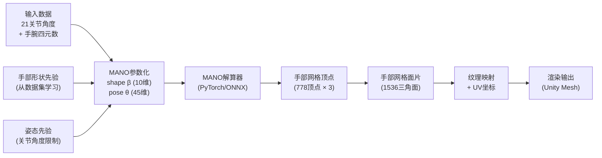

# SPEC-05: 3D渲染规范

> **版本**: v1.0.0
> **日期**: 2025-07-11
> **状态**: Draft
> **负责人**: AI系统架构师 + 3D渲染工程师
> **关联文档**: SPEC-01(系统总览)、SPEC-03(软件架构)、SPEC-04(AI流水线)

---

## 目录

1. [Phase1: Three.js MVP](#1-phase1-threejs-mvp)
2. [Phase2: Unity XR Hands + MS-MANO](#2-phase2-unity-xr-hands--ms-mano)
3. [渲染质量标准](#3-渲染质量标准)
4. [附录](#4-附录)

---

## 1. Phase1: Three.js MVP

### 1.1 技术方案

Phase1的3D渲染采用Three.js WebGL方案实现最小可行产品（MVP），目标是在浏览器中实时展示双手的3D骨骼动画，并叠加显示手势识别结果和语音输出触发按钮。Three.js是最成熟的Web 3D渲染库，拥有完善的GLTF模型加载器、骨骼动画系统和丰富的社区资源，能够快速实现手部3D可视化的原型。

**技术栈选型：**

| 组件 | 选择 | 版本 | 理由 |
|------|------|------|------|
| 3D引擎 | Three.js | r160+ | WebGL标准, GLTF支持完善, 骨骼动画成熟 |
| 构建工具 | Vite | 5.x | 快速HMR, 原生ESM支持 |
| UI框架 | 原生HTML/CSS + Tailwind | 3.x | 轻量, 无额外依赖 |
| 状态管理 | Zustand | 4.x | 简洁, 适合小型应用 |
| 通信 | WebSocket (native) | — | 实时数据推送 |

**GLTF手部模型规格：**

手部模型使用GLTF 2.0格式（.glb二进制格式），包含完整的骨骼绑定（Skinning）和动画定义。模型需满足以下规格：

- **多边形数**：单手≤5000三角面，确保在移动端也能流畅渲染
- **纹理**：PBR材质，Albedo + Normal + Roughness三张贴图，总尺寸≤1024×1024
- **骨骼数**：遵循InterHand2.6M标准的21关节骨骼层次
- **文件大小**：单手模型≤2MB（.glb格式）
- **朝向**：模型默认朝向Z轴正方向，手掌面向X轴正方向
- **单位**：1单位 = 1毫米（与传感器坐标系统一致）
- **比例**：符合标准成人手部比例，手掌长度约190mm

**骨骼绑定（Bone Hierarchy）：**

GLTF模型的骨骼层次严格对应InterHand2.6M的21关键点定义。根骨骼（Root）位于手腕中心（WRIST），其余骨骼按照手指的自然层次结构排列。每个骨骼的局部坐标系遵循Three.js的Y-up约定：Y轴沿骨骼长度方向（指向子关节），X轴为手指展开方向，Z轴为弯曲方向（叉乘确定）。

```
Root (WRIST) — 手腕根骨骼
├── THUMB_CMC — 拇指腕掌关节
│   ├── THUMB_MCP — 拇指掌指关节
│   │   └── THUMB_IP — 拇指指间关节
│   │       └── THUMB_TIP — 拇指尖端 [末端]
├── INDEX_MCP — 食指掌指关节
│   ├── INDEX_PIP — 食指近端指间关节
│   │   └── INDEX_DIP — 食指远端指间关节
│   │       └── INDEX_TIP — 食指尖端 [末端]
├── MIDDLE_MCP — 中指掌指关节
│   ├── MIDDLE_PIP — 中指近端指间关节
│   │   └── MIDDLE_DIP — 中指远端指间关节
│   │       └── MIDDLE_TIP — 中指尖端 [末端]
├── RING_MCP — 无名指掌指关节
│   ├── RING_PIP — 无名指近端指间关节
│   │   └── RING_DIP — 无名指远端指间关节
│   │       └── RING_TIP — 无名指尖端 [末端]
└── PINKY_MCP — 小指掌指关节
    ├── PINKY_PIP — 小指近端指间关节
    │   └── PINKY_DIP — 小指远端指间关节
    │       └── PINKY_TIP — 小指尖端 [末端]
```

**关节映射（传感器数据→骨骼旋转）：**

传感器数据到骨骼旋转的映射需要将弯曲传感器角度转换为每个骨骼的局部旋转变换。映射算法基于关节生理约束：

- **弯曲关节（PIP、DIP）**：弯曲传感器直接映射为绕X轴的旋转（正值为弯曲，即手指向掌心方向弯曲），旋转范围0°~180°
- **MCP关节**：除了弯曲（绕X轴旋转），还支持外展/内收（绕Z轴旋转，范围-15°~15°）和微小旋转（绕Y轴，范围-5°~5°）
- **拇指CMC关节**：特殊处理，拇指的运动更加自由，支持三个轴的旋转
- **手腕（WRIST）**：由IMU四元数直接控制，提供手掌的整体方向

```javascript
// jointMapper.js — 传感器数据到骨骼旋转映射
class JointMapper {
    constructor() {
        // InterHand2.6M 关节索引
        this.jointIndices = {
            WRIST: 0,
            THUMB_CMC: 1, THUMB_MCP: 2, THUMB_IP: 3, THUMB_TIP: 4,
            INDEX_MCP: 5, INDEX_PIP: 6, INDEX_DIP: 7, INDEX_TIP: 8,
            MIDDLE_MCP: 9, MIDDLE_PIP: 10, MIDDLE_DIP: 11, MIDDLE_TIP: 12,
            RING_MCP: 13, RING_PIP: 14, RING_DIP: 15, RING_TIP: 16,
            PINKY_MCP: 17, PINKY_PIP: 18, PINKY_DIP: 19, PINKY_TIP: 20,
        };

        // 弯曲传感器到关节索引的映射
        // [拇指PIP, 拇指DIP, 食指PIP, 食指DIP, ...]
        this.flexToJoint = [
            { joint: 'THUMB_IP', axis: 'x', scale: 1.0, offset: 0 },
            { joint: 'THUMB_TIP', axis: 'x', scale: 0.8, offset: 0 },
            { joint: 'INDEX_PIP', axis: 'x', scale: 1.0, offset: 0 },
            { joint: 'INDEX_DIP', axis: 'x', scale: 0.8, offset: 0 },
            { joint: 'MIDDLE_PIP', axis: 'x', scale: 1.0, offset: 0 },
            { joint: 'MIDDLE_DIP', axis: 'x', scale: 0.8, offset: 0 },
            { joint: 'RING_PIP', axis: 'x', scale: 1.0, offset: 0 },
            { joint: 'RING_DIP', axis: 'x', scale: 0.8, offset: 0 },
            { joint: 'PINKY_PIP', axis: 'x', scale: 1.0, offset: 0 },
            { joint: 'PINKY_DIP', axis: 'x', scale: 0.8, offset: 0 },
        ];

        // MCP弯曲估算系数 (基于PIP弯曲的线性回归)
        this.mcpCoefficients = {
            THUMB: 0.6, INDEX: 0.5, MIDDLE: 0.45,
            RING: 0.5, PINKY: 0.55
        };
    }

    /**
     * 将传感器数据映射为骨骼旋转四元数
     * @param {Object} sensorData - 传感器数据
     * @param {Float32Array} sensorData.flex - 10个弯曲传感器值 (0~1)
     * @param {Float32Array} sensorData.quat - 手腕四元数 (w,x,y,z)
     * @returns {Object} jointRotations - 各关节的旋转四元数
     */
    mapSensorToRotations(sensorData) {
        const { flex, quat } = sensorData;
        const rotations = {};

        // 1. 手腕旋转 (直接使用IMU四元数)
        rotations.WRIST = new THREE.Quaternion(
            quat[1], quat[2], quat[3], quat[0]  // GLTF使用(x,y,z,w)顺序
        );

        // 2. 拇指CMC (特殊处理: 绕多轴旋转)
        const thumbPIPAngle = flex[0] * Math.PI;
        rotations.THUMB_CMC = new THREE.Quaternion().setFromEuler(
            new THREE.Euler(0, thumbPIPAngle * 0.3, thumbPIPAngle * 0.2, 'XYZ')
        );

        // 3. 各手指的PIP/DIP弯曲
        const fingerNames = ['THUMB', 'INDEX', 'MIDDLE', 'RING', 'PINKY'];
        for (let i = 0; i < 5; i++) {
            const pipIndex = i * 2;
            const dipIndex = i * 2 + 1;
            const pipAngle = flex[pipIndex] * Math.PI;   // 0~π
            const dipAngle = flex[dipIndex] * Math.PI * 0.8;  // DIP范围略小

            // PIP关节旋转 (绕X轴)
            const pipJointName = fingerNames[i] + '_PIP';
            if (i === 0) {
                // 拇指使用IP关节
                rotations['THUMB_IP'] = new THREE.Quaternion().setFromAxisAngle(
                    new THREE.Vector3(1, 0, 0), pipAngle
                );
                rotations['THUMB_TIP'] = new THREE.Quaternion().setFromAxisAngle(
                    new THREE.Vector3(1, 0, 0), dipAngle
                );
            } else {
                rotations[pipJointName] = new THREE.Quaternion().setFromAxisAngle(
                    new THREE.Vector3(1, 0, 0), pipAngle
                );
                // DIP关节旋转
                const dipJointName = fingerNames[i] + '_DIP';
                rotations[dipJointName] = new THREE.Quaternion().setFromAxisAngle(
                    new THREE.Vector3(1, 0, 0), dipAngle
                );
            }

            // MCP关节旋转 (基于PIP弯曲估算)
            if (i > 0) {
                const mcpAngle = pipAngle * this.mcpCoefficients[fingerNames[i]];
                const mcpJointName = fingerNames[i] + '_MCP';
                rotations[mcpJointName] = new THREE.Quaternion().setFromAxisAngle(
                    new THREE.Vector3(1, 0, 0), mcpAngle
                );
            } else {
                // 拇指MCP
                const mcpAngle = pipAngle * this.mcpCoefficients['THUMB'];
                rotations['THUMB_MCP'] = new THREE.Quaternion().setFromAxisAngle(
                    new THREE.Vector3(1, 0, 0), mcpAngle
                );
            }
        }

        // TIP关节不旋转 (末端效应器, 不含额外关节)
        for (const finger of fingerNames) {
            const tipName = finger + '_TIP';
            if (!rotations[tipName]) {
                rotations[tipName] = new THREE.Quaternion();  // 单位四元数 (无旋转)
            }
        }

        return rotations;
    }
}
```

### 1.2 数据流

Phase1的数据流架构采用WebSocket实时推送模式，确保3D渲染的低延迟和高帧率。数据从ESP32传感器出发，经过ESP-NOW无线传输、上位机串口接收、数据解析和AI推理，最终通过WebSocket推送到浏览器，驱动Three.js渲染。整个数据链路的目标端到端延迟为小于100ms。

```
┌──────────┐  ESP-NOW  ┌──────────┐  UART/USB  ┌──────────────┐
│  ESP32   │ ────────→ │ ESP-NOW  │ ─────────→ │  上位机软件   │
│  数据手套│  2.4GHz   │  接收网关│  115200bps │  (Python)     │
└──────────┘           └──────────┘            └──────┬───────┘
                                                      │
                                               数据解析 + AI推理
                                                      │
                                              ┌───────▼────────┐
                                              │   WebSocket    │
                                              │   Server       │
                                              │  (FastAPI)     │
                                              └───────┬────────┘
                                                      │ ws://
                                               ┌──────▼───────┐
                                               │   浏览器      │
                                               │  ┌─────────┐ │
                                               │  │Three.js │ │
                                               │  │ 渲染引擎 │ │
                                               │  └─────────┘ │
                                               │  ┌─────────┐ │
                                               │  │ Web UI  │ │
                                               │  │ 结果显示 │ │
                                               │  └─────────┘ │
                                               └──────────────┘
```

**WebSocket消息格式：**

```json
// 类型1: Pose数据推送 (60Hz)
{
    "type": "pose",
    "timestamp": 1689012345.678,
    "left_hand": {
        "joints": [[0,0,0], [15,5,0], ...],   // 21×3 关节坐标
        "quaternion": [0.998, 0.002, 0.001, 0.001],  // 手腕四元数
        "confidence": [1.0, 0.95, ...]          // 21×置信度
    },
    "right_hand": {
        "joints": [[0,0,0], [-15,5,0], ...],
        "quaternion": [0.998, -0.002, 0.001, 0.001],
        "confidence": [1.0, 0.95, ...]
    }
}

// 类型2: 识别结果推送 (事件驱动)
{
    "type": "recognition",
    "timestamp": 1689012345.678,
    "gesture_id": 1,
    "gesture_name": "你好",
    "confidence": 0.95,
    "processed_text": "你好。",
    "is_stable": true
}

// 类型3: 系统状态推送 (1Hz)
{
    "type": "system_status",
    "timestamp": 1689012345.678,
    "fps": 60,
    "connection_status": "connected",
    "model_version": "1.2.3",
    "latency_ms": 45.2
}
```

### 1.3 渲染实现

#### 1.3.1 场景设置

Three.js场景设置包含光照系统、相机配置和材质参数。场景采用PBR（Physically Based Rendering）渲染管线，以获得逼真的手部视觉效果。光照系统使用三点照明方案：主光源（DirectionalLight）提供主要照明和环境感，补光源（HemisphereLight）补充环境光，背光（PointLight）增加轮廓感和深度。所有光源的色温和强度经过调优，确保手部模型在不同角度下都有良好的视觉表现。

```javascript
// scene.js — Three.js 场景设置
import * as THREE from 'three';
import { OrbitControls } from 'three/addons/controls/OrbitControls.js';

class HandScene {
    constructor(container) {
        this.container = container;
        this.renderer = null;
        this.scene = null;
        this.camera = null;
        this.controls = null;
        this.leftHand = null;
        this.rightHand = null;
        this.clock = new THREE.Clock();
        this.frameCount = 0;
        this.fps = 0;

        this.init();
    }

    init() {
        // 渲染器
        this.renderer = new THREE.WebGLRenderer({
            antialias: true,
            alpha: true,
            powerPreference: 'high-performance',
        });
        this.renderer.setSize(this.container.clientWidth, this.container.clientHeight);
        this.renderer.setPixelRatio(Math.min(window.devicePixelRatio, 2));
        this.renderer.outputColorSpace = THREE.SRGBColorSpace;
        this.renderer.toneMapping = THREE.ACESFilmicToneMapping;
        this.renderer.toneMappingExposure = 1.2;
        this.renderer.shadowMap.enabled = true;
        this.renderer.shadowMap.type = THREE.PCFSoftShadowMap;
        this.container.appendChild(this.renderer.domElement);

        // 场景
        this.scene = new THREE.Scene();
        this.scene.background = new THREE.Color(0x1a1a2e);

        // 相机
        const aspect = this.container.clientWidth / this.container.clientHeight;
        this.camera = new THREE.PerspectiveCamera(45, aspect, 0.1, 1000);
        this.camera.position.set(0, 150, 400);  // mm单位, 稍微俯视
        this.camera.lookAt(0, 100, 0);

        // 轨道控制器
        this.controls = new OrbitControls(this.camera, this.renderer.domElement);
        this.controls.enableDamping = true;
        this.controls.dampingFactor = 0.05;
        this.controls.target.set(0, 100, 0);
        this.controls.minDistance = 100;
        this.controls.maxDistance = 800;
        this.controls.update();

        // 光照系统 (三点照明)
        this.setupLights();

        // 地面参考网格
        this.setupGround();

        // 窗口大小自适应
        window.addEventListener('resize', () => this.onResize());
    }

    setupLights() {
        // 环境光
        const ambientLight = new THREE.AmbientLight(0x404060, 0.4);
        this.scene.add(ambientLight);

        // 主光源 (方向光, 从右上方照射)
        const mainLight = new THREE.DirectionalLight(0xfff5e6, 1.2);
        mainLight.position.set(200, 300, 200);
        mainLight.castShadow = true;
        mainLight.shadow.mapSize.width = 1024;
        mainLight.shadow.mapSize.height = 1024;
        mainLight.shadow.camera.near = 1;
        mainLight.shadow.camera.far = 1000;
        mainLight.shadow.camera.left = -200;
        mainLight.shadow.camera.right = 200;
        mainLight.shadow.camera.top = 200;
        mainLight.shadow.camera.bottom = -200;
        this.scene.add(mainLight);

        // 补光 (半球光, 天空蓝+地面暖色)
        const hemiLight = new THREE.HemisphereLight(0x87ceeb, 0x362d1b, 0.6);
        this.scene.add(hemiLight);

        // 背光 (点光源, 从后方打光增加轮廓)
        const backLight = new THREE.PointLight(0x6495ed, 0.5, 500);
        backLight.position.set(0, 150, -200);
        this.scene.add(backLight);

        // 柔和的填充光 (从左侧)
        const fillLight = new THREE.DirectionalLight(0xe0e0ff, 0.3);
        fillLight.position.set(-150, 100, 100);
        this.scene.add(fillLight);
    }

    setupGround() {
        // 参考网格 (辅助空间感知)
        const gridHelper = new THREE.GridHelper(600, 30, 0x333355, 0x222244);
        gridHelper.position.y = -10;
        this.scene.add(gridHelper);

        // 透明地面 (接收阴影)
        const groundGeom = new THREE.PlaneGeometry(600, 600);
        const groundMat = new THREE.MeshStandardMaterial({
            color: 0x1a1a2e,
            transparent: true,
            opacity: 0.5,
            roughness: 0.9,
        });
        const ground = new THREE.Mesh(groundGeom, groundMat);
        ground.rotation.x = -Math.PI / 2;
        ground.position.y = -10;
        ground.receiveShadow = true;
        this.scene.add(ground);
    }

    onResize() {
        const w = this.container.clientWidth;
        const h = this.container.clientHeight;
        this.camera.aspect = w / h;
        this.camera.updateProjectionMatrix();
        this.renderer.setSize(w, h);
    }
}
```

#### 1.3.2 手部模型加载

手部GLTF模型的加载使用Three.js内置的GLTFLoader。加载后遍历模型的骨骼层次结构，建立关节名称到骨骼对象的映射表，以便后续通过名称直接设置骨骼旋转。同时缓存模型的默认姿态（T-pose或自然松弛姿态），用于初始化和重置。

```javascript
// handModel.js — 手部模型加载和骨骼驱动
import * as THREE from 'three';
import { GLTFLoader } from 'three/addons/loaders/GLTFLoader.js';
import { DRACOLoader } from 'three/addons/loaders/DRACOLoader.js';

class HandModel {
    /**
     * @param {string} modelPath - GLTF模型路径
     * @param {string} handType - 'left' | 'right'
     * @param {THREE.Scene} scene - Three.js场景
     */
    constructor(modelPath, handType, scene) {
        this.handType = handType;
        this.scene = scene;
        this.model = null;
        this.mixer = null;
        this.skeleton = null;
        this.boneMap = {};  // 关节名称 → THREE.Bone 映射
        this.defaultPose = {};  // 默认姿态存储
        this.jointMapper = new JointMapper();

        this.loadModel(modelPath);
    }

    async loadModel(modelPath) {
        const loader = new GLTFLoader();

        // 启用Draco压缩 (减小模型体积)
        const dracoLoader = new DRACOLoader();
        dracoLoader.setDecoderPath('https://www.gstatic.com/draco/versioned/decoders/1.5.6/');
        loader.setDRACOLoader(dracoLoader);

        return new Promise((resolve, reject) => {
            loader.load(modelPath, (gltf) => {
                this.model = gltf.scene;

                // 如果是右手, 镜像模型 (X轴翻转)
                if (this.handType === 'right') {
                    this.model.scale.x = -1;
                }

                // 设置位置
                const xOffset = this.handType === 'left' ? -80 : 80;
                this.model.position.set(xOffset, 0, 0);
                this.model.traverse((child) => {
                    if (child.isMesh) {
                        child.castShadow = true;
                        child.receiveShadow = true;
                    }
                });

                this.scene.add(this.model);

                // 建立骨骼映射
                this.buildBoneMap();

                // 存储默认姿态
                this.storeDefaultPose();

                resolve(this.model);
            }, undefined, reject);
        });
    }

    buildBoneMap() {
        // 遍历模型找到骨架
        this.model.traverse((child) => {
            if (child.isSkinnedMesh) {
                this.skeleton = child.skeleton;
                console.log(`找到骨架: ${this.skeleton.bones.length} 个骨骼`);
                // 建立名称映射
                for (const bone of this.skeleton.bones) {
                    if (bone.name) {
                        this.boneMap[bone.name] = bone;
                    }
                }
            }
        });
    }

    storeDefaultPose() {
        for (const [name, bone] of Object.entries(this.boneMap)) {
            this.defaultPose[name] = {
                position: bone.position.clone(),
                quaternion: bone.quaternion.clone(),
                scale: bone.scale.clone(),
            };
        }
    }

    /**
     * 更新手部骨骼姿态
     * @param {Object} poseData - 来自WebSocket的Pose数据
     * @param {Float32Array} poseData.joints - (21, 3) 关节坐标
     * @param {Float32Array} poseData.quaternion - (4,) 手腕四元数
     * @param {Float32Array} poseData.confidence - (21,) 置信度
     */
    updatePose(poseData) {
        if (!this.skeleton || !poseData) return;

        const { joints, quaternion, confidence } = poseData;

        // 方法1: 直接设置手腕位置 (使用第一个关节作为手腕位置)
        const wristBone = this.boneMap['WRIST'] || this.skeleton.bones[0];
        if (wristBone) {
            // 将毫米坐标转换为Three.js单位
            const scale = 0.01;  // mm → cm (或根据场景缩放调整)
            wristBone.position.set(
                joints[0][0] * scale,
                joints[0][1] * scale,
                joints[0][2] * scale
            );
        }

        // 方法2: 通过传感器弯曲数据驱动骨骼旋转
        // (需要在上位机侧将弯曲传感器数据编码到pose消息中)
        // 这里使用关节坐标差分反推旋转角度
        this.updateBoneRotationsFromJoints(joints);
    }

    /**
     * 从关节坐标反推骨骼旋转 (Forward Kinematics逆解)
     * @param {Array} joints - (21, 3) 关节坐标
     */
    updateBoneRotationsFromJoints(joints) {
        // 拇指链
        this._setBoneRotation('THUMB_CMC', joints[1], joints[0], joints[2]);
        this._setBoneRotation('THUMB_MCP', joints[2], joints[1], joints[3]);
        this._setBoneRotation('THUMB_IP', joints[3], joints[2], joints[4]);

        // 食指链
        this._setBoneRotation('INDEX_MCP', joints[5], joints[0], joints[6]);
        this._setBoneRotation('INDEX_PIP', joints[6], joints[5], joints[7]);
        this._setBoneRotation('INDEX_DIP', joints[7], joints[6], joints[8]);

        // 中指链
        this._setBoneRotation('MIDDLE_MCP', joints[9], joints[0], joints[10]);
        this._setBoneRotation('MIDDLE_PIP', joints[10], joints[9], joints[11]);
        this._setBoneRotation('MIDDLE_DIP', joints[11], joints[10], joints[12]);

        // 无名指链
        this._setBoneRotation('RING_MCP', joints[13], joints[0], joints[14]);
        this._setBoneRotation('RING_PIP', joints[14], joints[13], joints[15]);
        this._setBoneRotation('RING_DIP', joints[15], joints[14], joints[16]);

        // 小指链
        this._setBoneRotation('PINKY_MCP', joints[17], joints[0], joints[18]);
        this._setBoneRotation('PINKY_PIP', joints[18], joints[17], joints[19]);
        this._setBoneRotation('PINKY_DIP', joints[19], joints[18], joints[20]);
    }

    /**
     * 根据三个关节位置设置骨骼旋转 (lookAt方法)
     */
    _setBoneRotation(boneName, currentJoint, parentJoint, childJoint) {
        const bone = this.boneMap[boneName];
        if (!bone) return;

        // 计算骨骼方向向量
        const direction = new THREE.Vector3(
            childJoint[0] - currentJoint[0],
            childJoint[1] - currentJoint[1],
            childJoint[2] - currentJoint[2]
        ).normalize();

        // 使用临时对象计算旋转
        const up = new THREE.Vector3(0, 1, 0);
        const matrix = new THREE.Matrix4();
        matrix.lookAt(
            new THREE.Vector3(...currentJoint),
            new THREE.Vector3(...childJoint),
            up
        );
        bone.quaternion.setFromRotationMatrix(matrix);
    }

    resetPose() {
        for (const [name, pose] of Object.entries(this.defaultPose)) {
            const bone = this.boneMap[name];
            if (bone) {
                bone.position.copy(pose.position);
                bone.quaternion.copy(pose.quaternion);
                bone.scale.copy(pose.scale);
            }
        }
    }
}
```

#### 1.3.3 骨骼动画驱动

骨骼动画驱动是3D渲染的核心环节，负责将实时更新的Pose数据平滑地应用到模型骨骼上。为了避免直接设置骨骼旋转导致的抖动和跳变，动画驱动器实现了插值平滑（SLERP球面线性插值）和低通滤波。每帧渲染时，动画驱动器将目标旋转与当前旋转进行SLERP混合，混合系数根据帧率自适应调整（目标帧率60fps下，插值系数α=0.3，提供约5帧的平滑窗口）。

```javascript
// animationDriver.js — 骨骼动画驱动器
import * as THREE from 'three';

class AnimationDriver {
    constructor() {
        this.targetRotations = {};   // 目标旋转 (来自传感器)
        this.currentRotations = {};  // 当前旋转 (经过平滑)
        this.interpolationFactor = 0.3;  // SLERP插值系数
        this.isEnabled = true;
    }

    /**
     * 设置目标旋转
     * @param {string} boneName - 骨骼名称
     * @param {THREE.Quaternion} rotation - 目标旋转四元数
     */
    setTargetRotation(boneName, rotation) {
        if (!this.currentRotations[boneName]) {
            this.currentRotations[boneName] = rotation.clone();
        }
        this.targetRotations[boneName] = rotation.clone();
    }

    /**
     * 每帧更新, 应用平滑插值
     * @param {number} deltaTime - 帧间时间 (秒)
     */
    update(deltaTime) {
        if (!this.isEnabled) return;

        const alpha = Math.min(this.interpolationFactor, 1.0);

        for (const [boneName, targetQuat] of Object.entries(this.targetRotations)) {
            const currentQuat = this.currentRotations[boneName];
            if (currentQuat && targetQuat) {
                currentQuat.slerp(targetQuat, alpha);
            }
        }
    }

    /**
     * 获取平滑后的旋转
     * @param {string} boneName
     * @returns {THREE.Quaternion|null}
     */
    getRotation(boneName) {
        return this.currentRotations[boneName] || null;
    }

    /**
     * 批量设置目标旋转 (从Pose数据)
     */
    setPoseTarget(poseData) {
        const rotations = this.jointMapper.mapSensorToRotations(poseData);
        for (const [name, quat] of Object.entries(rotations)) {
            this.setTargetRotation(name, quat);
        }
    }

    /**
     * 应用到模型骨骼
     */
    applyToModel(handModel) {
        for (const [boneName, quat] of Object.entries(this.currentRotations)) {
            const bone = handModel.boneMap[boneName];
            if (bone && quat) {
                bone.quaternion.copy(quat);
            }
        }
    }

    reset() {
        this.targetRotations = {};
        this.currentRotations = {};
    }
}
```

#### 1.3.4 帧率和性能优化

Three.js渲染的性能优化是确保流畅用户体验的关键。目标帧率为60fps（桌面端）和30fps（移动端），需要从渲染管线、资源管理和数据传输三个层面进行优化。

**渲染层面优化：**

- **自适应分辨率**：根据实际帧率动态调整渲染分辨率（Resolution Scaling），当帧率低于目标时自动降低分辨率，确保渲染不卡顿
- **视锥体剔除（Frustum Culling）**：Three.js默认启用，确保只渲染视口内的对象
- **遮挡剔除（Occlusion Culling）**：对于复杂场景启用遮挡剔除，减少不必要的绘制调用
- **实例化渲染（InstancedMesh）**：对于重复的几何体（如粒子效果）使用实例化渲染
- **LOD（Level of Detail）**：根据相机距离自动切换不同精度的模型

**资源层面优化：**

- **纹理压缩**：使用KTX2/Basis Universal压缩纹理格式，减少GPU内存占用
- **Draco网格压缩**：GLTF模型启用Draco压缩，减少模型文件大小和加载时间
- **模型预加载**：在应用启动时预加载所有必要资源，避免运行时的加载卡顿
- **对象池**：对于频繁创建和销毁的对象（如特效粒子）使用对象池模式

**数据传输优化：**

- **WebSocket二进制协议**：将Pose数据编码为二进制格式（ArrayBuffer），减少网络传输量（JSON约200字节/帧 vs 二进制约100字节/帧）
- **差异更新**：仅传输相对于上一帧的变化量，而不是每帧发送完整的Pose数据
- **帧率解耦**：渲染帧率（60fps）与数据更新帧率（60Hz）解耦，避免网络波动影响渲染流畅度

```javascript
// performanceOptimizer.js — 性能优化管理器
class PerformanceOptimizer {
    constructor(renderer, camera) {
        this.renderer = renderer;
        this.camera = camera;
        this.targetFPS = 60;
        this.minFPS = 30;
        this.frameTimes = [];
        this.resolutionScale = 1.0;
        this.pixelRatio = Math.min(window.devicePixelRatio, 2);
        this.statsEnabled = false;

        // FPS监控
        this.fps = 0;
        this.frameCount = 0;
        this.lastFPSTime = performance.now();
    }

    update() {
        // 记录帧时间
        const now = performance.now();
        this.frameTimes.push(now);
        // 只保留最近60帧的时间记录
        if (this.frameTimes.length > 60) {
            this.frameTimes.shift();
        }

        // 计算实际FPS
        this.frameCount++;
        if (now - this.lastFPSTime >= 1000) {
            this.fps = this.frameCount;
            this.frameCount = 0;
            this.lastFPSTime = now;
        }

        // 自适应分辨率调整
        this.adaptiveResolution();
    }

    adaptiveResolution() {
        if (this.frameTimes.length < 10) return;

        // 计算最近帧的平均帧时间
        const recentFrames = this.frameTimes.slice(-10);
        const avgFrameTime = (recentFrames[recentFrames.length - 1] -
                            recentFrames[0]) / (recentFrames.length - 1);
        const currentFPS = 1000 / avgFrameTime;

        // 动态调整分辨率
        if (currentFPS < this.minFPS && this.resolutionScale > 0.5) {
            // 帧率过低, 降低分辨率
            this.resolutionScale = Math.max(0.5, this.resolutionScale - 0.05);
            this.applyResolution();
        } else if (currentFPS > this.targetFPS * 1.2 && this.resolutionScale < 1.0) {
            // 帧率有余量, 提高分辨率
            this.resolutionScale = Math.min(1.0, this.resolutionScale + 0.02);
            this.applyResolution();
        }
    }

    applyResolution() {
        this.renderer.setPixelRatio(this.pixelRatio * this.resolutionScale);
    }

    getStats() {
        return {
            fps: this.fps,
            resolutionScale: this.resolutionScale,
            pixelRatio: this.pixelRatio * this.resolutionScale,
        };
    }
}
```

### 1.4 交互功能

#### 1.4.1 手势识别结果叠加显示

手势识别结果以浮动UI的形式叠加在3D场景上方。显示内容包括：当前识别的手势名称（大字体）、置信度（进度条或百分比）、已识别的手势历史（滚动列表）。当识别结果稳定时（连续N帧识别为同一手势且置信度超过阈值），触发TTS语音输出并更新历史记录。识别结果的UI设计采用半透明玻璃质感背景，确保不遮挡3D场景的视觉体验。

#### 1.4.2 语音输出触发

语音输出触发机制设计为"稳定确认后自动播放"模式。当识别结果稳定达到设定的帧数阈值（默认5帧，约83ms@60Hz）且置信度超过设定阈值（默认0.7）时，自动调用TTS引擎合成语音并播放。为避免重复播报同一手势，设置了冷却时间（同一手势3秒内不重复播放）。用户也可以手动触发语音播报（点击播放按钮或按快捷键Space）。

#### 1.4.3 设置面板

设置面板提供可配置的用户参数，包括：

- **灵敏度调节**：调整弯曲传感器的灵敏度映射系数（0.5~2.0）
- **识别阈值**：调整手势识别的置信度阈值（0.3~0.95）
- **平滑窗口**：调整识别结果的时序平滑帧数（1~15帧）
- **语音设置**：TTS引擎选择（piper/espeak/edge）、语速调节、音量调节
- **显示设置**：显示模式（骨骼/网格/线框）、背景颜色、相机视角预设
- **连接设置**：WebSocket服务器地址、自动重连开关

```javascript
// settingsPanel.js — 设置面板
class SettingsPanel {
    constructor(container, store) {
        this.container = container;
        this.store = store;  // Zustand store
        this.isVisible = false;
        this.init();
    }

    init() {
        this.panel = document.createElement('div');
        this.panel.id = 'settings-panel';
        this.panel.className = 'settings-panel hidden';
        this.panel.innerHTML = `
            <div class="panel-header">
                <h3>⚙️ 设置</h3>
                <button id="close-settings">✕</button>
            </div>
            <div class="panel-body">
                <section class="setting-group">
                    <h4>识别设置</h4>
                    <label>置信度阈值:
                        <input type="range" id="confidence-threshold"
                               min="0.3" max="0.95" step="0.05" value="0.7">
                        <span id="threshold-value">0.70</span>
                    </label>
                    <label>平滑窗口:
                        <input type="range" id="smoothing-window"
                               min="1" max="15" step="1" value="5">
                        <span id="smoothing-value">5 帧</span>
                    </label>
                </section>
                <section class="setting-group">
                    <h4>语音设置</h4>
                    <label>TTS引擎:
                        <select id="tts-engine">
                            <option value="piper" selected>Piper (离线)</option>
                            <option value="espeak">eSpeak (离线)</option>
                            <option value="edge">Edge-TTS (在线)</option>
                        </select>
                    </label>
                    <label>语速:
                        <input type="range" id="speech-rate"
                               min="0.5" max="2.0" step="0.1" value="1.0">
                        <span id="rate-value">1.0x</span>
                    </label>
                </section>
                <section class="setting-group">
                    <h4>显示设置</h4>
                    <label>显示模式:
                        <select id="display-mode">
                            <option value="mesh" selected>网格</option>
                            <option value="skeleton">骨骼</option>
                            <option value="wireframe">线框</option>
                            <option value="xray">X光</option>
                        </select>
                    </label>
                </section>
            </div>
        `;
        this.container.appendChild(this.panel);
        this.bindEvents();
    }

    bindEvents() {
        // 置信度阈值
        document.getElementById('confidence-threshold').addEventListener('input', (e) => {
            const val = parseFloat(e.target.value);
            document.getElementById('threshold-value').textContent = val.toFixed(2);
            this.store.setConfidenceThreshold(val);
        });

        // 平滑窗口
        document.getElementById('smoothing-window').addEventListener('input', (e) => {
            const val = parseInt(e.target.value);
            document.getElementById('smoothing-value').textContent = `${val} 帧`;
            this.store.setSmoothingWindow(val);
        });

        // TTS引擎
        document.getElementById('tts-engine').addEventListener('change', (e) => {
            this.store.setTTSEngine(e.target.value);
        });

        // 显示模式
        document.getElementById('display-mode').addEventListener('change', (e) => {
            this.store.setDisplayMode(e.target.value);
        });

        // 关闭面板
        document.getElementById('close-settings').addEventListener('click', () => {
            this.toggle(false);
        });
    }

    toggle(visible) {
        this.isVisible = visible ?? !this.isVisible;
        this.panel.classList.toggle('hidden', !this.isVisible);
    }
}
```

### 1.5 参考代码结构（参考Gill003）

Gill003仓库提供了一个完整的Three.js手部骨骼动画和Web Speech API TTS的参考实现。以下是本项目Phase1的推荐代码结构，借鉴了Gill003的架构思路：

```
web/
├── index.html                      # 主页面
├── package.json                    # NPM依赖
├── vite.config.js                  # Vite配置
├── tailwind.config.js              # Tailwind CSS配置
├── public/
│   └── models/
│       ├── hand_left.glb           # 左手GLTF模型
│       └── hand_right.glb          # 右手GLTF模型
├── src/
│   ├── main.js                     # 应用入口
│   ├── app.js                      # 应用主类 (初始化所有模块)
│   ├── core/
│   │   ├── scene.js                # Three.js场景 (光照、相机、渲染器)
│   │   ├── handModel.js            # 手部模型加载和骨骼管理
│   │   ├── jointMapper.js          # 传感器→骨骼旋转映射
│   │   ├── animationDriver.js      # 骨骼动画平滑驱动
│   │   └── performanceOptimizer.js # 性能优化管理
│   ├── net/
│   │   ├── websocketClient.js      # WebSocket客户端
│   │   └── dataDecoder.js          # 二进制数据解码器
│   ├── ui/
│   │   ├── overlay.js              # 手势结果叠加UI
│   │   ├── settingsPanel.js        # 设置面板
│   │   ├── historyPanel.js         # 识别历史面板
│   │   └── statsDisplay.js         # 性能统计显示
│   ├── tts/
│   │   ├── speechSynth.js          # Web Speech API TTS (浏览器内置)
│   │   └── audioPlayer.js          # 音频播放管理
│   └── store/
│       └── useStore.js             # Zustand状态管理
└── tests/
    ├── scene.test.js
    └── handModel.test.js
```

**主应用入口文件（main.js）：**

```javascript
// main.js — 应用入口
import { App } from './app.js';

// 创建应用实例
const app = new App({
    container: document.getElementById('app-container'),
    canvasContainer: document.getElementById('canvas-container'),
    websocketUrl: `ws://${window.location.hostname}:8765`,
});

// 初始化应用
app.init().then(() => {
    console.log('手语翻译3D可视化系统已启动');
    app.start();
});

// 全局错误处理
window.addEventListener('error', (event) => {
    console.error('应用错误:', event.error);
});
```

**应用主类（app.js）：**

```javascript
// app.js — 应用主类
import { HandScene } from './core/scene.js';
import { HandModel } from './core/handModel.js';
import { AnimationDriver } from './core/animationDriver.js';
import { PerformanceOptimizer } from './core/performanceOptimizer.js';
import { WebSocketClient } from './net/websocketClient.js';
import { Overlay } from './ui/overlay.js';
import { SettingsPanel } from './ui/settingsPanel.js';
import { SpeechSynth } from './tts/speechSynth.js';
import { useStore } from './store/useStore.js';

export class App {
    constructor(config) {
        this.config = config;
        this.store = useStore();
        this.scene = null;
        this.leftHand = null;
        this.rightHand = null;
        this.leftDriver = null;
        this.rightDriver = null;
        this.wsClient = null;
        this.overlay = null;
        this.settingsPanel = null;
        this.tts = null;
        this.optimizer = null;
        this.animationId = null;
    }

    async init() {
        // 1. 初始化3D场景
        this.scene = new HandScene(this.config.canvasContainer);

        // 2. 加载手部模型
        this.leftHand = new HandModel(
            '/models/hand_left.glb', 'left', this.scene.scene
        );
        this.rightHand = new HandModel(
            '/models/hand_right.glb', 'right', this.scene.scene
        );
        await Promise.all([
            this.leftHand.loadModel('/models/hand_left.glb'),
            this.rightHand.loadModel('/models/hand_right.glb'),
        ]);

        // 3. 初始化动画驱动器
        this.leftDriver = new AnimationDriver();
        this.rightDriver = new AnimationDriver();

        // 4. 初始化WebSocket客户端
        this.wsClient = new WebSocketClient(this.config.websocketUrl);
        this.wsClient.onMessage('pose', (data) => this.onPoseData(data));
        this.wsClient.onMessage('recognition', (data) => this.onRecognition(data));
        this.wsClient.onMessage('system_status', (data) => this.onSystemStatus(data));

        // 5. 初始化UI
        this.overlay = new Overlay(this.config.container);
        this.settingsPanel = new SettingsPanel(this.config.container, this.store);

        // 6. 初始化TTS
        this.tts = new SpeechSynth();

        // 7. 初始化性能优化器
        this.optimizer = new PerformanceOptimizer(
            this.scene.renderer, this.scene.camera
        );

        // 8. 键盘快捷键
        document.addEventListener('keydown', (e) => {
            if (e.key === 'Escape') this.settingsPanel.toggle();
            if (e.key === ' ') this.tts.speak(this.store.lastRecognition);
        });
    }

    start() {
        // 连接WebSocket
        this.wsClient.connect();

        // 启动渲染循环
        const renderLoop = () => {
            this.animationId = requestAnimationFrame(renderLoop);
            this.update();
            this.scene.render();
            this.optimizer.update();
        };
        renderLoop();
    }

    update() {
        const delta = this.scene.clock.getDelta();

        // 更新动画驱动器
        this.leftDriver.update(delta);
        this.rightDriver.update(delta);

        // 应用到模型
        this.leftDriver.applyToModel(this.leftHand);
        this.rightDriver.applyToModel(this.rightHand);

        // 更新轨道控制器
        this.scene.controls.update();
    }

    onPoseData(data) {
        // 处理Pose数据
        if (data.left_hand) {
            this.leftDriver.setPoseTarget(data.left_hand);
        }
        if (data.right_hand) {
            this.rightDriver.setPoseTarget(data.right_hand);
        }
    }

    onRecognition(data) {
        // 处理识别结果
        this.overlay.updateResult(data);
        this.store.setLastRecognition(data);

        // 触发TTS
        if (data.is_stable && data.confidence >= this.store.confidenceThreshold) {
            this.tts.speak(data.processed_text || data.gesture_name);
        }
    }

    onSystemStatus(data) {
        // 更新系统状态显示
        this.overlay.updateStatus(data);
    }

    destroy() {
        if (this.animationId) cancelAnimationFrame(this.animationId);
        this.wsClient.disconnect();
        this.scene.dispose();
    }
}
```

---

## 2. Phase2: Unity XR Hands + MS-MANO

### 2.1 Unity项目配置

Phase2将3D渲染从Three.js浏览器方案升级为Unity桌面应用方案，利用Unity的专业渲染能力和XR Hands包实现更高质量的3D手部可视化。Unity方案的优势包括：更丰富的材质和纹理效果、支持高级渲染管线（HDRP）、内置物理引擎支持碰撞和布料模拟、原生C#性能、以及未来扩展到VR/AR设备的可能性。

**Unity项目配置参数：**

| 配置项 | 选择 | 说明 |
|--------|------|------|
| Unity版本 | 2022.3 LTS | 长期支持版本, 稳定性最佳 |
| 渲染管线 | URP (Universal Render Pipeline) | 平衡质量和性能 |
| XR Plugin | OpenXR | 统一的XR接口标准 |
| XR Hands Package | com.unity.xr.hands | 手部追踪支持 |
| 脚本后端 | IL2CPP | 更好的运行时性能 |
| 目标平台 | Windows x64 (Phase2), Android (Phase3) | 桌面优先, 后续移动端 |
| .NET版本 | .NET Standard 2.1 | 兼容性 |

**项目初始化步骤：**

1. 创建Unity项目，选择3D (URP)模板
2. 通过Package Manager安装以下包：
   - Universal RP (14.0+)
   - OpenXR Plugin (1.8+)
   - XR Interaction Toolkit (2.5+)
   - XR Hands (1.3+)
3. 配置URP渲染管线资源（Quality Settings: Medium-High）
4. 设置OpenXR交互配置文件（Hand Tracking）
5. 导入MS-MANO模型资源和着色器

**XR Hands Package集成：**

Unity XR Hands包提供了标准化的手部骨骼数据接口，兼容多种手部追踪设备（如Meta Quest、HoloLens等）。在本项目中，我们不使用VR设备的手部追踪，而是自定义手部数据源，通过实现`IHandDataProvider`接口将我们的21关键点Pose数据注入到XR Hands系统中。这种方式使我们既能利用XR Hands的标准骨骼表示和动画系统，又能使用自己的传感器数据。

```csharp
// CustomHandDataProvider.cs — 自定义手部数据提供者
using UnityEngine.XR.Hands;

/// <summary>
/// 自定义手部数据提供者, 将传感器Pose数据注入XR Hands系统
/// </summary>
public class CustomHandDataProvider : IHandDataProvider
{
    private XRHand[] _hands = new XRHand[2];
    private bool[] _isTracked = new bool[2];
    private PoseData _leftPose;
    private PoseData _rightPose;

    public CustomHandDataProvider()
    {
        // 初始化左右手
        _hands[0] = new XRHand(XRHandedness.Left);
        _hands[1] = new XRHand(XRHandedness.Right);
    }

    /// <summary>
    /// 更新手部Pose数据 (由网络线程调用)
    /// </summary>
    public void UpdatePoseData(PoseData leftHand, PoseData rightHand)
    {
        _leftPose = leftHand;
        _rightPose = rightHand;
        _isTracked[0] = leftHand != null;
        _isTracked[1] = rightHand != null;

        if (_leftPose != null)
        {
            UpdateHandJoints(_hands[0], _leftPose);
        }
        if (_rightPose != null)
        {
            UpdateHandJoints(_hands[1], _rightPose);
        }
    }

    private void UpdateHandJoints(XRHand hand, PoseData poseData)
    {
        // WRIST (关节0)
        UpdateJoint(hand, XRHandJointID.Wrist,
            poseData.Joints[0], poseData.Quaternion);

        // 拇指
        UpdateJoint(hand, XRHandJointID.ThumbMetacarpal, poseData.Joints[1]);
        UpdateJoint(hand, XRHandJointID.ThumbProximal, poseData.Joints[2]);
        UpdateJoint(hand, XRHandJointID.ThumbDistal, poseData.Joints[3]);
        UpdateJoint(hand, XRHandJointID.ThumbTip, poseData.Joints[4]);

        // 食指
        UpdateJoint(hand, XRHandJointID.IndexProximal, poseData.Joints[5]);
        UpdateJoint(hand, XRHandJointID.IndexIntermediate, poseData.Joints[6]);
        UpdateJoint(hand, XRHandJointID.IndexDistal, poseData.Joints[7]);
        UpdateJoint(hand, XRHandJointID.IndexTip, poseData.Joints[8]);

        // 中指
        UpdateJoint(hand, XRHandJointID.MiddleProximal, poseData.Joints[9]);
        UpdateJoint(hand, XRHandJointID.MiddleIntermediate, poseData.Joints[10]);
        UpdateJoint(hand, XRHandJointID.MiddleDistal, poseData.Joints[11]);
        UpdateJoint(hand, XRHandJointID.MiddleTip, poseData.Joints[12]);

        // 无名指
        UpdateJoint(hand, XRHandJointID.RingProximal, poseData.Joints[13]);
        UpdateJoint(hand, XRHandJointID.RingIntermediate, poseData.Joints[14]);
        UpdateJoint(hand, XRHandJointID.RingDistal, poseData.Joints[15]);
        UpdateJoint(hand, XRHandJointID.RingTip, poseData.Joints[16]);

        // 小指
        UpdateJoint(hand, XRHandJointID.LittleProximal, poseData.Joints[17]);
        UpdateJoint(hand, XRHandJointID.LittleIntermediate, poseData.Joints[18]);
        UpdateJoint(hand, XRHandJointID.LittleDistal, poseData.Joints[19]);
        UpdateJoint(hand, XRHandJointID.LittleTip, poseData.Joints[20]);
    }

    private void UpdateJoint(XRHand hand, XRHandJointID jointId,
                              Vector3 position, Quaternion rotation = default)
    {
        if (hand.TryGetJoint(jointId, out XRHandJoint joint))
        {
            joint.position = position * 0.001f; // mm → m
            joint.rotation = rotation;
            joint.isTracked = true;
        }
    }

    // IHandDataProvider 接口实现
    public bool TryGetHand(XRHandedness handedness, out XRHand hand)
    {
        int index = handedness == XRHandedness.Left ? 0 : 1;
        hand = _hands[index];
        return _isTracked[index];
    }

    public void Update()
    {
        // 每帧调用, 更新手部数据状态
    }
}
```

### 2.2 MS-MANO解算

MS-MANO（Multi-Scale MANO）是基于MANO（Model-Based Articulated Hands）的改进手部模型，能够从21个关键点关节角度和手腕姿态解算出高质量的手部3D网格。MS-MANO是InterHand2.6M数据集的官方配套模型，提供了手部形状和姿态的参数化表示。

**MS-MANO解算流程：**



**MS-MANO解算模块设计：**

MS-MANO解算可以作为Python后端服务运行，通过ONNX Runtime高效推理，然后将生成的网格顶点数据通过socket发送给Unity渲染。解算流程的实时性能要求：单次解算延迟<10ms，支持60fps更新率。

```python
# ms_mano_solver.py — MS-MANO手部网格解算
import numpy as np
import onnxruntime as ort
import time
from dataclasses import dataclass
from typing import Optional

@dataclass
class MANOInput:
    """MANO模型输入参数"""
    pose_coeffs: np.ndarray      # (48,) 姿态参数 (3全局旋转 + 15关节×3)
    shape_coeffs: np.ndarray     # (10,) 形状参数 (β)
    transl: np.ndarray           # (3,) 平移 (手腕位置)

@dataclass
class MANOOutput:
    """MANO模型输出"""
    vertices: np.ndarray         # (778, 3) 网格顶点
    faces: np.ndarray            # (1536, 3) 面片索引
    joints: np.ndarray           # (21, 3) 关节位置

class MSMANOSolver:
    """
    MS-MANO手部模型解算器

    使用ONNX Runtime加速推理, 将21关节Pose解算为3D网格
    """

    def __init__(self, model_path: str = "models/mano.onnx",
                 use_gpu: bool = True):
        """
        初始化MS-MANO解算器

        Args:
            model_path: ONNX模型文件路径
            use_gpu: 是否使用GPU加速
        """
        providers = ['CUDAExecutionProvider', 'CPUExecutionProvider'] \
                    if use_gpu else ['CPUExecutionProvider']

        self.session = ort.InferenceSession(model_path, providers=providers)
        self.input_names = [inp.name for inp in self.session.get_inputs()]
        self.output_names = [out.name for out in self.session.get_outputs()]

        # 默认形状参数 (平均手型)
        self.default_shape = np.zeros(10, dtype=np.float32)
        self.default_transl = np.zeros(3, dtype=np.float32)

        # 性能统计
        self._solve_times = []

    def solve(self, joints_21: np.ndarray,
              wrist_quat: np.ndarray = None,
              shape: np.ndarray = None) -> MANOOutput:
        """
        从21关键点解算手部网格

        Args:
            joints_21: (21, 3) 关节坐标 (mm)
            wrist_quat: (4,) 手腕四元数 (w,x,y,z)
            shape: (10,) 形状参数, 默认使用平均手型

        Returns:
            MANOOutput: 网格顶点和面片
        """
        start = time.perf_counter()

        # 1. 准备MANO输入
        mano_input = self._prepare_mano_input(joints_21, wrist_quat, shape)

        # 2. ONNX推理
        inputs = {
            self.input_names[0]: mano_input.pose_coeffs.reshape(1, -1).astype(np.float32),
            self.input_names[1]: (shape or self.default_shape).reshape(1, -1).astype(np.float32),
            self.input_names[2]: mano_input.transl.reshape(1, -1).astype(np.float32),
        }

        outputs = self.session.run(self.output_names, inputs)
        vertices = outputs[0].reshape(-1, 3)  # (778, 3)

        # 3. 加载标准面片 (MANO拓扑结构固定)
        faces = self._get_standard_faces()

        solve_time = (time.perf_counter() - start) * 1000
        self._solve_times.append(solve_time)

        return MANOOutput(
            vertices=vertices * 1000,  # m → mm
            faces=faces,
            joints=joints_21
        )

    def _prepare_mano_input(self, joints_21: np.ndarray,
                            wrist_quat: np.ndarray,
                            shape: np.ndarray) -> MANOInput:
        """
        将21关键点转换为MANO姿态参数

        注意: 这是一个简化版本, 实际实现需要使用MANO的逆运动学求解器
        将关节位置映射到MANO的45维姿态空间
        """
        # 全局旋转 (从手腕四元数)
        if wrist_quat is not None:
            global_rot = self._quat_to_axis_angle(wrist_quat)  # (3,)
        else:
            global_rot = np.zeros(3, dtype=np.float32)

        # 关节旋转 (从关节位置差分计算)
        # 简化: 使用相邻关节的相对方向作为关节旋转
        joint_rots = np.zeros(45, dtype=np.float32)  # 15关节 × 3轴角
        parent_indices = [0, 1, 2, 3, 0, 5, 6, 7, 0, 9, 10, 11, 0, 13, 14]

        for i in range(15):
            if i < len(parent_indices):
                parent = parent_indices[i]
                child = parent + 1 if i < 4 else (i // 3 + 1) * 4 + (i % 3 + 1)
                if child < 21:
                    direction = joints_21[child] - joints_21[parent]
                    direction = direction / (np.linalg.norm(direction) + 1e-8)
                    # 简化的轴角表示
                    joint_rots[i*3:i*3+3] = direction * np.linalg.norm(direction) * 0.1

        pose_coeffs = np.concatenate([global_rot, joint_rots])

        return MANOInput(
            pose_coeffs=pose_coeffs,
            shape=shape or self.default_shape,
            transl=joints_21[0]  # 手腕位置作为平移
        )

    @staticmethod
    def _quat_to_axis_angle(quat: np.ndarray) -> np.ndarray:
        """四元数转轴角表示"""
        w, x, y, z = quat
        angle = 2 * np.arccos(np.clip(w, -1, 1))
        s = np.sqrt(1 - w * w) + 1e-8
        return np.array([x * s, y * s, z * s]) * (angle / (2 * s + 1e-8))

    @staticmethod
    def _get_standard_faces() -> np.ndarray:
        """获取MANO标准面片索引"""
        # MANO拓扑结构是固定的, 预定义1536个三角面
        # 实际实现中从MANO的JSON文件加载
        return np.load("models/mano_faces.npy")

    def get_avg_solve_time(self) -> float:
        """获取平均解算时间 (ms)"""
        if not self._solve_times:
            return 0.0
        return np.mean(self._solve_times)
```

### 2.3 Unity渲染管线

#### 2.3.1 URP/HDRP选择

Unity提供两种高级渲染管线：通用渲染管线（URP）和高清渲染管线（HDRP）。本项目Phase2推荐使用URP，原因如下：URP在保证视觉质量的同时有更好的性能表现，支持广泛的硬件平台（包括集成显卡和中端移动设备），着色器开发更简单，社区资源更丰富。如果未来需要电影级别的渲染质量（如皮肤次表面散射、高级全局光照），可以升级到HDRP。

**URP渲染管线配置：**

- **质量等级**：Medium（平衡质量和性能）
- **抗锯齿**：FXAA（快速近似抗锯齿）或 SMAA
- **阴影**：Hard Shadows（硬阴影），距离150mm，级联2级
- **后处理**：Bloom（辉光）、Tone Mapping（色调映射ACES）、Vignette（暗角）
- **光照**：Mixed（混合）模式，支持实时光照和烘焙光照
- **HDR**：启用（高动态范围渲染）

#### 2.3.2 手部材质和纹理

手部材质是决定视觉真实感的关键因素。Phase2的手部模型使用以下材质配置：

- **着色器**：URP Lit Shader（支持PBR光照模型）
- **Albedo贴图**：手部皮肤纹理（1024×1024，包含指纹细节）
- **Normal贴图**：皮肤凹凸法线贴图（增强表面细节感）
- **Roughness贴图**：粗糙度贴图（手掌中心较光滑R=0.3，指尖和关节较粗糙R=0.6）
- **Subsurface Scattering（可选）**：使用自定义Shader Graph实现简化的次表面散射效果，模拟光透过皮肤的效果

材质配置通过Unity的Material Asset管理，支持运行时动态切换（例如切换不同的肤色和手套样式）。

#### 2.3.3 物理模拟

Unity的物理引擎（PhysX）支持手部模型的碰撞检测和简单的布料模拟，增强3D渲染的交互感和真实感。

- **碰撞检测**：为手指和手掌添加简化的碰撞体（Capsule Collider），实现手与虚拟物体的交互（如抓取、点击）
- **布料模拟**：如果模型包含衣物元素（如手套布料），使用Unity Cloth组件模拟布料的物理行为
- **关节约束**：通过ConfigurableJoint组件限制关节的旋转范围，确保手部姿态始终符合生理约束

物理模拟仅在需要时启用（例如展示手与物体的交互），在纯手部动画展示模式下禁用以节省计算资源。

### 2.4 Unity与上位机通信

Unity桌面应用与上位机Python服务之间通过TCP Socket通信。通信协议采用自定义的二进制协议，确保低延迟和高吞吐量。上位机作为TCP Server监听连接，Unity客户端连接后接收Pose数据和识别结果。

**通信协议设计：**

```csharp
// NetworkProtocol.cs — Unity端通信协议
using System;
using System.Net.Sockets;
using System.Threading;
using UnityEngine;

/// <summary>
/// 二进制协议消息头 (12字节)
/// </summary>
public struct MessageHeader
{
    public const int SIZE = 12;
    public uint MagicNumber;     // 4B: 0x534C4844 ("SLHD" = Sign Language Hand Data)
    public uint MessageType;      // 4B: 1=Pose, 2=Recognition, 3=Control
    public uint PayloadSize;      // 4B: 负载大小 (字节)

    public static byte[] Encode(uint msgType, uint payloadSize)
    {
        byte[] header = new byte[SIZE];
        BitConverter.GetBytes(0x534C4844).CopyTo(header, 0);
        BitConverter.GetBytes(msgType).CopyTo(header, 4);
        BitConverter.GetBytes(payloadSize).CopyTo(header, 8);
        return header;
    }
}

/// <summary>
/// Pose数据负载格式:
/// [JointsLeft: 21×3×float32=252B] [JointsRight: 21×3×float32=252B]
/// [QuatLeft: 4×float32=16B] [QuatRight: 4×float32=16B]
/// [Confidence: 21×float32=84B] [Flags: 4B] [Timestamp: 8B]
/// 总计: 632字节
/// </summary>
public class PosePayload
{
    public const int SIZE = 632;
    public Vector3[] LeftJoints = new Vector3[21];    // 252B
    public Vector3[] RightJoints = new Vector3[21];   // 252B
    public Quaternion LeftQuat;                        // 16B
    public Quaternion RightQuat;                       // 16B
    public float[] Confidence = new float[21];         // 84B
    public uint Flags;                                 // 4B
    public double Timestamp;                           // 8B
}

/// <summary>
/// 上位机通信客户端
/// </summary>
public class HostConnection : IDisposable
{
    private TcpClient _client;
    private NetworkStream _stream;
    private Thread _recvThread;
    private bool _isRunning = false;
    private byte[] _recvBuffer = new byte[4096];

    public event Action<PosePayload> OnPoseReceived;
    public event Action<string, float> OnRecognitionReceived;

    /// <summary>
    /// 连接到上位机服务
    /// </summary>
    public bool Connect(string host = "127.0.0.1", int port = 9876)
    {
        try
        {
            _client = new TcpClient(host, port);
            _stream = _client.GetStream();
            _isRunning = true;
            _recvThread = new Thread(ReceiveLoop) { IsBackground = true };
            _recvThread.Start();
            Debug.Log($"已连接到上位机: {host}:{port}");
            return true;
        }
        catch (Exception e)
        {
            Debug.LogError($"连接失败: {e.Message}");
            return false;
        }
    }

    private void ReceiveLoop()
    {
        while (_isRunning)
        {
            try
            {
                // 读取消息头
                int bytesRead = ReadExactly(_stream, _recvBuffer, MessageHeader.SIZE);
                if (bytesRead == 0) break;

                // 解析消息头
                uint magic = BitConverter.ToUInt32(_recvBuffer, 0);
                uint msgType = BitConverter.ToUInt32(_recvBuffer, 4);
                uint payloadSize = BitConverter.ToUInt32(_recvBuffer, 8);

                // 读取消息负载
                byte[] payload = new byte[payloadSize];
                bytesRead = ReadExactly(_stream, payload, (int)payloadSize);
                if (bytesRead == 0) break;

                // 处理消息
                if (msgType == 1) // Pose
                {
                    var pose = ParsePosePayload(payload);
                    OnPoseReceived?.Invoke(pose);
                }
                else if (msgType == 2) // Recognition
                {
                    // 解析识别结果...
                }
            }
            catch (Exception e)
            {
                Debug.LogError($"接收错误: {e.Message}");
                break;
            }
        }
    }

    private int ReadExactly(NetworkStream stream, byte[] buffer, int count)
    {
        int totalRead = 0;
        while (totalRead < count)
        {
            int read = stream.Read(buffer, totalRead, count - totalRead);
            if (read == 0) return 0;
            totalRead += read;
        }
        return totalRead;
    }

    private PosePayload ParsePosePayload(byte[] data)
    {
        var pose = new PosePayload();
        int offset = 0;

        // 左手关节 (21 × Vector3)
        for (int i = 0; i < 21; i++)
        {
            float x = BitConverter.ToSingle(data, offset); offset += 4;
            float y = BitConverter.ToSingle(data, offset); offset += 4;
            float z = BitConverter.ToSingle(data, offset); offset += 4;
            pose.LeftJoints[i] = new Vector3(x, y, z) * 0.001f; // mm→m
        }

        // 右手关节
        for (int i = 0; i < 21; i++)
        {
            float x = BitConverter.ToSingle(data, offset); offset += 4;
            float y = BitConverter.ToSingle(data, offset); offset += 4;
            float z = BitConverter.ToSingle(data, offset); offset += 4;
            pose.RightJoints[i] = new Vector3(x, y, z) * 0.001f;
        }

        // 四元数等...
        return pose;
    }

    public void Dispose()
    {
        _isRunning = false;
        _stream?.Close();
        _client?.Close();
    }
}
```

**帧同步策略：**

帧同步的目标是确保3D渲染帧与传感器数据帧的精确对齐。由于Unity的Update频率（通常60Hz）与传感器采样率（60Hz）基本一致，可以采用简单的最新帧策略：每次Unity Update时，使用最新接收到的Pose数据进行渲染。如果网络延迟导致数据帧到达不及时，渲染引擎使用上一帧的数据进行插值预测，保持动画的流畅性。同步监控器持续计算数据到达时间与渲染时间的偏差，当偏差超过2帧（约33ms）时发出警告。

---

## 3. 渲染质量标准

### 3.1 帧率标准

| 平台 | 目标帧率 | 最低帧率 | 说明 |
|------|---------|---------|------|
| 桌面端 (GPU) | 60 fps | 45 fps | NVIDIA GTX 1060+ |
| 桌面端 (集成显卡) | 30 fps | 24 fps | Intel UHD 630+ |
| 移动端 (Phase3) | 30 fps | 24 fps | 骁龙845+ |
| VR头显 (Phase3) | 90 fps | 72 fps | Meta Quest 2+ |

帧率测量使用Unity的Profiler工具或Three.js的`performance.now()`，在应用运行10分钟后的稳态下测量平均帧率和最低帧率（1% Low）。帧率不达标时的处理策略：自动降低渲染分辨率（Resolution Scaling）、减少后处理效果、禁用阴影。

### 3.2 延迟标准

端到端延迟从传感器采集到屏幕像素更新的全链路时间，是用户体验的核心指标。延迟标准采用分层定义：

| 延迟层级 | 目标值 | 测量方法 |
|---------|--------|---------|
| 传感器→上位机 | <10ms | 传感器打时间戳，上位机接收后计算差值 |
| 上位机数据处理 | <5ms | CPU时间戳测量 |
| AI推理 | <20ms (GPU) / <100ms (CPU) | PyTorch profiler |
| 上位机→渲染 | <10ms | 发送时间戳，渲染端接收后计算差值 |
| 渲染处理 | <8ms | 渲染帧时间戳 |
| **端到端总延迟** | **<100ms** | 传感器打时间戳到屏幕显示的视觉验证 |

延迟低于100ms时，人眼无法感知明显的延迟，手部动画与真实手势之间的同步性良好。延迟在100~200ms时，可以感知到轻微的滞后但仍可接受。延迟超过200ms时，明显的不同步感会影响用户体验，需要优化。

### 3.3 关节精度

关节精度指3D渲染的手指关节位置与实际手指位置的偏差。由于传感器只能间接测量关节角度，映射算法的精度直接影响渲染的视觉真实性。

| 精度指标 | 目标值 | 测量方法 |
|---------|--------|---------|
| 关节角度误差 | <5° | 与光学动作捕捉系统对比 |
| 指尖位置误差 | <10mm | 与Vicon/OptiTrack对比 |
| 手腕方向误差 | <3° | 与IMU真值对比 |
| 端到端位置误差 | <15mm | 系统整体精度评估 |

精度验证使用光学动作捕捉系统（如Vicon或OptiTrack）作为ground truth。验证流程：操作者同时佩戴数据手套和光学标记点，执行标准手势集合，记录两套系统的数据并计算关节角度的均方根误差（RMSE）。

### 3.4 视觉质量指标

视觉质量指标评估3D渲染的视觉真实感和舒适度：

- **网格质量**：手部模型表面平滑，无明显三角面片的棱角感，边缘抗锯齿良好
- **光照一致性**：手部模型的光照与场景光照协调，阴影自然，无明显色偏
- **动画流畅度**：手指运动流畅无跳变，关节旋转过渡自然，无抖动
- **皮肤材质**：皮肤纹理真实，次表面散射效果自然（Phase2）
- **整体舒适度**：长时间观看不引起视觉疲劳或眩晕感（特别是VR模式下）

视觉质量评估通过主观评价和客观测量相结合的方式。主观评价邀请5~10名测试者，对渲染质量进行1~5分评分。客观测量使用图像质量评估指标（如SSIM、PSNR）与ground truth渲染结果对比。

---

## 4. 附录

### 附录A: Three.js vs Unity 对比

| 维度 | Three.js (Phase1) | Unity (Phase2) |
|------|-------------------|----------------|
| 部署方式 | 浏览器内运行 | 独立桌面应用 |
| 安装要求 | 无（浏览器即可） | 需要安装运行时 |
| 渲染质量 | 中等（WebGL限制） | 高（原生渲染） |
| 手部模型 | 简化GLTF | MS-MANO高质量 |
| 物理模拟 | 无/有限 | PhysX完整支持 |
| 开发效率 | 高（JavaScript） | 中（C# + Unity Editor） |
| 跨平台 | Web (全平台) | Windows/Mac/Android |
| 性能上限 | 中等 | 高 |
| VR/AR支持 | WebXR (有限) | OpenXR (完整) |
| 社区资源 | 丰富 | 非常丰富 |
| 适用场景 | MVP演示, 远程访问 | 专业应用, 高质量可视化 |

### 附录B: GLTF手部模型制作指南

手部GLTF模型的制作推荐使用以下工具链：

1. **建模**：Blender 3.6+，使用ManuelbastioniLAB插件生成基础手部模型
2. **骨骼绑定**：Blender内置的Armature系统，按照InterHand2.6M的21关节标准设置骨骼
3. **权重绑定**：Blender的Automatic Weights + 手动微调
4. **纹理绘制**：Substance Painter，制作PBR皮肤纹理
5. **导出**：Blender GLTF 2.0导出器，启用Draco压缩
6. **验证**：使用glTF-Validator验证导出的模型文件

### 附录C: WebSocket消息二进制编码

为减少网络传输开销，Pose数据可以编码为紧凑的二进制格式：

```
二进制Pose帧格式 (268字节):
┌──────────────────────────────────┐
│ Header: 0xAA55 (2B)              │
│ FrameType: 0x01=Pose (1B)        │
│ Timestamp: uint32 (4B)           │
│ SeqNum: uint16 (2B)              │
├──────────────────────────────────┤
│ LeftHand:                         │
│   Joints: 21×3×float16 = 126B   │  (FP16精度足够)
│   WristQuat: 4×float16 = 8B     │
├──────────────────────────────────┤
│ RightHand:                        │
│   Joints: 21×3×float16 = 126B   │
│   WristQuat: 4×float16 = 8B     │
├──────────────────────────────────┤
│ Flags: uint8 (1B)                │
├──────────────────────────────────┤
│ Total: 278 bytes per frame       │
│ At 60Hz: ~16.1 KB/s bandwidth   │
└──────────────────────────────────┘
```

使用FP16（半精度浮点数）代替FP32可以将数据量减半，而关节位置精度误差不超过0.5mm，完全满足渲染需求。

### 附录D: 性能测试场景

标准性能测试场景包含以下元素：

- 两只手部模型（完整骨骼绑定和纹理）
- 三点照明系统
- 阴影投射到地面平面
- 后处理效果（Bloom + Tone Mapping）
- 背景环境（渐变天空或简单环境）
- UI叠加层（手势识别结果文字）
- 实时WebSocket数据流（60Hz Pose更新）

在上述场景下测量帧率、延迟和GPU占用率，作为性能基准。

---

> **文档结束** | 三份SPEC文档（软件架构、AI流水线、3D渲染）全部完成
