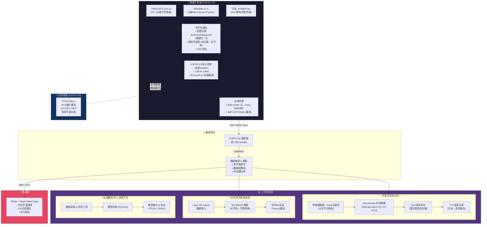

# 数据手套手语翻译+3D渲染系统 — 综合架构分析 & SPEC Plan

> 调研完成日期：2025-04-10
> 基于：10个GitHub仓库 + 14篇学术论文 + 核心技术文档

---

## 一、调研核心结论提炼

### 1.1 硬件方案 — 已明确

| 组件 | 推荐选型 | 核心理由 | 来源 |
|------|---------|---------|------|
| **MCU** | ESP32-S3 (Xtensa LX7 双核240MHz) | 128-bit SIMD向量指令, ESP-DL, TFLite Micro, WiFi+BLE, Deep Sleep 7uA | 所有仓库共识 |
| **手指弯曲传感** | **TMAG5273 (I2C 3D霍尔)** 替代弯曲传感器 | 非接触、3轴、1.7mA低功耗、16-bit内置ADC、可编程I2C地址(最多4设备/总线)、1.6mm封装 | 论文1+传感器调研 |
| **IMU** | **BNO085** (9轴Sensor Fusion) | 内置9轴融合直接输出四元数, 零CPU开销, 精度远超裸IMU | SlimeVR仓库+论文12 |
| **通信** | **ESP-NOW** (首选) + WiFi HTTP/SSE (备选) | <5ms延迟, 250bytes/包, 无需路由器, 极低功耗 | ESP-NOW文档 |
| **电池** | 1000mAh LiPo → 优化后8-12h续航 | ESP-NOW节省150mA | 功耗分析 |

### 1.2 算法模型 — 分层选型

| 阶段 | 模型 | 准确率 | 部署位置 | 理由 |
|------|------|--------|---------|------|
| **边缘端(简单手语)** | 1D-CNN / MLP (INT8量化) | ~95%+ | ESP32-S3 TFLite Micro | 低延迟、离线可用、Edge Impulse训练 |
| **上位机(复杂手语)** | **Attention-BiLSTM** | **98.85%** | PC/Jetson OpenHands框架 | 论文12最佳, 时序建模能力强 |
| **连续手语(后期)** | CTC端到端 / ST-GCN | 94-97% | PC端 OpenHands | 支持可变长度序列, 无需手动分段 |
| **Baseline** | Random Forest | 97.58% | 全平台 | Redgerd仓库验证, 快速验证用 |

### 1.3 3D渲染 — 两条路线

| 方案 | 引擎 | 优势 | 劣势 | 适用场景 |
|------|------|------|------|---------|
| **路线A: Three.js+GLTF** | WebGL浏览器 | 零安装、跨平台、Gill003已验证 | 关节精度有限 | Web展示、移动端H5 |
| **路线B: Unity XR Hands** | Unity引擎 | 高精度、XR生态、MS-MANO对接 | 需安装、体积大 | VR/AR沉浸式、桌面端 |

**推荐策略**：MVP用路线A快速验证, 后期升级路线B做高精度渲染。

---

## 二、总系统架构图



---

## 三、硬件布局设计 (手套版)

```
┌──────────────────────────────────────────────────────────┐
│                   数据手套 传感器布局                       │
│                                                            │
│  ┌──────┐                                                  │
│  │ TMAG │  拇指: DIP(1) + IP(1) + MCP(1) = 3个TMAG5273   │
│  │ x3   │                                                  │
│  ├──────┤                                                  │
│  │ TMAG │  食指: DIP(1) + PIP(1) + MCP(1) = 3个           │
│  │ x3   │                                                  │
│  ├──────┤                                                  │
│  │ TMAG │  中指: DIP(1) + PIP(1) + MCP(1) = 3个           │
│  │ x3   │                                                  │
│  ├──────┤                                                  │
│  │ TMAG │  无名指: DIP(1) + PIP(1) + MCP(1) = 3个         │
│  │ x3   │                                                  │
│  ├──────┤                                                  │
│  │ TMAG │  小指: DIP(1) + PIP(1) + MCP(1) = 3个           │
│  │ x3   │                                                  │
│  └──────┘                                                  │
│     共 15个 TMAG5273 (每指3关节, I2C总线)                  │
│                                                            │
│  ┌────────────────────────────────┐                        │
│  │       BNO085 x1                │  手背部(掌心): 1个BNO085│
│  │    (9轴IMU+Sensor Fusion)      │  检测手腕姿态/运动      │
│  └────────────────────────────────┘                        │
│                                                            │
│  ┌────────────────────────────────┐                        │
│  │     ESP32-S3 + LiPo电池         │  手腕/前臂绑带处       │
│  │     (主控+供电+无线)            │  1000mAh LiPo          │
│  └────────────────────────────────┘                        │
│                                                            │
│  I2C总线: TMAG5273(4组x最多4设备=16个) + BNO085            │
│  通信: ESP-NOW → 接收端 / WiFi SSE → 浏览器               │
└──────────────────────────────────────────────────────────┘

  TMAG5273 I2C地址分配:
  ├── Bus 0 (I2C0): Thumb-DIP(0x22), Thumb-IP(0x23), Thumb-MCP(0x24), Index-DIP(0x22)
  ├── Bus 1 (I2C1): Index-PIP(0x22), Index-MCP(0x23), Middle-DIP(0x24), Middle-PIP(0x22)
  ├── (TCA9548A I2C多路复用器解决地址冲突, 参考 Hand-Tracking-Glove)
  └── BNO085: 独立I2C地址 0x4A/0x4B
```

---

## 四、SPEC 四阶段工程计划

### Phase 1: 硬件原型验证 (Week 1-4)

**目标**: 单手数据手套原型, 传感器数据采集+无线传输可工作

| 任务 | 交付物 | 参考来源 |
|------|--------|---------|
| 1.1 ESP32-S3 PlatformIO工程搭建 | 可编译的PlatformIO项目 | SlimeVR仓库 |
| 1.2 TMAG5273 I2C驱动开发 | 单手指弯曲检测验证 | 论文1霍尔方案 |
| 1.3 BNO085驱动+四元数输出 | 手腕姿态数据输出 | SlimeVR仓库 |
| 1.4 TCA9548A I2C多路复用 | 15个TMAG5273稳定通信 | Hand-Tracking-Glove |
| 1.5 信号滤波 (Kalman/低通) | 平滑的传感器数据流 | ReikiC特征工程 |
| 1.6 ESP-NOW通信链路 | <5ms延迟数据传输 | ESP-NOW文档 |
| 1.7 3D打印手套骨架 | 可穿戴的传感器安装结构 | 论文1的3D设计 |

**里程碑 M1**: 传感器数据可实时无线传输到PC并可视化

### Phase 2: 边缘AI + 数据采集标注 (Week 5-8)

**目标**: 简单手语边缘推理 + 中国手语数据采集标注系统

| 任务 | 交付物 | 参考来源 |
|------|--------|---------|
| 2.1 Edge Impulse数据采集pipeline | 标注工具 (Web/桌面) | ReikiC Edge Impulse |
| 2.2 1D-CNN模型训练+量化 | INT8 TFLite模型 | GG1627 TFLite部署 |
| 2.3 TFLite Micro ESP32-S3部署 | 端侧实时推理 | ReikiC端侧方案 |
| 2.4 静态手语识别(10-20词) | 基础手语识别功能 | 论文12的20手势 |
| 2.5 传感器校准系统 | 用户自适应校准 | ReikiC校准方案 |
| 2.6 数据标注工具开发 | 图形化数据采集标注UI | Redgerd数据集流程 |

**里程碑 M2**: 边缘端可离线识别10-20个静态手语

### Phase 3: OpenHands集成 + 3D渲染 (Week 9-14)

**目标**: 复杂手语上位机识别 + 实时3D手部动画渲染

| 任务 | 交付物 | 参考来源 |
|------|--------|---------|
| 3.1 OpenHands框架部署+CSL数据集 | 中国手语识别baseline | OpenHands官方 |
| 3.2 传感器数据→21关节Pose映射 | 数据格式转换模块 | InterHand2.6M标准 |
| 3.3 Attention-BiLSTM训练+微调 | 复杂手语识别模型 | 论文12 (98.85%) |
| 3.4 Three.js 3D手部渲染+GLTF | 浏览器实时3D手动画 | Gill003方案 |
| 3.5 NLP语法校对模块 | 手语→通顺中文文本 | OpenHands后处理 |
| 3.6 TTS语音合成集成 | 实时语音翻译输出 | Gill003 Web Speech |
| 3.7 Unity XR Hands + MS-MANO(备选) | 高精度3D渲染方案 | 用户原始需求 |
| 3.8 数据采集+训练闭环 | 自动化训练pipeline | Edge Impulse |

**里程碑 M3**: 完整手语翻译+3D渲染系统可演示

### Phase 4: 系统集成优化 + 论文准备 (Week 15-20)

**目标**: 生产级原型、移动端部署、SCI论文素材

| 任务 | 交付物 | 参考来源 |
|------|--------|---------|
| 4.1 双手套同步采集 | 左右手协同识别 | 论文3双手交互 |
| 4.2 功耗优化(目标8-12h) | 低功耗模式策略 | ESP32-S3 Deep Sleep |
| 4.3 Flutter/React Native移动端 | 跨平台移动App | Redgerd Flutter |
| 4.4 连续手语CTC模型(可选) | 句子级识别 | 论文2 CTC方案 |
| 4.5 大规模数据采集(100+词) | 中文手语数据集 | 多仓库经验 |
| 4.6 消融实验 & 性能评测 | 论文实验数据 | SPEC可测试要求 |
| 4.7 系统文档 & 用户手册 | 完整工程文档 | SPEC文档清晰要求 |

**里程碑 M4**: 可提交SCI论文的完整系统

---

## 五、关键技术决策点（需你审阅确认）

### 🔴 决策点 1: 传感器方案 — 霍尔 vs 弯曲

| 方案 | 优点 | 缺点 | 成本/手 |
|------|------|------|---------|
| **A: TMAG5273全霍尔(推荐)** | 非接触耐久、3轴高精度、低功耗、I2C数字 | 需I2C多路复用、磁铁布局设计 | ~¥120-180 |
| **B: Flex弯曲传感器(经典)** | 成熟简单、ADC直读 | 易磨损漂移、寿命短、占ADC通道 | ~¥75-150 |
| **C: 混合方案(TMAG+Flex)** | 冗余互补、精度最高 | 布线复杂、功耗增加 | ~¥180-280 |

**我的推荐**: 方案A (TMAG5273全霍尔)，论文1已验证96%准确率+高耐久性

### 🔴 决策点 2: 3D渲染引擎选择

| 方案 | 优点 | 缺点 | 交付周期 |
|------|------|------|---------|
| **A: Three.js+GLTF(推荐MVP)** | 零安装、跨平台、Gill003已验证 | 关节精度有限、无XR生态 | 2-3周 |
| **B: Unity XR Hands+MS-MANO** | 高精度、XR生态完整、学术认可 | 安装体积大、开发周期长 | 6-8周 |
| **C: A先B后(推荐)** | 先快后精、渐进式开发 | 需维护两套渲染 | 总计8-10周 |

**我的推荐**: 方案C (先A后B)，MVP用Three.js快速验证，后期升级Unity做高精度

### 🔴 决策点 3: 通信方案

| 方案 | 延迟 | 功耗 | 复杂度 | 适用场景 |
|------|------|------|--------|---------|
| **A: ESP-NOW(推荐)** | <5ms | 极低 | 低 | 手套→接收端 |
| **B: WiFi HTTP/SSE** | 20-100ms | 高 | 中 | 手套→浏览器直连 |
| **C: BLE** | 30-100ms | 低 | 中 | 手套→手机App |
| **D: ESP-NOW + WiFi混合** | <5ms + 高带宽 | 中 | 高 | 全场景覆盖 |

**我的推荐**: 方案D (ESP-NOW传输数据 + WiFi给浏览器SSE推送3D渲染)

### 🟡 决策点 4: IMU选型

| 方案 | 精度 | CPU开销 | 功耗 | 成本 |
|------|------|---------|------|------|
| **A: BNO085(推荐)** | 高(内置融合) | 零 | 10-12mA | ¥30-50 |
| **B: ICM-90248(裸IMU)** | 中(需软件融合) | 高 | 2-3mA | ¥10-20 |

**我的推荐**: 方案A (BNO085)，内置融合减轻ESP32-S3负担，精度更高

### 🟡 决策点 5: AI模型分层策略

| 层级 | 模型 | 部署位置 | 触发条件 |
|------|------|---------|---------|
| L1边缘 | 1D-CNN/MLP (INT8) | ESP32-S3 | 简单静态手语(10-20词), 离线模式 |
| L2上位机 | Attention-BiLSTM | PC/网关 | 复杂动态手语, 在线模式 |
| L3云端(可选) | ST-GCN/Transformer | 云服务器 | 超大词汇量, 模型更新 |

**我的推荐**: L1+L2双层, MVP阶段不做L3

---

## 六、与现有开源项目的差异化创新点

| 创新点 | 现有项目现状 | 我们的差异化 |
|--------|------------|-------------|
| **传感器方案** | 多数用Flex弯曲传感器 | TMAG5273非接触霍尔, 耐久性+精度双优 |
| **通信架构** | 多数单一WiFi或BLE | ESP-NOW低延迟传输 + WiFi SSE渲染推送 |
| **AI分层** | 要么纯端侧要么纯云端 | 边缘轻量推理 + 上位机复杂推理 双层架构 |
| **3D渲染** | 少数有简单3D | Three.js快速原型 + Unity MS-MANO高精度 |
| **数据标注闭环** | 多数无标注工具 | 内置采集→标注→训练→部署 全流程 |
| **中国手语** | 多数为ASL | 聚焦CSL中国手语, OpenHands CSL数据集支持 |

---

## 七、风险与缓解

| 风险 | 影响 | 缓解措施 |
|------|------|---------|
| TMAG5273 I2C地址冲突 | 传感器无法通信 | TCA9548A多路复用(Hand-Tracking-Glove已验证) |
| BNO085功耗偏高 | 续航不足 | 间歇采集(10-20Hz) + Light Sleep |
| Attention-BiLSTM实时性 | 推理延迟过高 | 模型量化INT8 + 输入帧截断(30帧窗口) |
| ESP-NOW丢包 | 数据不完整 | 应用层CRC8 + 序号重传机制 |
| 中国手语数据不足 | 模型泛化差 | OpenHands CSL预训练 + 自采集微调 |
| Unity MS-MANO集成复杂 | 开发周期长 | 先Three.js MVP, 后期渐进升级 |

---

*请审阅以上5个关键决策点, 确认后我将开始详细SPEC工程文档的制定。*
