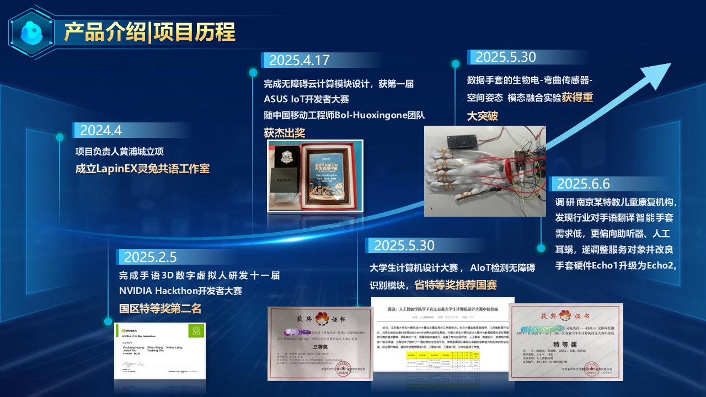

# Edge AI Data Glove V3

**Edge-AI-Powered Data Glove with Dual-Tier Inference for Real-Time Sign Language Translation and 3D Hand Animation Rendering**



---

## Project Overview

This project implements a dual-tier inference data glove system:

- **L1 (Edge)**: ESP32-S3 on-device inference with 1D-CNN+Attention model (<3ms latency)
- **L2 (Relay)**: Python server with ST-GCN for complex gesture sequences (<20ms latency)
- **L3a (Web MVP)**: React + R3F 3D hand skeleton visualization
- **L3b (Unity Pro)**: Unity 2022 LTS + ms-MANO high-fidelity rendering

---

## Architecture

```
ESP32-S3 (Layer 1)              Python Relay (Layer 2)          Web Frontend (Layer 3)
┌─────────────────┐   UDP:8888  ┌──────────────────┐  WS:8765  ┌─────────────────┐
│ TMAG5273 ×5     │             │ FastAPI Server   │           │ React + R3F     │
│ BNO085 ×1       │──Protobuf─→ │ UDP Receiver     │──JSON──→ │ 3D Hand Skeleton│
│ TCA9548A        │   (100Hz)   │ Protobuf Parser  │  (100Hz)  │ Zustand Store   │
│ FreeRTOS        │             │ L2 ST-GCN        │           │ TailwindCSS UI  │
│ Core1: 100Hz    │             │ NLP Correction   │           │ PWA             │
│ Core0: L1+Comm  │             │ edge-tts         │           │                 │
└─────────────────┘             └──────────────────┘           └─────────────────┘
```

---

## Quick Start

### 1. Firmware (glove_firmware)

```bash
cd glove_firmware
pio run                    # Build
pio run -t upload          # Upload to ESP32-S3
pio device monitor         # Monitor serial output (115200 baud)
```

### 2. Python Relay (glove_relay)

```bash
cd glove_relay
pip install -r requirements.txt
uvicorn src.main:app --host 0.0.0.0 --port 8000 --reload
```

### 3. Web Frontend (glove_web)

```bash
cd glove_web
npm install
npm run dev                # Development server: http://localhost:5173
npm run build              # Production build
```

### 4. Unity (glove_unity)

1. Open with Unity 2022.3 LTS
2. Install XR Hands Package
3. Configure WebSocket URL to Python Relay

---

## Key Design Decisions (V3)

| Decision         | Choice                    | Reason                                          |
| ---------------- | ------------------------- | ----------------------------------------------- |
| D1: Frontend     | React + R3F               | Remove Tauri/Rust, pure Web zero-install        |
| D2: Relay        | FastAPI + WebSocket       | Unified Python hub for relay + L2 + TTS + NLP   |
| D3: Rendering    | React MVP → Unity Pro    | Two-stage progressive evolution                 |
| D4: Mobile       | Responsive Web + PWA      | "Add to Home Screen" for native-like experience |
| D5: BLE          | Provisioning only         | No Web Bluetooth API (unstable)                 |
| D6: L1 Models    | 1D-CNN+Attention + MS-TCN | Model pool with hot-switch support              |
| D7: Model Switch | BaseModel + YAML          | Runtime switching without restart               |
| D8: Benchmark    | Top-1/5 + FLOPs + latency | Data-driven model selection                     |

---

## Key Components

### glove_firmware (ESP32-S3)

- FreeRTOS dual-core task scheduling (Core 1: 100Hz sampling, Core 0: inference + comms)
- TCA9548A I2C multiplexer driver (5 channel switching)
- TMAG5273 3D Hall sensor driver (12-bit, ±40mT)
- BNO085 IMU driver with SH-2 protocol
- Kalman filter for noise reduction
- ModelRegistry for L1 model hot-switching
- Nanopb Protobuf serialization

### glove_relay (Python)

- FastAPI + WebSocket server (port 8765)
- asyncio UDP receiver (port 8888)
- Protobuf → JSON conversion
- ST-GCN L2 inference model
- NLP grammar correction (CSL → Mandarin)
- edge-tts voice synthesis

### glove_web (React)

- React 18 + Vite + TailwindCSS
- React Three Fiber (R3F) for 3D rendering
- Zustand state management
- WebSocket hook with auto-reconnect
- PWA manifest for "Add to Home Screen"

---

## Performance Targets

| Metric                   | Target     |
| ------------------------ | ---------- |
| L1 inference latency     | <3ms       |
| L2 inference latency     | <20ms      |
| End-to-end latency       | <100ms     |
| L1 accuracy (46 classes) | >90% Top-1 |
| L2 accuracy (46 classes) | >95% Top-1 |
| Sensor sampling rate     | 100Hz      |

---

## Hardware

- **MCU**: ESP32-S3-DevKitC-1 N16R8 (8MB Flash + 8MB PSRAM)
- **Hall Sensors**: 5× TMAG5273A1 (Texas Instruments, 3D Hall)
- **IMU**: 1× BNO085 (Bosch, 9-axis with hardware fusion)
- **I2C Mux**: TCA9548A (8-channel)
- **I2C Pins**: GPIO 8 (SDA), GPIO 9 (SCL)
- **BOM Cost**: ~$38.60

---

## Documentation

- `docs/SOP_SPEC_PLAN_V3.md` — Full phase specification
- `docs/CLAUDE_CODE_PROMPTS_V3.md` — 28 executable prompts for Claude Code
- `docs/references/` — Chip datasheets and research papers

---

## License

Academic research project for thesis/publication.
